* [Back to the note](./note.md)

 

## 1.1
</img>

</img>

</img>

</img>

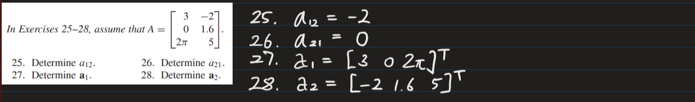</img>

</img>

</img>

</img>

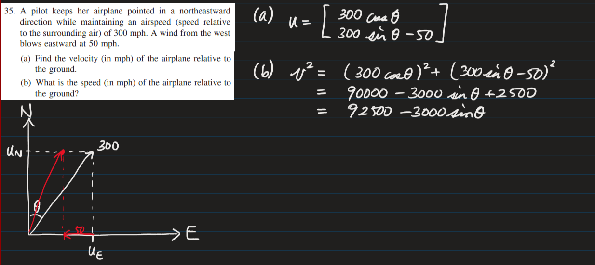</img>

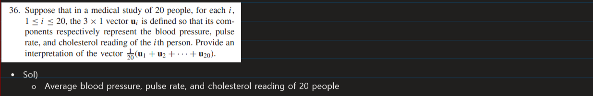</img>

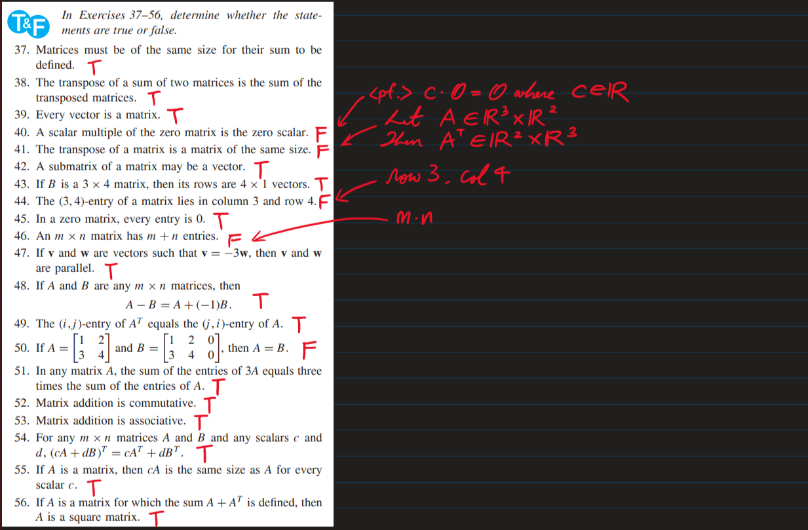</img>

</img>

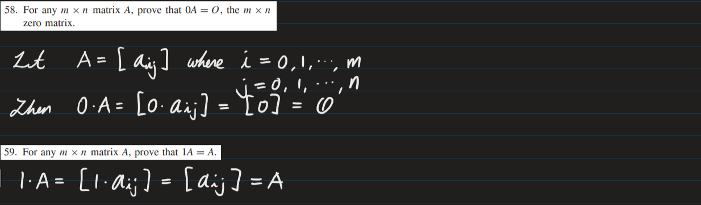</img>

</img>

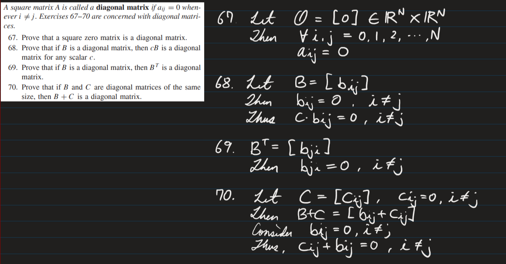</img>

</img>

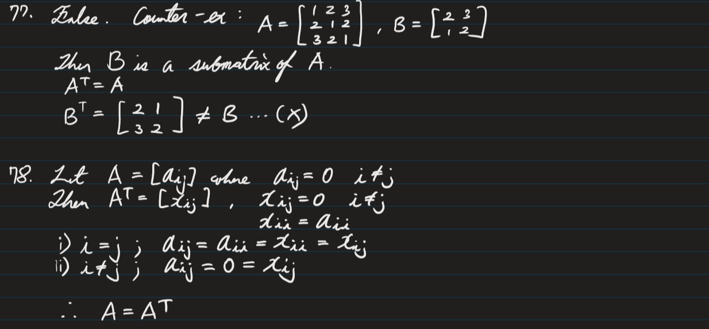</img>

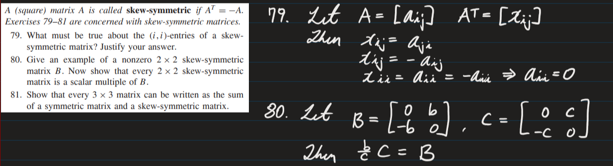</img>

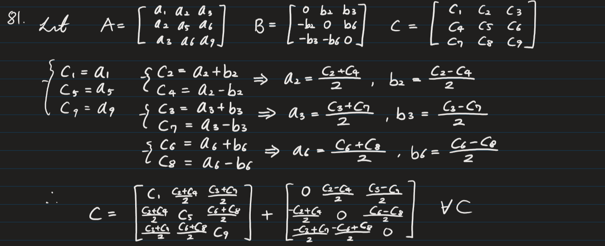</img>

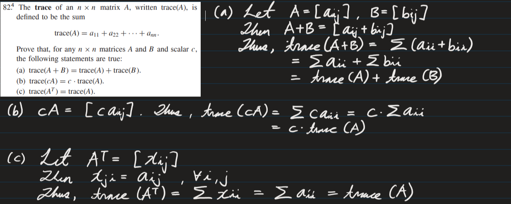</img>

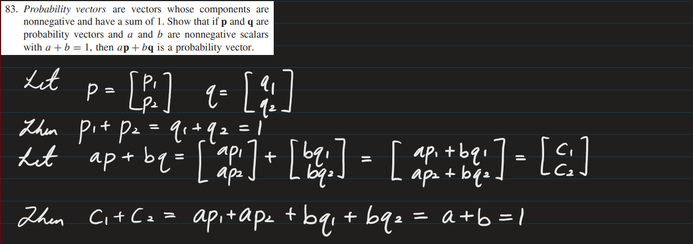</img>

* [Back to the note](./note.md)