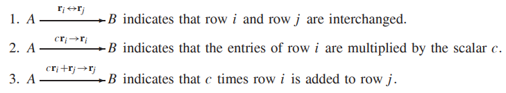
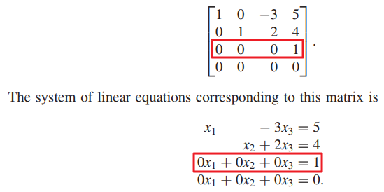

* [Back to Linear Algebra Main](../../main.md)

# 1.3 SYSTEMS OF LINEAR EQUATIONS

#### Def) Linear Equations
* $a_1x_1+a_2x_2+...+a_nx_n = b$
  * where $x_1, x_2, ..., x_n$ are variables
  * and $a_1, a_2, ..., a_n$, and $b$ are real numbers.
    * $a_1, a_2, ..., a_n$ : coefficients
    * $b$ : constant term

#### Def) System of Linear Equations

  

### 1.3.1 Systems of 2 Linear Equations in 2 variables

#### Three possible situations
|Parallel (No sol.)|Intersect once (One sol.)|Coinside (Inf. sols.)|
|:-:|:-:|:-:|
||||
* Terminology)
  * Consistent
    * A system of linear equations have **one or more solutions**.
  * Inconsistent
    * A system of linear equations have **no solution**.

  

### 1.3.2 Elementary Row Operations
#### Def.) Equivalence
* Two systems of linear equations that have exactly the same solutions are
called equivalent.

 

#### Def.) Coefficient Matrix & Augmented Matrix
For a linear system $$ \left\{ \begin{array}{ccc} a_{11}x_1+a_{12}x_2+ & \dots & +a_{1n}x_n=b_1 \\\ a_{21}x_1+a_{22}x_2+ & \dots & +a_{2n}x_n=b_2 \\\ \vdots & \ddots & \vdots \\\ a_{m1}x_1+a_{m2}x_2+ & \dots&+a_{mn}x_n=b_m\end{array}\right. $$
* **Coefficient Matrix** is $\left[ \begin{array}{cccc} a_{11} & a_{12} & \dots & a_{1n} \\\ a_{21} & a_{22} & \dots & a_{2n} \\\ \vdots & \vdots & \ddots & \vdots \\\ a_{m1} & a_{m2} & \dots & a_{mn} \end{array}\right]$
* **Augmented Matrix** is $\left[ \begin{array}{ccccc} a_{11} & a_{12} & \dots & a_{1n} & b_1 \\\ a_{21} & a_{22} & \dots & a_{2n} & b_2 \\\ \vdots & \vdots & \ddots & \vdots & \vdots \\\ a_{m1} & a_{m2} & \dots & a_{mn} & b_m \end{array}\right]$

$a+b=1$

trial1

$\left\{ content \right.$  

trial2

$\begin{array}{c} content \end{array}$

trial3

$\begin{bmatrix} X \\\ Y \end{bmatrix}$

#### Def.) Elementary Row Operations

1. Interchange any two rows of the matrix. (interchange operation)
2. Multiply every entry of some row of the matrix by the same nonzero scalar.
(scaling operation)
3. Add a multiple of one row of the matrix to another row. (row addition operation)

* **Notations)**
  

* Prop.)
  * Performing an elementary row operation on the augmented matrix of a system of linear equations does not change the solution set. 
    * i.e.) Each elementary row operation produces the augmented matrix of an equivalent system of linear equations.
    * [Pf. will be made in Chapter 2]()

  

### 1.3.3 Reduced Row Echelon Form
#### Terms.)
* **Zero Row** : A row which entries are all 0
* **Nonezero Row** : A row that is not a **Zero Row**
* **Leading Entry** : The leftmost nonzero entry of a **Nonzero Row**

 

#### Def.) Row Echelon Form
A matrix is said to be in **row echelon form** if it satisfies the following
three conditions:
1. Each nonzero row lies above every zero row.
2. The leading entry of a nonzero row lies in a column to the right of the column containing the leading entry of any preceding row.
3. If a column contains the leading entry of some row, then all entries of that column below the leading entry are 0.

 

#### Def.) Reduced Row Echelon Form
If a row echelon form matrix satisfies the following two additional conditions, we say that it is in reduced row echelon form.
1. If a column contains the leading entry of some row, then all the other entries of that column are 0.
2. The leading entry of each nonzero row is 1.

 

#### Tech.) How to solve a system of equations
1. Represent the system by its augmented matrix
2. Use elementary row operations to transform the augmented matrix into a reduced row echelon form.

 

#### Concept) General Solution
* **Basic Variables** : Correspond to the leading entries of the augmented matrix
* **Free Variables** : ~ **Basic Variables**
* **General Solution** : A solution that every **Basic Variables** are solved in terms of **Free Variables**.

 

#### Prop.)
Whenever an augmented matrix contains a row in which the only nonzero entry
lies in the last column, the corresponding system of linear equations has no
solution.
* ex) 

 

#### Theorem 1.4)
Every matrix can be transformed into one and only one matrix in reduced row echelon form by means of a sequence of elementary row operations.

### [Exercises 1.3](./exercises.md)

* [Back to Linear Algebra Main](../../main.md)