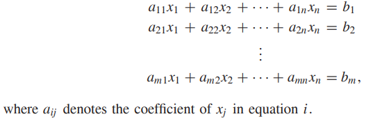
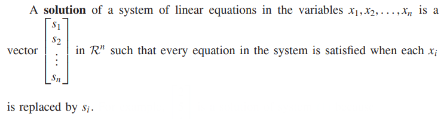
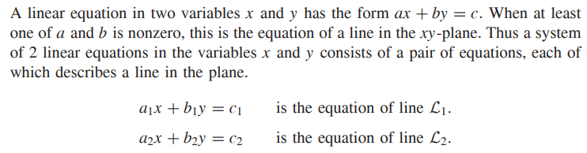
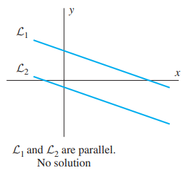
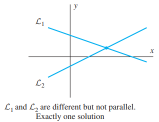
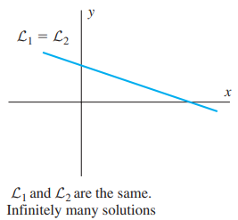

* [Back to Linear Algebra Main](../../main.md)

# 1.3 SYSTEMS OF LINEAR EQUATIONS

#### Def) Linear Equations
* $a_1x_1+a_2x_2+...+a_nx_n = b$
  * where $x_1, x_2, ..., x_n$ are variables
  * and $a_1, a_2, ..., a_n$, and $b$ are real numbers.
    * $a_1, a_2, ..., a_n$ : coefficients
    * $b$ : constant term

#### Def) System of Linear Equations

  

### 1.3.1 Systems of 2 Linear Equations in 2 variables

#### Three possible situations
|Parallel (No sol.)|Intersect once (One sol.)|Coinside (Inf. sols.)|
|:-:|:-:|:-:|
||||

### [Exercises 1.3](./exercises.md)

* [Back to Linear Algebra Main](../../main.md)