* [Back to the note](./note.md)

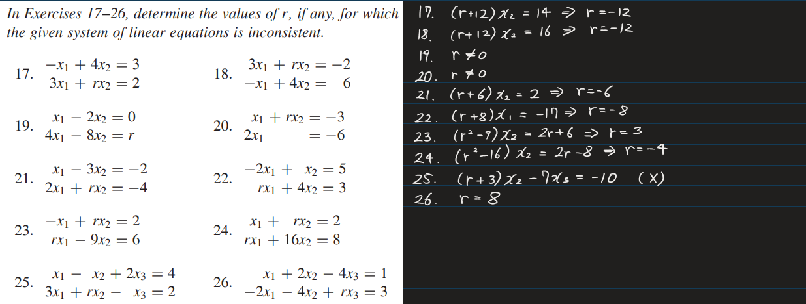

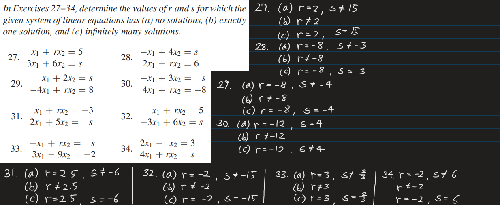

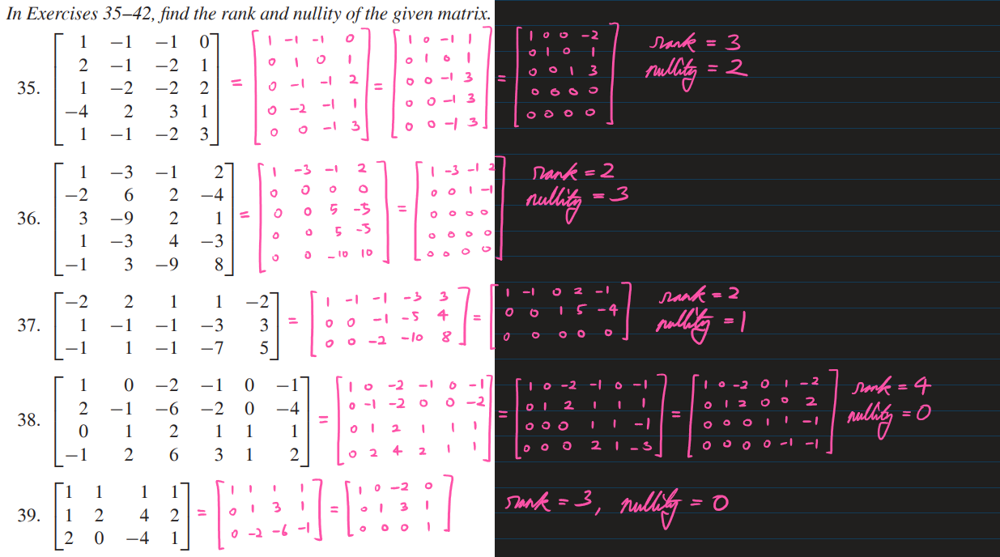

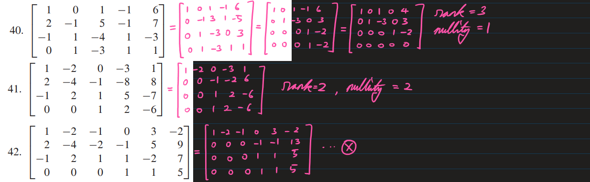

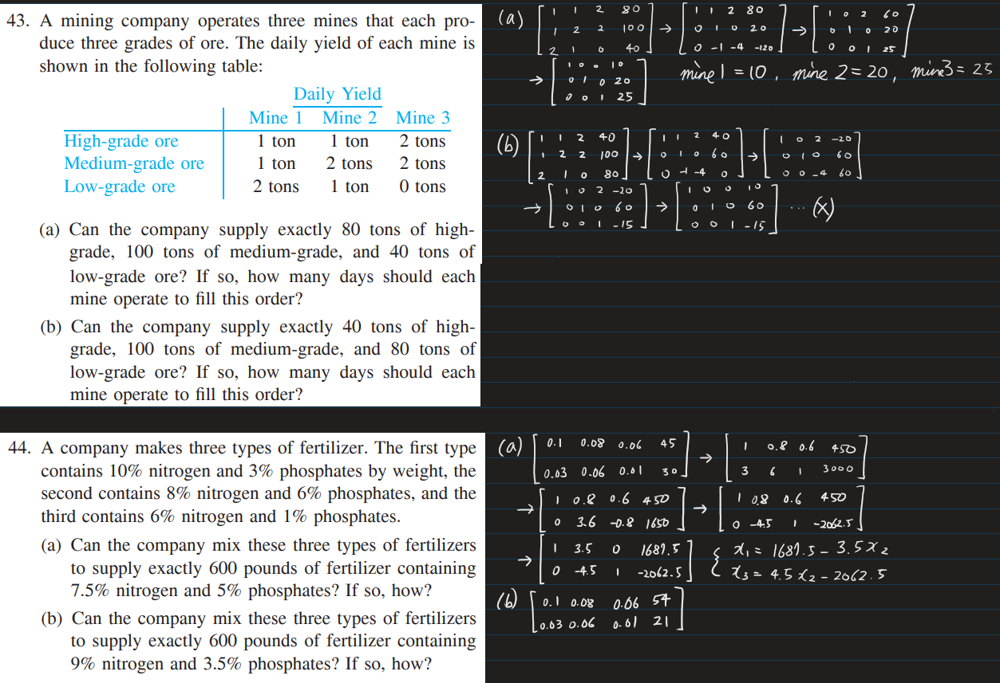

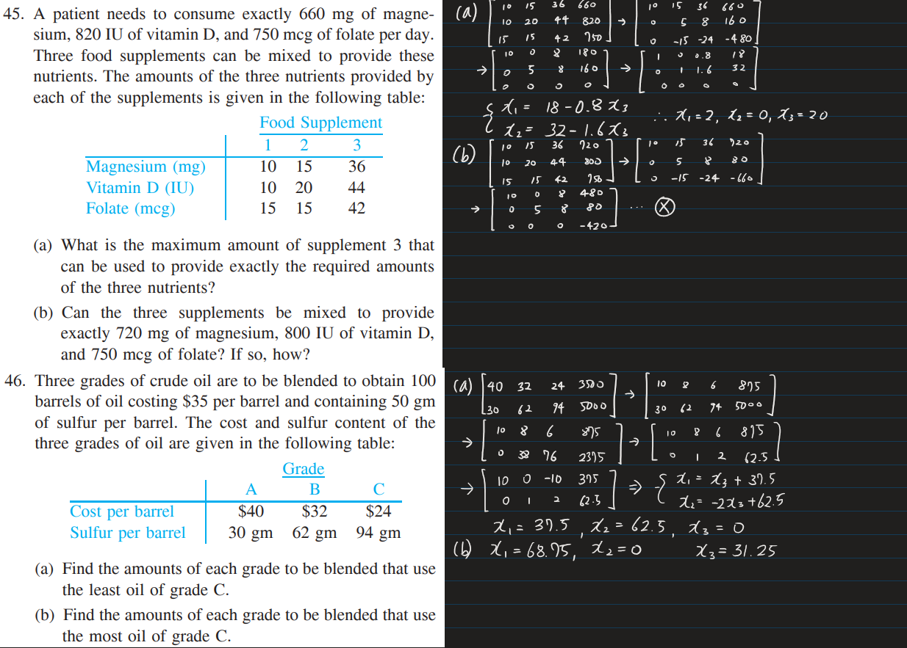

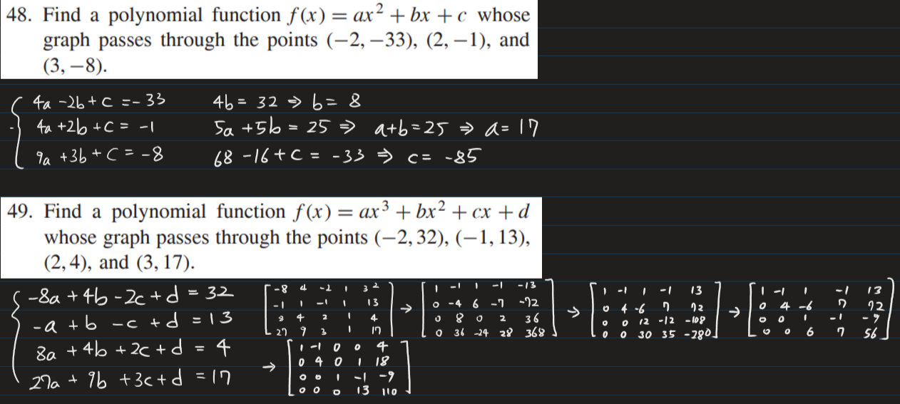

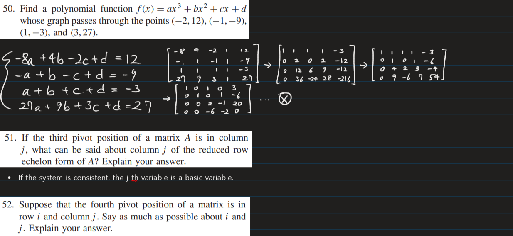
* $i \ge 4$
* If the system is consistent, $j$-th variable will be a basic variable.

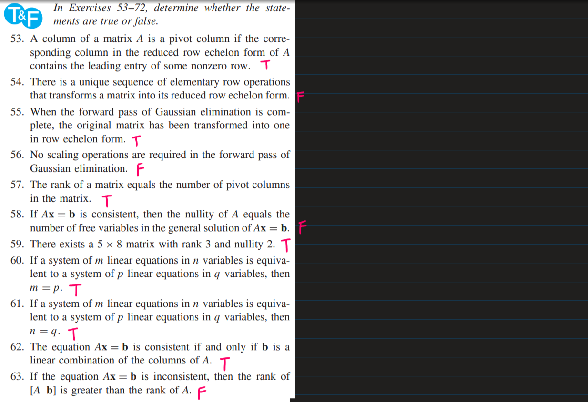

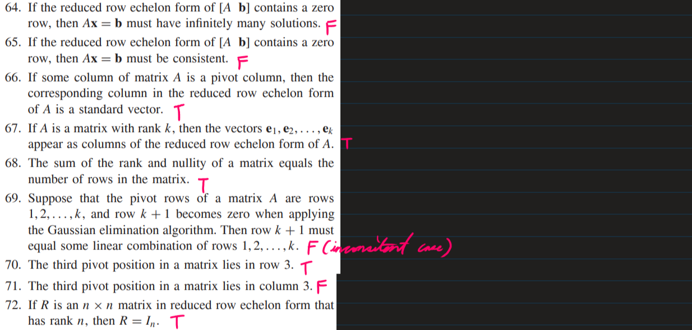

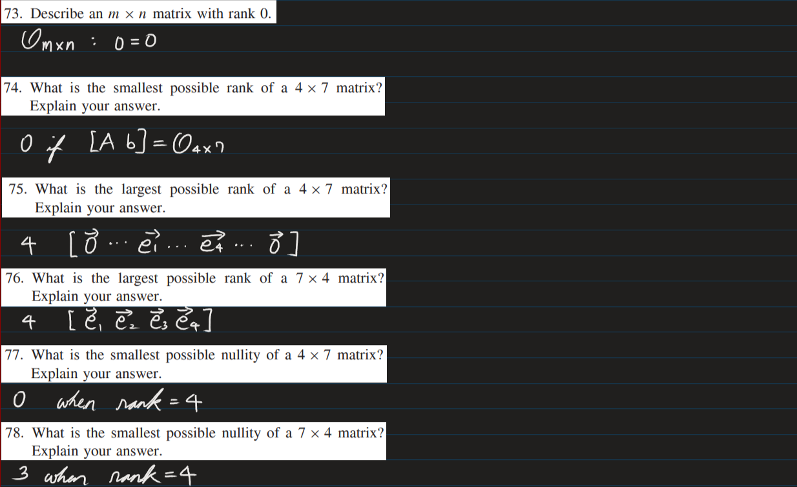

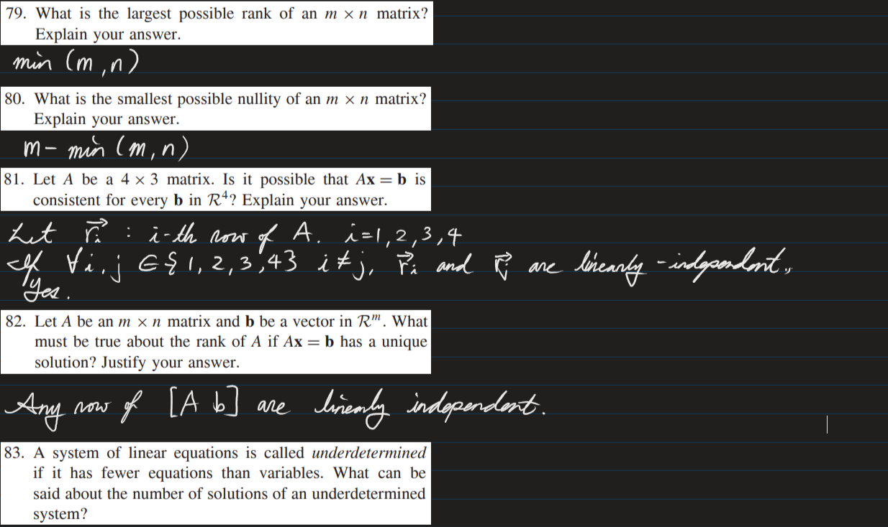
* The number of rows is less than the number of columns.

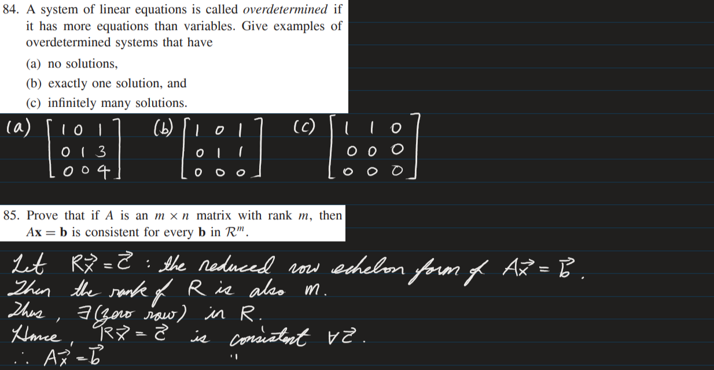

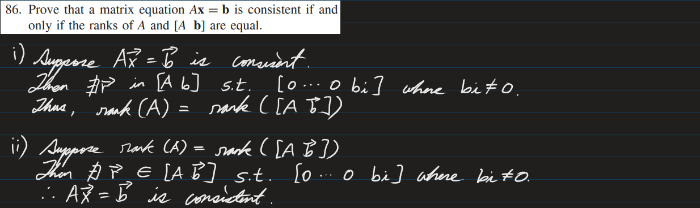

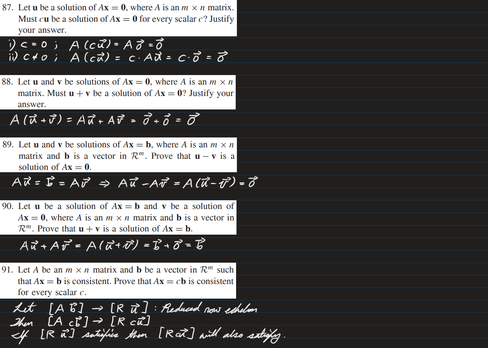

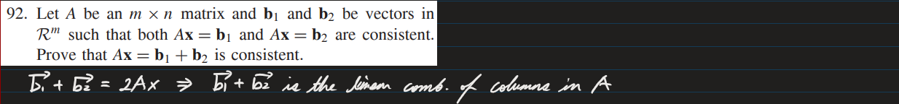

* [Back to the note](./note.md)