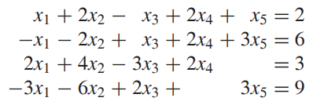

* [Back to Linear Algebra Main](../../main.md)

# 1.4 Gaussian Elimination

#### Defs.) Pivot Position and Pivot Column
Suppose $R$ is the reduced row echelon form of a matrix $A$.
* Pivot Positions of $A$
  * The positions that contain the leading entries of the nonzero rows of $R$
* Pivot Columns
  * A column of $A$ that contains some pivot positions of $A$.
* Example   
  
  

 

#### Tech.) Gaussian Elimination Algorithm
* Goal)
  * Locate the pivot positions so we can compute the reduced row echelon form
* Assumptions)
  * The target matrix is nonzero
* Algorithm
  1. Determine the leftmost nonzero column.
  2. In the pivot column, choose any nonzero entry in a row that is not above the pivot row, and perform the appropriate row interchange to bring this entry into the pivot position.
  3. Add an appropriate multiple of the row containing the pivot position to each lower row in order to change each entry below the pivot position into 0.
  4. Ignore the row containing the pivot position and all rows above it. If there is a nonzero row that is not ignored, repeat steps 1–4 on the submatrix that remains.
  5. If the leading entry of the row is not 1, perform the appropriate scaling operation to make it 1. Then add an appropriate multiple of this row to every preceding row to change each entry above the pivot position into 0.
  6. If step 5 was performed on the first row, stop. Otherwise, repeat step 5 on the preceding row.
* Example   
  * System of Linear Equation   
    
  * Augmented Matrix   
    
  * Gaussian Elimination   
    
    
    
  * Result   
    

 

#### Def.) Rank and Nullity of a Matrix
Let $A$ a $m \times n$ matrix.
* Rank of $A$ : $rank(A)$
  * the number of nonzero rows in the reduced row echelon form of $A$
* Nullity of $A$
  * $n - rank(A)$

 

#### Props.)
* The rank of a matrix equals the number of pivot columns in the matrix
* the nullity of a matrix equals the number of nonpivot columns in the matrix
* In a matrix in reduced row echelon form with rank $k$, the standard vectors $e_1, e_2, ... , e_k$ must appear.   
  
* If a $n \times n$ matrix has rank $n$, then its reduced row echelon form is $I_n$.   
  

 

#### Props.)
Let $Ax=b$ a consistent system of linear equations
* $rank(A) =$ (the number of basic variables in a general solution of the system)
* (nullity of A) = (the number of free variables in a general solution of the system)
* A consistent system of linear equations has a **unique solution** if and only if the nullity of its coefficient matrix equals 0.
* A consistent system of linear equations has **infinitely many solutions** if and only if the nullity of its
coefficient matrix is positive.

### [Exercises 1.4](./exercises.md)

* [Back to Linear Algebra Main](../../main.md)