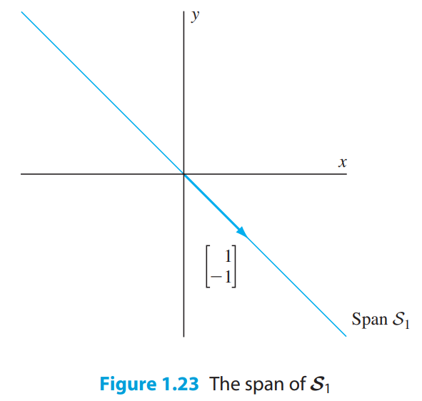
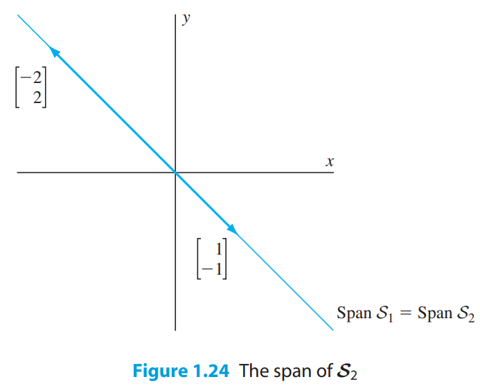
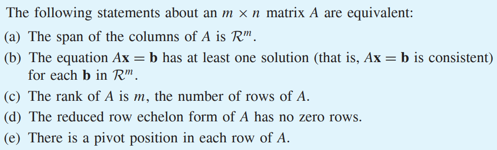
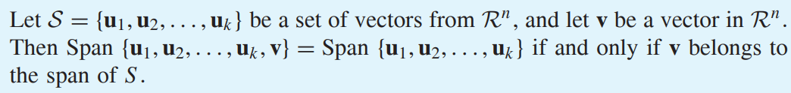

* [Back to Linear Algebra Main](../../main.md)

# 1.6 The Span of a Set of Vectors

#### Def) Span
For a nonempty set $S=\lbrace u_1, u_2, \dots, u_k \rbrace$ of vectors in $\R^n$, we define the **span of** $S$ to be the set of all linear combinations of $u_1, u_2, \dots, u_k \in \R^n$. This set is denoted by Span $S$ or Span $\lbrace u_1, u_2, \dots, u_k \rbrace$.

 

#### Prop.) Span
* If $u \in S$, then $cu \in Span(S), \forall c \in \R$.
* Span $\lbrace 0 \rbrace$ = $\lbrace 0 \rbrace$

#### Ex) Span
* $'S1 = \left \lbrace \left [ {\begin{array}{c} 1 \\ -1 \end{array}} \right ] \right \rbrace'$
   * Span $S1$ = $'\left \lbrace \left [ {\begin{array}{c} c \\ -c \end{array}} \right ], \forall c \in \R \right \rbrace'$
* $'S2 = \left \lbrace \left [ {\begin{array}{c} 1 \\ -1 \end{array}} \right ], \left [ {\begin{array}{c} -2 \\ 2 \end{array}} \right ] \right \rbrace'$
   * Span $S2$ = $'\left \lbrace \left [ {\begin{array}{c} c \\ -c \end{array}} \right ], \forall c \in \R \right \rbrace'$    
   
|Span $S1$|Span $S2$|
|:-:|:-:|
|||

* $'S3 = \left \lbrace \left [ {\begin{array}{c} 1 \\ -1 \end{array}} \right ], \left [ {\begin{array}{c} -2 \\ 2 \end{array}} \right ], \left [ {\begin{array}{c} 2 \\ 0 \end{array}} \right ] \right \rbrace'$
   * Span $S2$ = $\R^2$

 

#### Prop.) 
Let $S=\lbrace u_1, u_2, \dots, u_k \rbrace$ be a set of vectors from $\R^n$ and let $A$ be the matrix whose columns are $u_1, u_2, \dots, u_k$. Then a vector $v$ from $\R^n$ in the span of $S$ if and only if the equation $Ax=v$ is consistent.

 

#### Def.) Generating Set
For a subset $S \subset \R^n$, if $V=Span (S)$, $S$ is generating set for $V$ or $S$ generates $V$.

 

#### Theorem 1.6)

 

#### Theorem 1.7)

### [Exercises 1.6](./exercises.md)

* [Back to Linear Algebra Main](../../main.md)