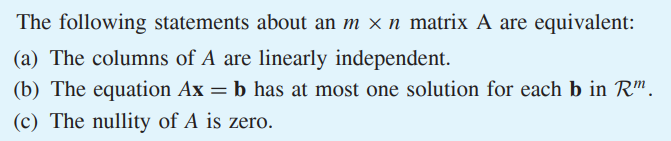
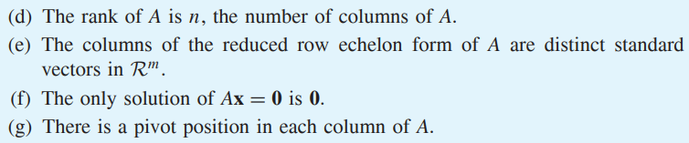
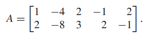

* [Back to Linear Algebra Main](../../main.md)

# 1.7 Linear Dependence and Linear Independence

#### Def) Linear Dependence
A set of $k$ vectors $\lbrace u_1, u_2, \dots, u_k \rbrace \subset \mathbb{R}^n$ is called linearly dependent if there exists scalars $c_1, c_2, \dots, c_k$, not all 0, such that $\Sigma_{i=1}^k c_iu_i = 0$.

Also, the vectors $u_1, u_2, \dots, u_k$ are linearly dependent.

 

#### Def) Linear Independence
A set of $k$ vectors $\lbrace u_1, u_2, \dots, u_k \rbrace \subset \mathbb{R}^n$ is called linearly independent if the only scalars $c_1, c_2, \dots, c_k$ such that $\Sigma_{i=1}^k c_iu_i = 0$ are $c_1 = c_2 = \dots = c_k = 0$.

Also, the vectors $u_1, u_2, \dots, u_k$ are linearly independent.

 

#### Prop.) A Set with the Zero Vector
Any finite subset $S \subset \mathbb{R}^n$ that contains the zero vector is linearly dependent.
- why?)
  - $\forall u_i \in \mathbb{R^n}, 1\cdot \overrightarrow{0} + \Sigma_{i=1}^k 0 \cdot u_i = 0$
    - where $\overrightarrow{0}$ is the zero vector.

 

#### Notation) Matrix Vector Product
$\Sigma c_iu_i = 0$ can be denoted as follows.
- $`\left[ \begin{array}{cccc} u_1 & u_2 & \cdots & u_k \end{array} \right] \left[ \begin{array}{c} c_1 \\ c_2 \\ \vdots \\ c_k \end{array} \right] = 0`$
- $Ax = 0$
  - where $`A = \left[ \begin{array}{cccc} u_1 & u_2 & \cdots & u_k \end{array} \right]`$

 

#### Theorem 1.8)
   
   

 

#### Concept) Homogeneous Equation
- Def.)
  - The equation $Ax=b$ is called homogeneous if $b=0$.
- Prop.)
  - The important question concerning a homogeneous equation is not if it has solutions, but whether $\overrightarrow{0}$ is the only solution.
    - If not, then the system has infinitely many solutions.
  - A homogeneous system of linear equations with more variables than equations has infinitely many solutions.

 

#### Concept) Vector Form of General Solution of Homogeneous Equation
For a matrix $A$, we can express any solution of $Ax = 0$ as a linear combination of vectors in which the coefficients are the free variables in the general solution. We call such a representation a vector form of the general solution of $Ax = 0$.
- e.g)
  - Consider   
    
  - Then, the reduced row echelon form of $`[A 0]`$ is   
    

  

# [Exercises 1.7](./exercises.md)

 

* [Back to Linear Algebra Main](../../main.md)