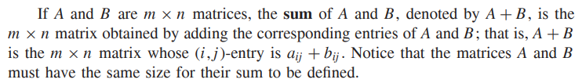
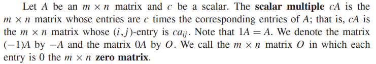
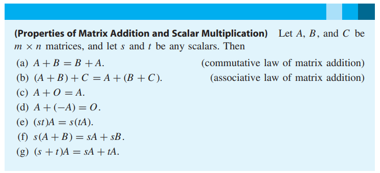
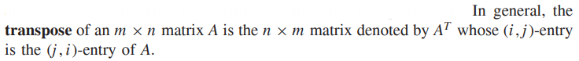
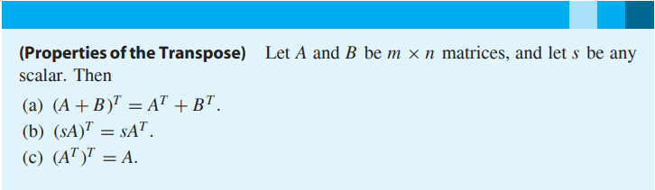
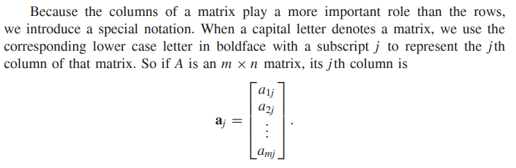
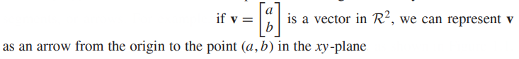
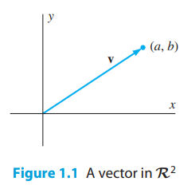

* [Back to Linear Algebra Main](../main.md)

# Chapter 1. Matrices, Vectors, and Systems of Linear Equations

## 1.1 MATRICES AND VECTORS

#### Def) Matrix (plural, matrices)
* A rectangular array of scalars. 
* If the matrix has m rows and n columns, we say that the size of the matrix is m by n, written m × n. 
* The matrix is square if m = n. 
* The scalar in the ith row and jth column is called the (i, j)-entry of the matrix.

 

#### Def) Submatrix
* A submatrix of a matrix M is obtained by deleting from M entire rows, entire columns, or both.

 

#### Def) Matrix Sum

 

#### Def) Scalar Multiplication & Zero Matrix

 

#### Theorem 1.1) Properties of Matrix Addition and Scalar Multiplication

 

#### Def) Matrix Transpose

 

#### Theorem 1.2) Properties of the Transpose

 

#### Def) Vector
* Row Vector : A matrix that has exactly one row
* Column Vector : A matrix that has exactly
one column
* Vector : Either a row vector or a column vector
* Components : The entries of a vector

 

#### Notation) Column Vectors in a Matrix

 

#### Prop.) Geometry of Vectors

  

* [Back to Linear Algebra Main](../main.md)