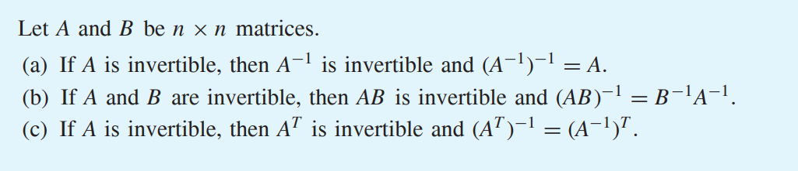
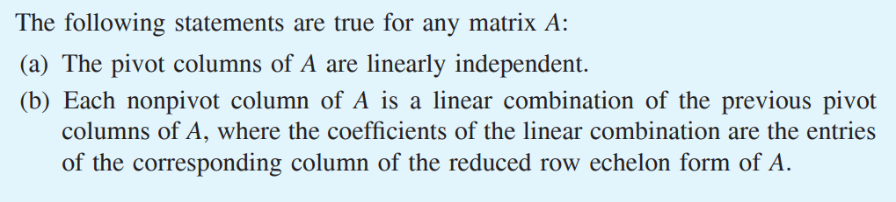

* [Back to Linear Algebra Main](../../main.md)

# 2.3 Invertibility and Elementary Matrices

#### Def) Invertibility
An $n \times n$ matrix $A$ is called **invertible** if there exists an $n \times n$ matrix $B$ such that $AB = BA = I_n$. In this case, $B$ is called an **inverse** of $A$.
- Notation)
  - $A^{-1} = B$
- Props.)
  - If $A$ is invertible, $A^{-1}$ is unique.
    - pf.)
      - Suppose, $B=A^{-1}$ and $C=A^{-1}$.
      - Then, $B = BI_n = B(AC) = (BA)C = I_nC = C$
  - If $A^{-1} = B$, then $B^{-1} = A$
  - $\nexists O^{-1}$

 

#### Prop.)
If $A$ is an invertible $n \times n$ matrix, then for every $b$ in $\mathbb{R}^n$ , $Ax = b$ has the unique solution $A^{−1}b$.

 

#### Theorem 2.2

  

## 2.3.1 Elementary Matrices
#### Def.) Elementary Matrix
In general, an $n \times n$ matrix $E$ is called an elementary matrix if we can obtain $E$ from In by a single elementary row operation.
- e.g.)
  - For a $2 \times 2$ matrix $`A=\left[\begin{array}{cc} a & b \\ c & d \end{array}\right]`$
    - Multiplying row 2 by scalar $k$.
      - $`\left[\begin{array}{cc} 1 & 0 \\ 0 & k \end{array}\right]\left[\begin{array}{cc} a & b \\ c & d \end{array}\right] = \left[\begin{array}{cc} a & b \\ kc & kd \end{array}\right]`$
    - Interchanging row 1 and row 2.
      - $`\left[\begin{array}{cc} 0 & 1 \\ 1 & 0 \end{array}\right]\left[\begin{array}{cc} a & b \\ c & d \end{array}\right] = \left[\begin{array}{cc} c & d \\ a & b \end{array}\right]`$
    - Add $k$ times row 1 of $A$ to row 2.
      - $`\left[\begin{array}{cc} 1 & 0 \\ k & 1 \end{array}\right]\left[\begin{array}{cc} a & b \\ c & d \end{array}\right] = \left[\begin{array}{cc} a & b \\ ka+c & kb+d \end{array}\right]`$
  - The matrices $`\left[\begin{array}{cc} 1 & 0 \\ 0 & k \end{array}\right],\left[\begin{array}{cc} 0 & 1 \\ 1 & 0 \end{array}\right]`$ and $`\left[\begin{array}{cc} 1 & 0 \\ k & 1 \end{array}\right]`$ are the **elementary matrices** of $A$.

 

#### Prop.) 
Let $A$ be an $m \times n$ matrix, and let $E$ be an m × m elementary matrix resulting from an elementary row operation on $I_m$ . Then the product $EA$ can be obtained from $A$ by the identical elementary row operation on $A$.

 

#### Prop.) 
Every elementary matrix is invertible. Furthermore, the inverse of an elementary matrix is also an elementary matrix.

 

#### Theorem 2.3)
Let $A$ be an $m \times n$ matrix with reduced row echelon form $R$. Then there exists
an invertible $m \times m$ matrix $P$ such that $PA = R$.
- Why?)
  - If $R$ exists, then $\exists E_1, \cdots, E_n$, the elementary matrices, such that $(E_1 \cdots E_n)A = R$.
  - Then, $P = E_1 \cdots E_n$.
- Corollary)
  - The matrix equation $Ax = b$ has the same solutions as $Rx = c$, where $[R \space c]$
is the reduced row echelon form of the augmented matrix $[A \space b]$.
    - pf.) 
      - By, Theorem 2.3, $\exists P$ such that $P[A \space b] = [R \space c]$
      - Suppose $\exists v$ such that $Av=b$.
        - Then, $Rv = PAv = Pb = c$
      - Also, suppose $\exists u$ such that $Ru=c$.
        - Then, $Au = P^{-1}Ru = P^{-1}c = b$

  

## 2.3.2 The Column Correspondence Property
#### Concept) Column Correspondence Property
Let $A$ be a matrix and $R$ its reduced row echelon form. If column $j$ of $R$ is a linear
combination of other columns of $R$, then column $j$ of $A$ is a linear combination
of the corresponding columns of $A$ using the same coefficients, and vice versa.

 

#### Theorem 2.4

### [Exercises 1.2](./exercises.md)

* [Back to Linear Algebra Main](../../main.md)