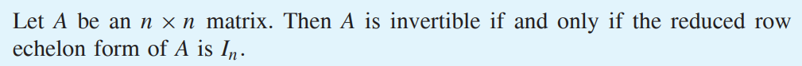
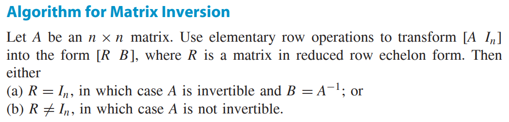
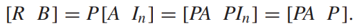
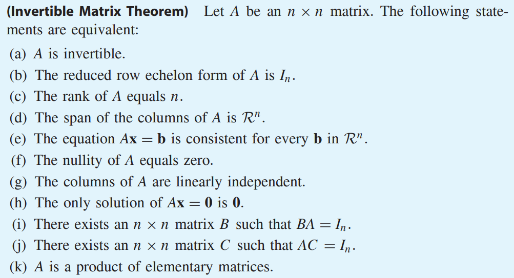
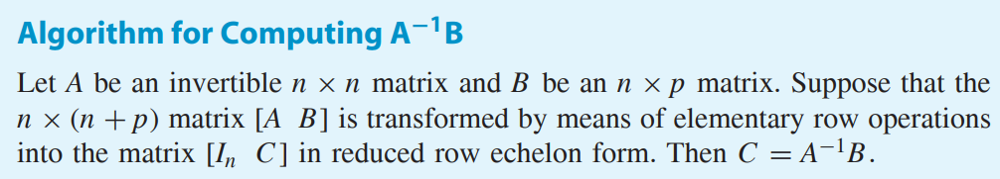

* [Back to Linear Algebra Main](../../main.md)

# 2.4 The Inverse of a Matrix

#### Theorem 2.5)

  

## 2.4.1 An Algorithm for Matrix Inversion

- why?)   
  

 

#### Theorem 2.6) Invertible Matrix Theorem

 

## 2.4.2 An Algorithm of Computing A-1B

  

### [Exercises 2.4](./exercises.md)

* [Back to Linear Algebra Main](../../main.md)