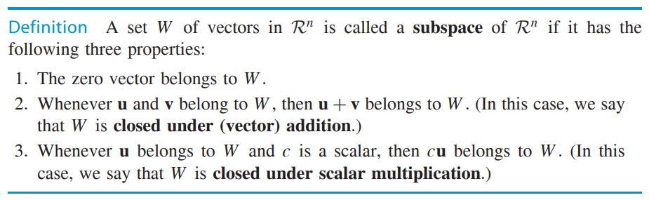
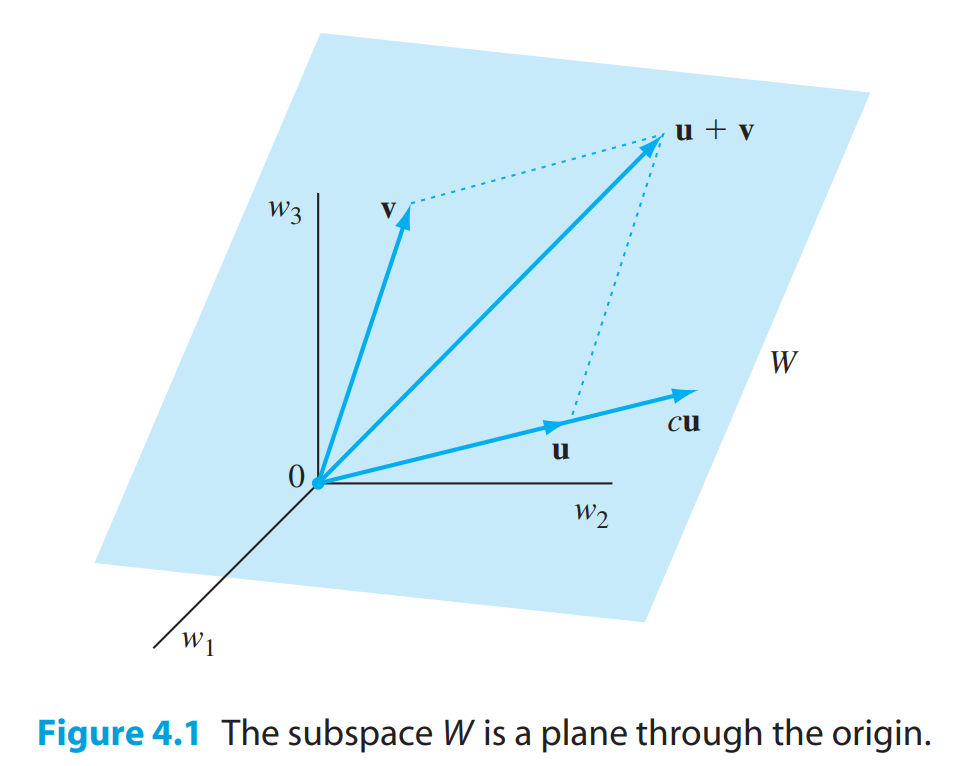
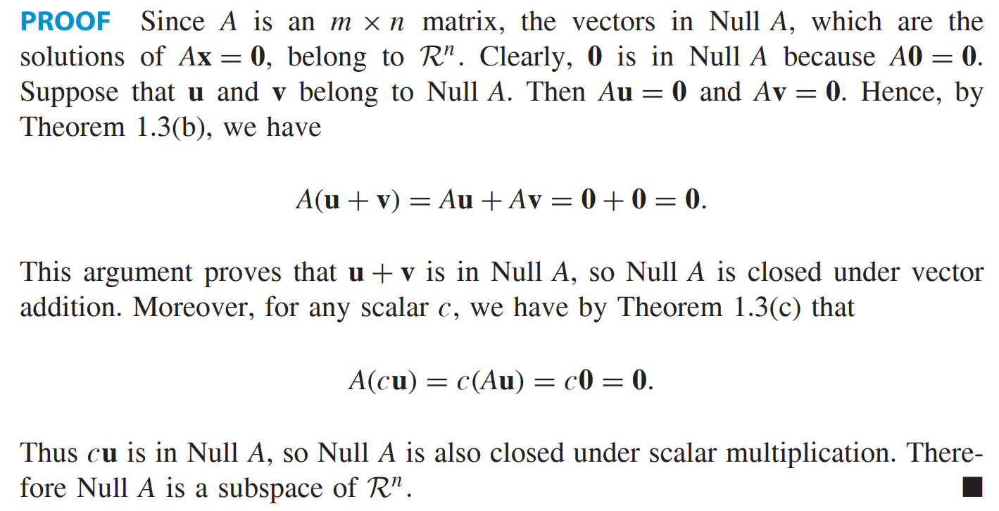
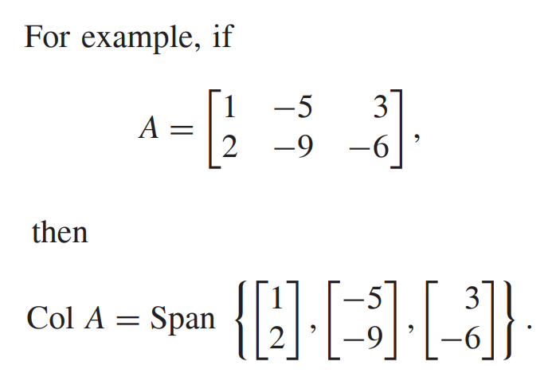

* [Back to Linear Algebra Main](../../main.md)

# 4.1 Subspaces

#### Def) Subspaces and Closure

- Props.)
  - The set $\mathbb{R}^n$ is a subspace of itself.
    - why?)
      - $\mathbf{0} \in \mathbb{R}^n$
      - $\forall \mathbf{u}, \mathbf{v}\in \mathbb{R}^n, \mathbf{u}+\mathbf{v} \in \mathbb{R}^n$
      - $\forall c \in \mathbb{R}, \forall\mathbf{u}\in \mathbb{R}^n, c\mathbf{u} \in \mathbb{R}^n$

 

#### Concept) Zero Subspace
- Def.)
  - A set consisting of only the zero vector in $\mathbb{R}^n$ is a subspace of $\mathbb{R}^n$ called the zero subspace.
- Prop.)
  - Zero subspace is a subspace of $\mathbb{R}^n$.

 

#### Concept) Nonzero Subspace
- Def.) $\mathbb{R}^n - \lbrace 0 \rbrace$
- Prop.)
  - Nonzero subspace is NOT a subspace of $\mathbb{R}^n$.
    - why?)
      - $\mathbf{0} \notin \mathbb{R}^n - \lbrace 0 \rbrace$

 

#### E.g.) No Subspace Cases
1. $`V = \left \{ \left[\begin{array}{c} v_1 \\ v_2 \end{array} \right] \in \mathbb{R}^2 : v_1, v_2 \ge 0 \right\}`$ : NOT a subspace of $\mathbb{R}^2$.
   - why?)
     - Counter ex.)
       - Let $\mathbf{u} \in V$.
       - Then $(-2)\cdot\mathbf{u} \notin V$
2. $`W = \left \{ \left[\begin{array}{c} w_1 \\ w_2 \end{array} \right] \in \mathbb{R}^2 : w_1^2 = w_2^2 \right\}`$ : NOT a subspace of $\mathbb{R}^2$.
   - why?)
     - Counter ex.)
       - Let $`\mathbf{u} = \left[\begin{array}{c} 1 \\ 1 \end{array} \right],\mathbf{v} = \left[\begin{array}{c} 1 \\ -1 \end{array} \right]`$.
       - Then $\mathbf{u}, \mathbf{v} \in W$.
       - But $\mathbf{u}+\mathbf{v} = \left[\begin{array}{c} 2 \\ 0 \end{array} \right] \notin W$.

 

### Theorem 4.1)
The span of a finite nonempty subset of $\mathbb{R}^n$ is a subspace of $\mathbb{R}^n$.
- pf.)
  - Let $V \in R^n$ and $`S=\{\mathbf{w}_1, \mathbf{w}_2, \cdots, \mathbf{w}_k\}`$ be the span of $V$.
  - Then by def., $`\displaystyle \sum_{i=1}^k 0\cdot\mathbf{w}_i = \mathbf{0} \in S`$.
  - Put $\mathbf{u}, \mathbf{v} \in S$ such that
    - $\mathbf{u}=\sum_{i=1}^k{a_i\mathbf{w}_i}, \mathbf{v}=\sum_{i=1}^k{b_i\mathbf{w}_i}, \exists a_i, b_i \in \mathbb{R}$
  - Then $\mathbf{u}+\mathbf{v}=\sum_{i=1}^k{(a_i+b_i)\mathbf{w}_i}\in S$.
  - Also, $\forall c \in \mathbb{R}, c\mathbf{u}=c\sum_{i=1}^k{a_i\mathbf{w}_i}=\sum_{i=1}^k{ca_i\mathbf{w}_i} \in S$

- e.g.) 
  - $`W = \left \{ \left[\begin{array}{c} 2a-3b \\ b \\ -a+4b \end{array} \right] \in \mathbb{R}^e : a,b\in \mathbb{R} \right\}`$ is a subspace of $\mathbb{R}^3$.
    - why?)
      - $`\left[\begin{array}{c} 2a-3b \\ b \\ -a+4b \end{array} \right] = a\left[\begin{array}{c} 2 \\ 0 \\ -1 \end{array} \right] + b\left[\begin{array}{c} -3 \\ 1 \\ 4 \end{array} \right]`$
      - Thus, $W=Span\left(\left\{ \left[\begin{array}{c} 2 \\ 0 \\ -1 \end{array} \right], \left[\begin{array}{c} -3 \\ 1 \\ 4 \end{array} \right] \right\}\right)$.
      - By [the Theorem 4.1](#theorem-41), $W$ is a subspace of $\mathbb{R}^3$.

  

## 4.1.1 Subspaces Associated with a Matrix
### Concept) Null Space
- Def.)
  - The null space of a matrix $A$ is the solution set of $A\mathbf{x} = \mathbf{0}$. It is denoted by $\textrm{Null}(A)$.
    - i.e.) $`\textrm{Null}(A)=\{\mathbf{v}\in \mathbb{R}^n : A\mathbf{v}=\mathbf{0}\}`$
- cf.)
  - [Already introduced for linear transformations.](../../ch02/08/note.md#def-null-space)

 

### Theorem 4.2)
If $A$ is a $m \times n$ matrix, then Null$(A)$ is a subspace of $\mathbb{R}^n$.

- pf.)   
  

 

### Concept) Column Space
- Def.)
  - The column space of a matrix $A$ is the span of its columns. It is denoted by Col$(A)$.

- e.g.)   
  

 

### [Exercises 4.1](./exercises.md)

* [Back to Linear Algebra Main](../../main.md)