* [Back to the note](./note.md)

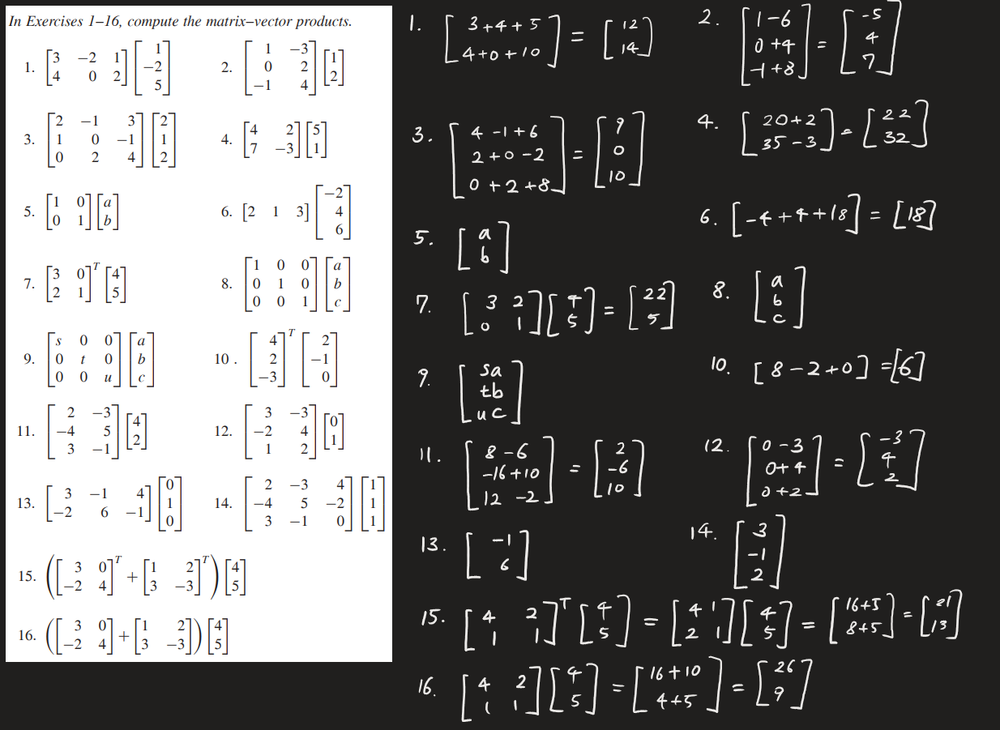
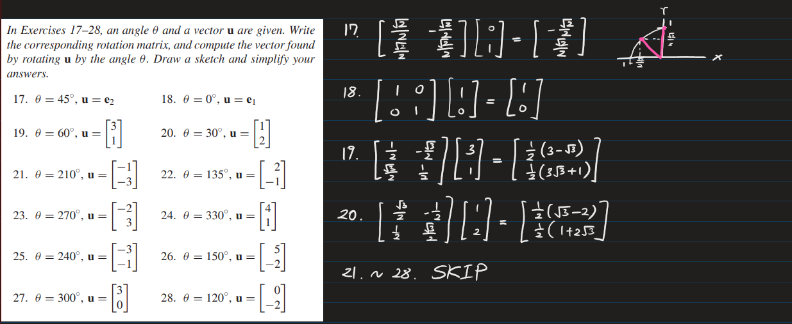
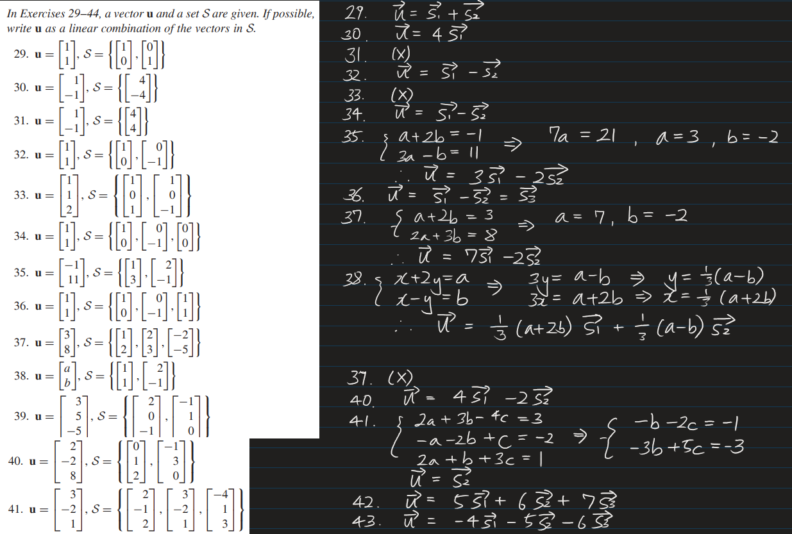
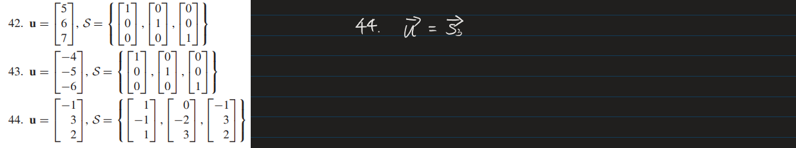
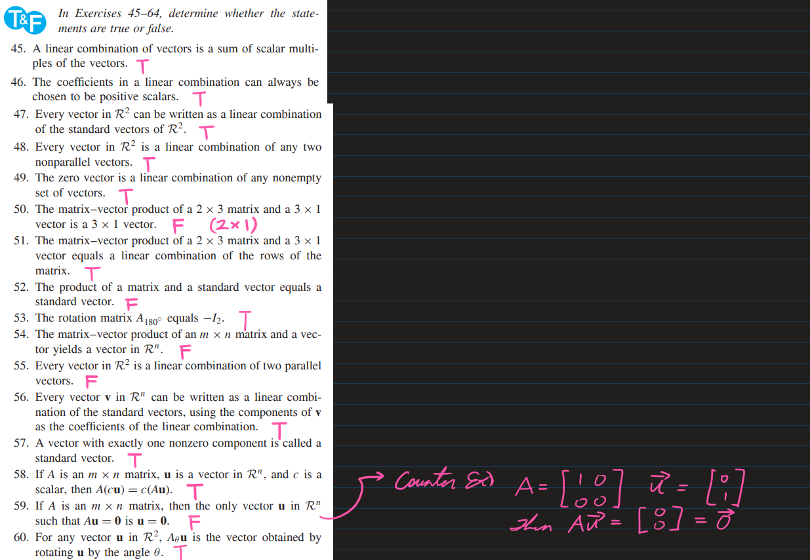
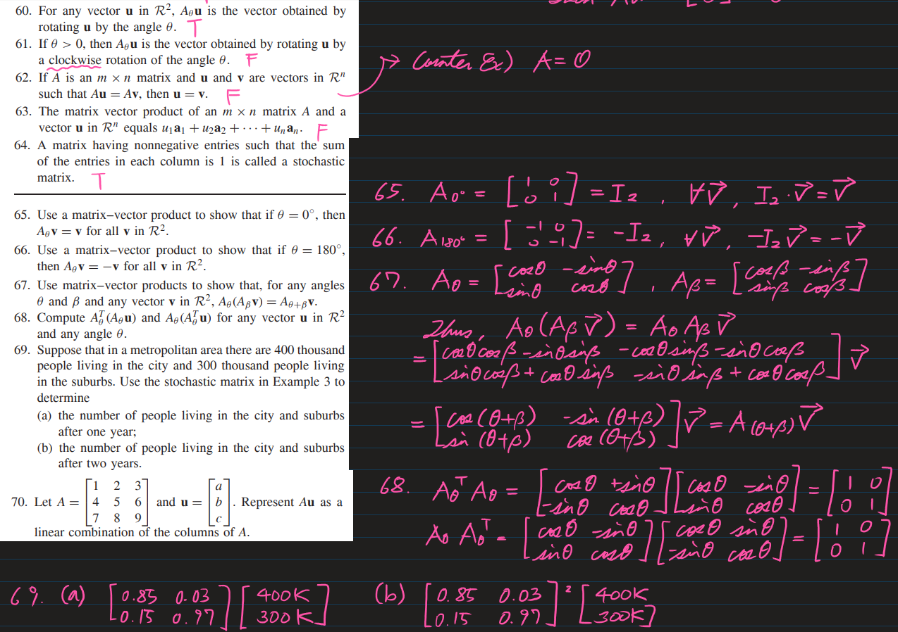
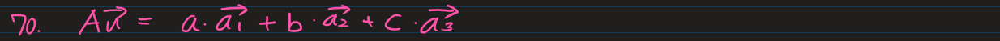
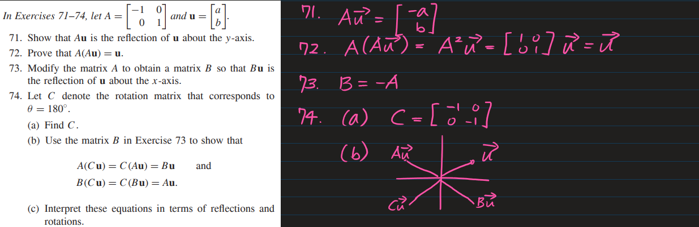
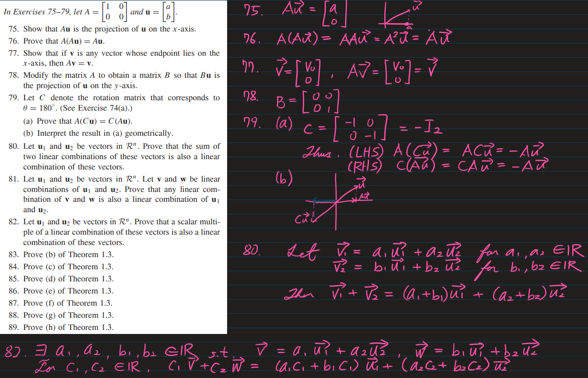
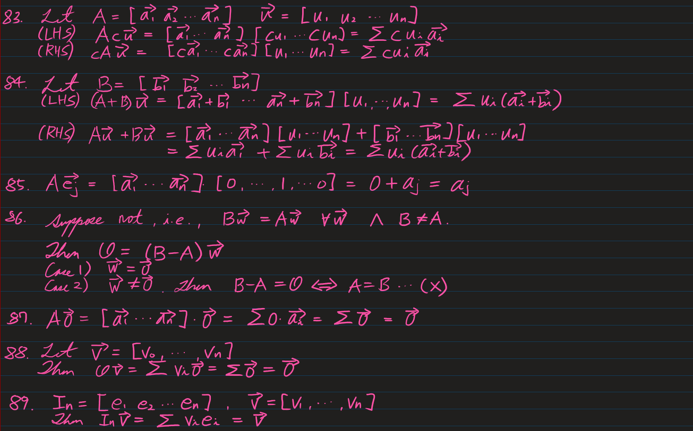
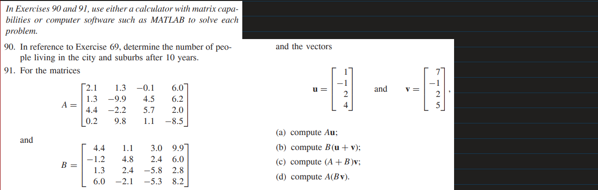

90.
```python
from library import *

stochastic_mat = [
    [.85, .03],
    [.15, .97],
]

population = [400000, 300000]

for i in range(10):
    population = matrix_vector_product(stochastic_mat, population)
    print('After {} year(s) : {}'.format(i+1, population))
```

91.
* library.py
  ```python
    from copy import deepcopy


    def matrix_vector_product(M, V):
        if len(M) != len(V):
            raise ValueError('Matrix Vector size miss')
        
        result = [0] * len(M)
        for i, row in enumerate(M):
            for j, v in enumerate(row):
                result[j] += v * V[i]
        
        return result


    def matrix_sum(M1, M2):
        result = deepcopy(M1)
        for i, row in enumerate(M2):
            for j, val in enumerate(row):
                result[i][j] += val
        
        return result


    def vector_sum(V1, V2):
        result = deepcopy(V1)
        for i, val in enumerate(V2):
            result[i] += val
        
        return result
  ```

* Sol.)
  ```python
    from library import *

    A = [
        [2.1, 1.3, -0.1, 6.0,],
        [1.3, -9.9, 4.5, 6.2,],
        [4.4, -2.2, 5.7, 2.0,],
        [0.2, 9.8, 1.1, -8.5,],
    ]

    B = [
        [4.4, 1.1, 3.0, 9.9,],
        [-1.2, 4.8, 2.4, 6.0,],
        [1.3, 2.4, -5.8, 2.8,],
        [6.0, -2.1, -5.3, 8.2,],
    ]

    u = [1, -1, 2, 4]
    v = [7, -1, 2, 5]

    print('(a) Au = {}'.format(matrix_vector_product(A, u)))
    print('(b) B(u+v) = {}'.format(matrix_vector_product(B, vector_sum(u, v))))
    print('(c) (A+B)v = {}'.format(matrix_vector_product(matrix_sum(A, B), v)))
    print('(d) A(Bv) = {}'.format(matrix_vector_product(A, matrix_vector_product(B, v))))
  ```


* [Back to the note](./note.md)