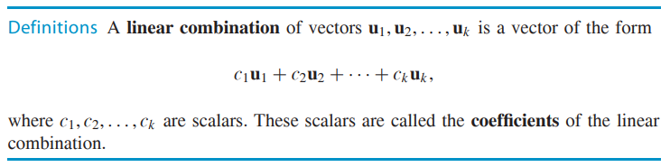
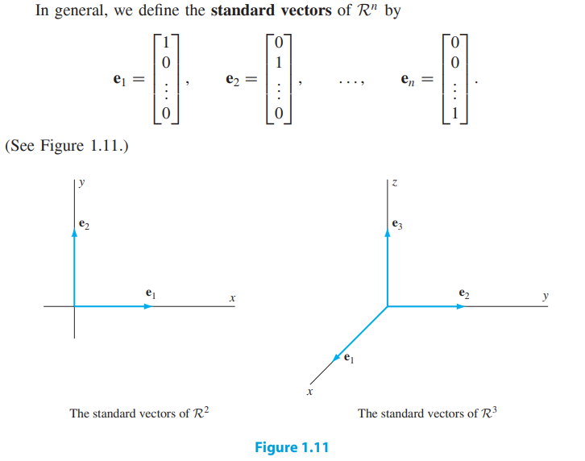
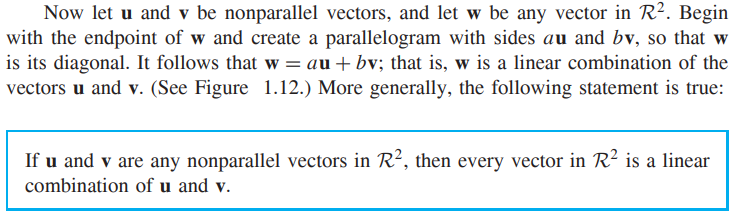
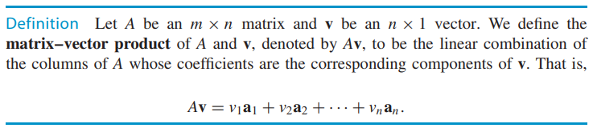
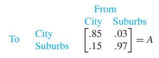
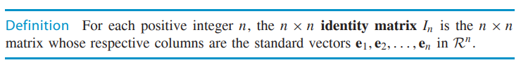
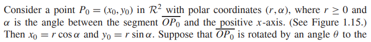
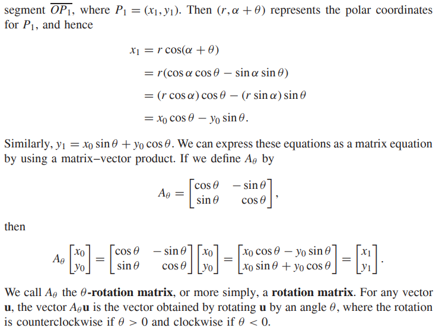
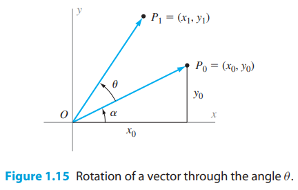
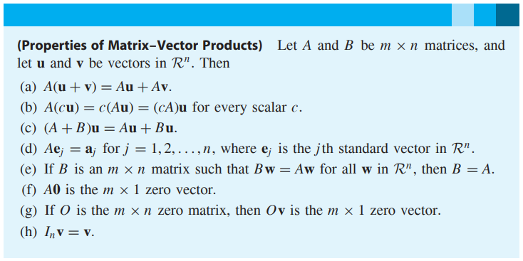

* [Back to Linear Algebra Main](../../../main.md)

# 1.2 Linear Combinations, Matrix–Vector Products, and Special Matrices

#### Def) Linear Combinations and coefficients

 

#### Def) Standard Vectors

 

#### Prop.)

 

#### Def) Matrix-Vector Product

  

#### Def) Stochastic Matrix
* A matrix that the entries are nonnegative and that the entries of each column sum to 1.
* ex)   
  

  

#### Def) Identity Matrix

  

#### Def) Rotation Matrix

  

#### Theorem 1.3) Properties of Matrix-Vector Products

### [Exercises 1.2](./exercises.md)

* [Back to Linear Algebra Main](../../../main.md)