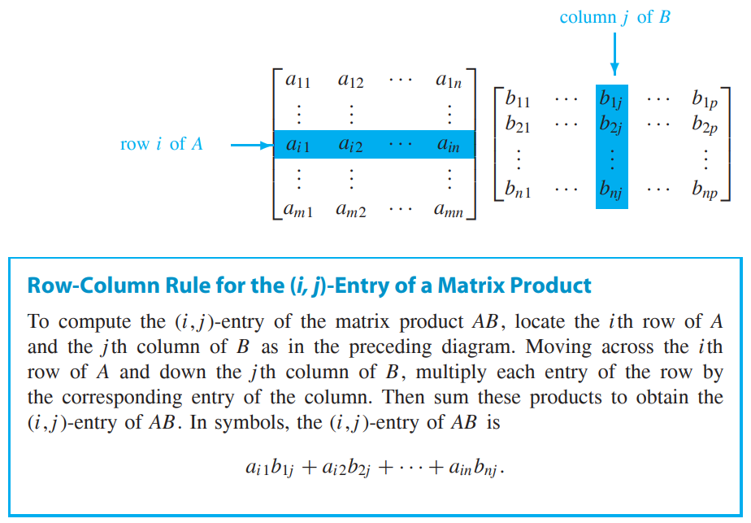
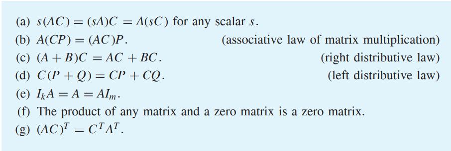

* [Back to Linear Algebra Main](../../../main.md)

# 2.1 Matrix Multiplication

#### Def.) Matrix Product

 

#### Prop.) Associated Law for the Product of Two Matrices

- cf.) Matrix Multiplication Is Not Commutative
  - i.e.) For arbitrary matrices $A$ and $B$, $AB$ need not equal $BA$.

 

#### Prop.) Row-Column Rule for the (i, j)-Entry of a Matrix Product

 

#### Theorem 2.1) 
   
   

 

#### Def.) Augmented Matrix
If $A$ and $B$ are matrices with the same number of rows, then we denote by $[A \space B]$
the matrix whose columns are the columns of $A$ followed by the columns of $B$, in
order. We call $[A \space B]$ an augmented matrix.
- Prop.)
  - If $P$ is an $m \times n$ matrix and $A$ and $B$ are matrices with $n$ rows, then $P[A \space B] = [PA \space PB]$.

 

#### Def.) Diagonal Matrix
A square matrix $A$ is called a diagonal matrix if all its nondiagonal entries are zeros.
- Props.)
  - All diagonal matrices are symmetric.
    - i.e.) $A^T = A$

### [Exercises 1.2](./exercises.md)

* [Back to Linear Algebra Main](../../../main.md)