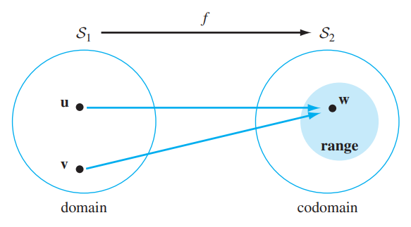
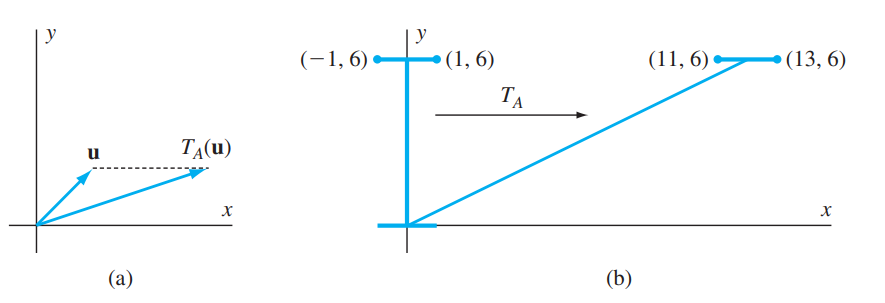

* [Back to Linear Algebra Main](../../../main.md)

# 2.7 Linear Transformations and Matrices

#### Def) Image, Domain, Codomain, and Range
   
   

 

#### Def) Matrix Transformation
   

 

#### Concept) Orthogonal Projection with Matrix Transformation
Let $`A = \left[ \begin{array}{ccc} 1&0&0\\0&1&0\\0&0&0 \end{array} \right]`$, $`u = \left[ \begin{array}{c} u_1\\u_2\\u_3 \end{array} \right]`$.   
Then, $T_A: R^3 \rightarrow R^3$ is defined by $`T_A\left(\left[ \begin{array}{c} x_1\\x_2\\x_3 \end{array} \right]\right)=\left[ \begin{array}{c} x_1\\x_2\\0 \end{array} \right]`$.   
Thus, $`T_A(u) = \left[ \begin{array}{c} u_1\\u_2\\0 \end{array} \right]`$, which is the orthogonal projection of $u$ on the $xy$-plane.

 

#### Concept) Shear Transformation
Let $k \in \mathbb{R}$, $`A=\left[\begin{array}{cc} 1&k\\0&1\end{array}\right]`$.   
Then $T_A: R^2 \rightarrow R^2$ is defined by $`T_A\left(\left[\begin{array}{c} x_1\\x_2 \end{array}\right]\right) = \left[\begin{array}{c} x_1+kx_2\\x_2 \end{array}\right]`$ and is called a shear transformation.   
   

 

#### Theorem 2.7)
    

 

#### Def) Linear Transformation
    
- cf.)
  - Identity Transformation : $I:R^n \rightarrow R^n$ which is defined by $I(x)=x$
  - Zero Transformation : $T_0:R^n \rightarrow R^n$ which is defined by $T_0(x)=0$

 

#### Theorem 2.8)
    

 

#### Theorem 2.9)
    

 

#### Concept) Standard Matrix
    

### [Exercises 2.7](./exercises.md)

* [Back to Linear Algebra Main](../../../main.md)