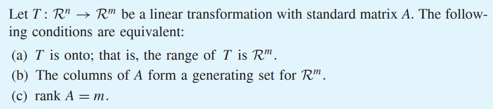
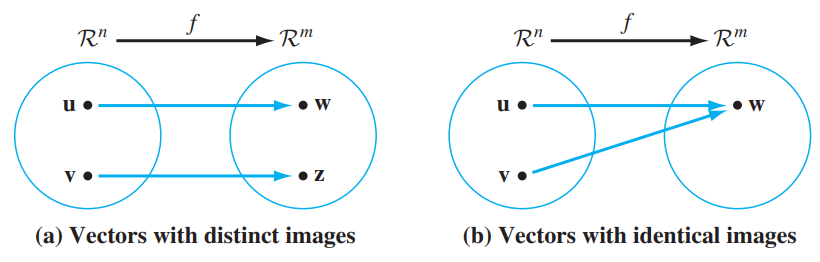
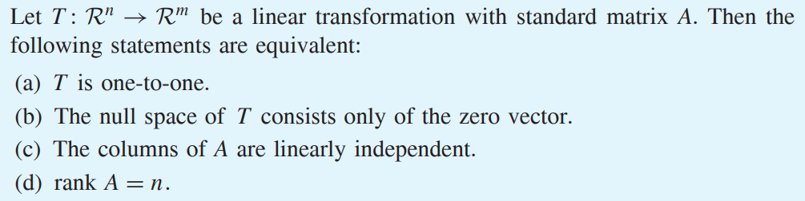
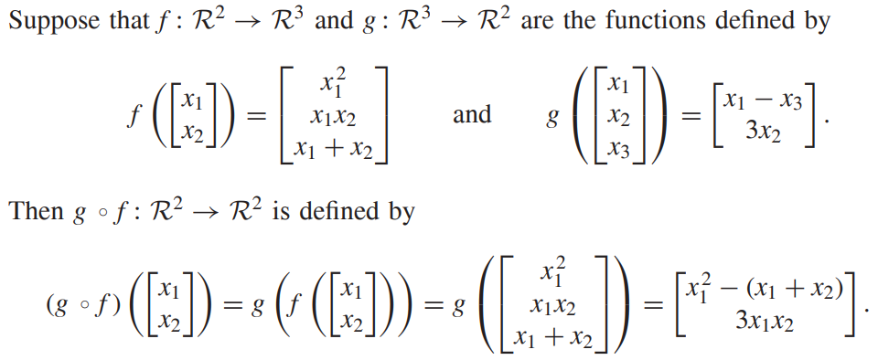
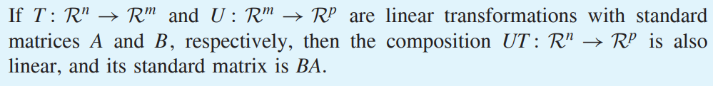
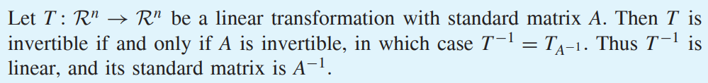
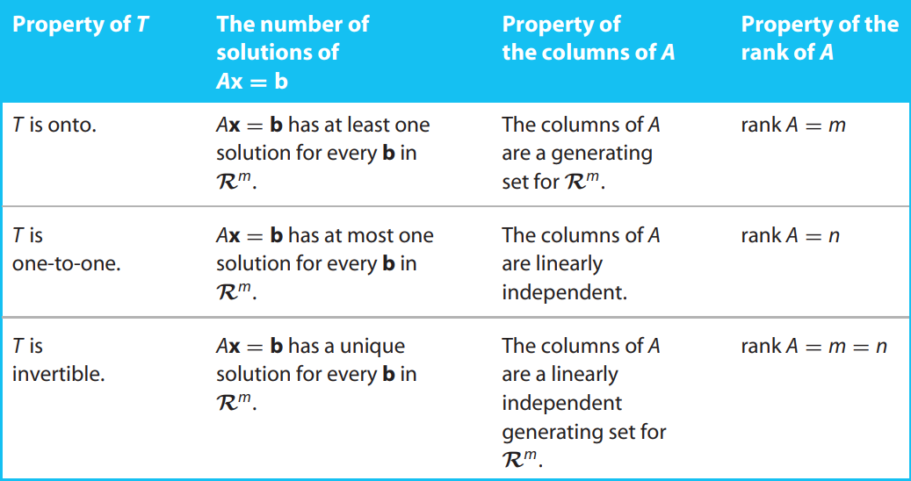

* [Back to Linear Algebra Main](../../../main.md)

# 2.8 Composition and Invertibility of Linear Transformation

## 2.8.1 Onto and One-To-One
#### Concept) The Range of a Linear Transformation
The range of a linear transformation equals the span of the columns of its standard matrix.
- e.g.)
  - Consider a linear transformation $T:\mathbb{R}^3\rightarrow\mathbb{R}^2$ such that $`T\left(\left[\begin{array}{c}x_1\\x_2\\x_3\end{array}\right]\right)=\left[\begin{array}{c}3x_1-4x_2\\2x_1+x_3\end{array}\right]`$.
  - Then the standard matrix of $T$ is $`A=\left[\begin{array}{ccc}T(e_1)&T(e_2)&T(e_3)\end{array}\right]=\left[\begin{array}{ccc}3&-4&0\\2&0&1\end{array}\right]`$.
  - Now $w$ is in the range of $T$ iff. $w=T(v), \exists v \in \mathbb{R}^3$.
  - Putting $v=v_1e_1+v_2e_2+v_3e_3$, 
    - $w=T(v)=T(v_1e_1+v_2e_2+v_3e_3)=v_1T(e_1)+v_2T(e_2)+v_3T(e_3)$.
  - Thus, $w$ is the span of the columns of $A$, which is the standard matrix of $T$.

  

#### Def.) Onto Function
A function $f : \mathbb{R}^n \rightarrow \mathbb{R}^m$ is said to be **onto** if its range is all of $\mathbb{R}^m$, that is, if every vector in $\mathbb{R}^m$ is an image.

 

#### Theorem 2.10)

 

#### Def.) One-To-One Function
A function $f : \mathbb{R}^n \rightarrow \mathbb{R}^m$ is said to be **one-to-one** if every pair of distinct vectors in $\mathbb{R}^n$ has distinct images. That is, if $u, v \in \mathbb{R}^n$ and $u \ne v$, then
$f(u)$ and $f(v)$ are distinct vectors in $\mathbb{R}^m$.

 

#### Def.) Null Space
Let $T:\mathbb{R}^n\rightarrow\mathbb{R}^m$ be linear.   
The **null space** of $T$ is a set of all $v \in \mathbb{R}^n$ such that $T(v)=0$.

 

#### Prop.) One-To-One and Null Space
A linear transformation is one-to-one if and only if its null space contains only $0$.
- why?)
  1. Suppose $T$ is one-to-one.
     - Considering that $T(0)=0$, $T(w) \ne T(0) = 0, w \ne 0$.
     - Thus, $0$ is the only element in its null space.
  2. Suppose $T$'s null space contains only $0$.
     - Then if $w \ne 0$, $T(w) \ne 0 = T(0)$.

 

#### Theorem 2.11)

  

## 2.8.2 Composition of Linear Transformations
#### Concept) Composition of Linear Transformations
- Def.)
  - Let
    - $f: S_1 \rightarrow S_2$
    - $g: S_2 \rightarrow S_3$
  - Then, the composition $g \circ f : S_1 \rightarrow S_3$ is defined by $(g \circ f)(u) = g(f(u)), \forall u \in S_1$
- Notation)
  - $\circ$ can be omitted.
    - $U \circ T \equiv UT$

- e.g.)   
  

 

### Theorem 2.12)

- pf.)
  - Suppose
    - $A \subset \lbrace\mathbb{R}^m\times\mathbb{R}^n\rbrace$ : a $m\times n$ matrix
    - $B \subset \lbrace\mathbb{R}^p\times\mathbb{R}^m\rbrace$ : a $p\times m$ matrix
    - $T_A:\mathbb{R}^n\rightarrow\mathbb{R}^m$ : a matrix transformation
    - $T_B:\mathbb{R}^m\rightarrow\mathbb{R}^p$ : a matrix transformation
    - $T_{AB}:\mathbb{R}^n\rightarrow\mathbb{R}^p$ : a matrix transformation
  - Then, $\forall v \in \mathbb{R}^n$
    - $T_{AB}(v)=(BA)v=B(Av)=B(T_A(v))=T_B(T_A(v))=T_BT_A(v)$

 

### Theorem 2.13)

- pf.)
  - Suppose $A$ is an invertible $n\times n$ matrix.
  - Then, $\forall v \in \mathbb{R}^n$
    - $T_AT_{A^{-1}}(v)=T_A(T_{A^{-1}}(v))=T_A(A^{-1}v)=AA^{-1}v=v$
  - By definition, ${T_A}^{-1}=T_{A^{-1}}$

 

### [Exercises 2.8](./exercises.md)

 

* [Back to Linear Algebra Main](../../../main.md)