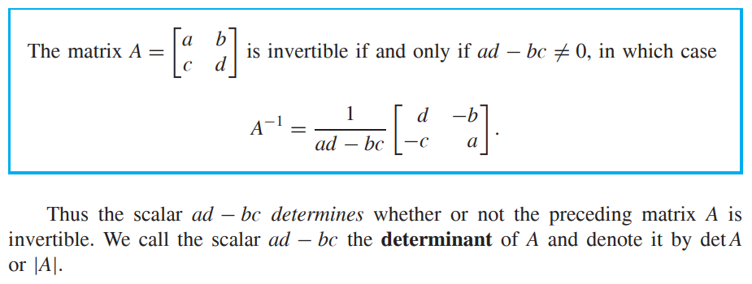
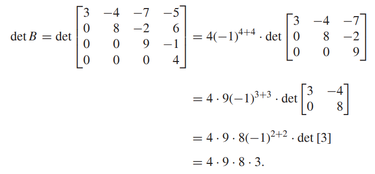
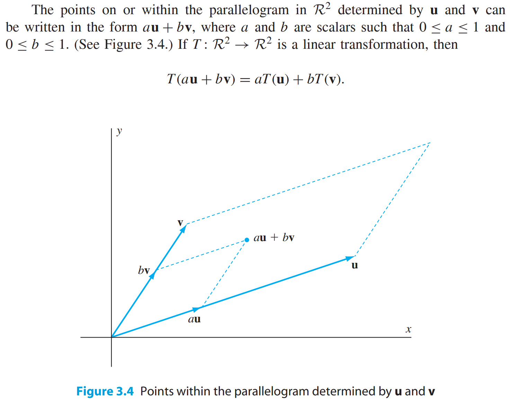

* [Back to Linear Algebra Main](../../../main.md)

# 3.1 Cofactor Expansion

#### Def.) Determinant of a 2 X 2 Matrix

 

#### Def.) Determinant of a n X n Matrix
- Let $A_{ij}$ be a $(n-1)\times(n-1)$ matrix obtained from $A$ by deleting row $i$ and column $j$.   
- Then the determinant of an $n \times n$ matrix $A$ for $n \ge 3$ by
  - $\det{A} = a_{11}\cdot\det{A_{11}}-a_{12}\cdot\det{A_{12}}+\cdots+(-1)^{n+1}a_{1n}\cdot\det{A_{1n}}$
    - where $a_{ij}$ is the $(i,j)$-th value of $A$.

 

#### Def.) Cofactor and the Cofactor Expansion
- Consider the determinant of an $n \times n$ matrix $A$ such that 
  - $\det{A} = a_{11}\cdot\det{A_{11}}-a_{12}\cdot\det{A_{12}}+\cdots+(-1)^{n+1}a_{1n}\cdot\det{A_{1n}}$
- The $(i,j)$-cofactor of $A$ is 
  - $c_{ij}=(-1)^{i+j}\cdot\det{A_{ij}}$.
- The Cofactor Expasion of $A$ along the $i$-th row is
  - $\det{A} = a_{i1}c_{i1}+a_{i2}c_{i2}+\cdots+a_{in}c_{in}$

 

#### Theorem 3.1)

 

#### Theorem 3.2)

- e.g.)
  

- Furthermore, $\det I_n = 1$
  
  

## Geometric Applications of the Determinant

### Concept) Area of Parallelogram and Determinant
The area of the parallelogram determined by $\mathbf{u}$ and $\mathbf{v}$ is $`\left| \det \left[\begin{array}{cc}\mathbf{u} & \mathbf{v}\end{array}\right]\right|`$.

How?)   
  

Consider that
1. $\det{AB} = \det{A}\det{B}, \forall A,B \in \mathbb{R}^{2\times 2}$
2. $\det{A_\theta}=1$ where $A_\theta$ is a rotation matrix.   

Then, $`\left| \det \left[\begin{array}{cc}\mathbf{u'} & \mathbf{v'}\end{array}\right]\right|`=\left| \det{A_\theta} \cdot \det{\left[\begin{array}{cc}\mathbf{u'} & \mathbf{v'}\end{array}\right]} \right|=\left| \det{A_\theta \left[\begin{array}{cc}\mathbf{u'} & \mathbf{v'}\end{array}\right]} \right|=\left| \det{\left[\begin{array}{cc}A_\theta\mathbf{u'} & A_\theta\mathbf{v'}\end{array}\right]} \right|=\left| \det \left[\begin{array}{cc}\mathbf{u} & \mathbf{v}\end{array}\right]\right|$

  

### Concept) Linear Transformation and Determinant
Let $T:\mathbb{R}^n \rightarrow \mathbb{R}^n$ is an invertible linear transformation with standard matrix $A$.   
If $R\subset \mathbb{R}^n$ is a sufficiently nice region, then the $n$-dimensional volume of the image of $R$ under $T$ equals $|\det{A}|$ times the $n$-dimensional volume of $R$.

#### e.g.) 2-dimensional example

- Desc.)
  - Then $`\left| \det \left[\begin{array}{cc}T(\mathbf{u}) & T(\mathbf{v})\end{array}\right]\right|=\left| \det \left[\begin{array}{cc}A\mathbf{u} & A\mathbf{v}\end{array}\right]\right|=\left| \det{A \left[\begin{array}{cc}\mathbf{u} & \mathbf{v}\end{array}\right]} \right|=\left| \det{A}|| \det{\left[\begin{array}{cc}\mathbf{u} & \mathbf{v}\end{array}\right]} \right|`$
    - where $A$ is the standard matrix of $T$.
  - Or, the area of the image parallelogram is $| \det A|$ times larger than that of the parallelogram determined by  $\mathbf{u}$ and  $\mathbf{v}$.

### [Exercises 3.1](./exercises.md)

* [Back to Linear Algebra Main](../../../main.md)