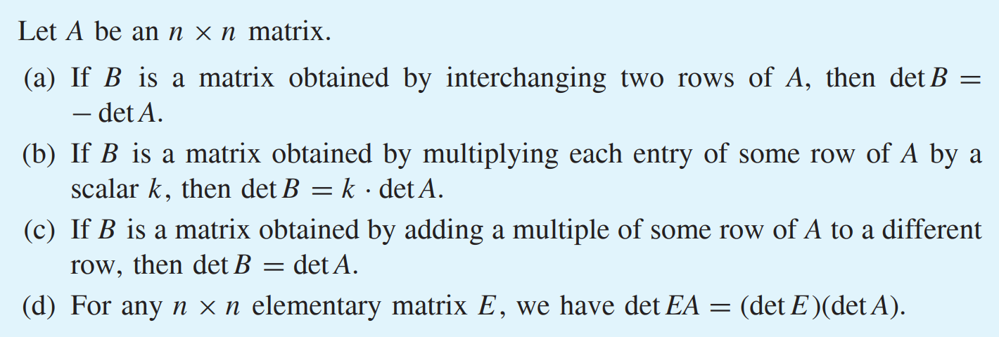
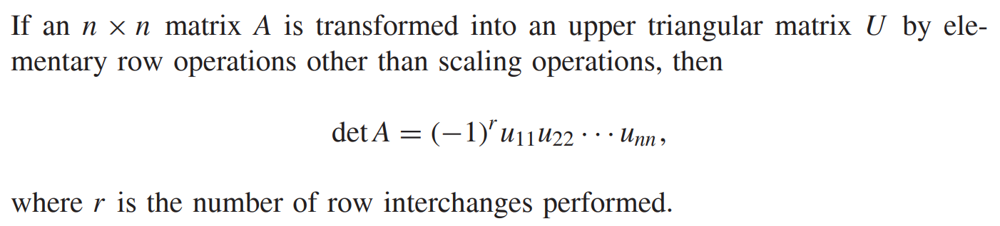
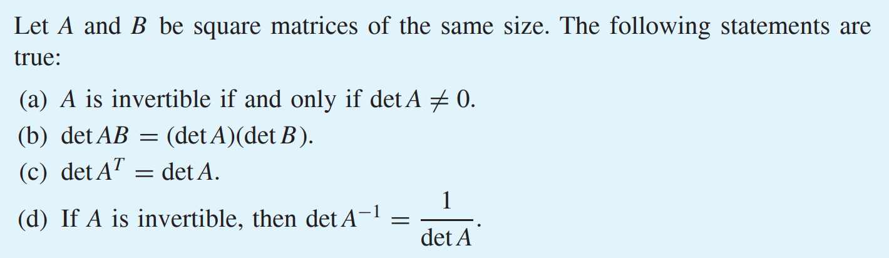
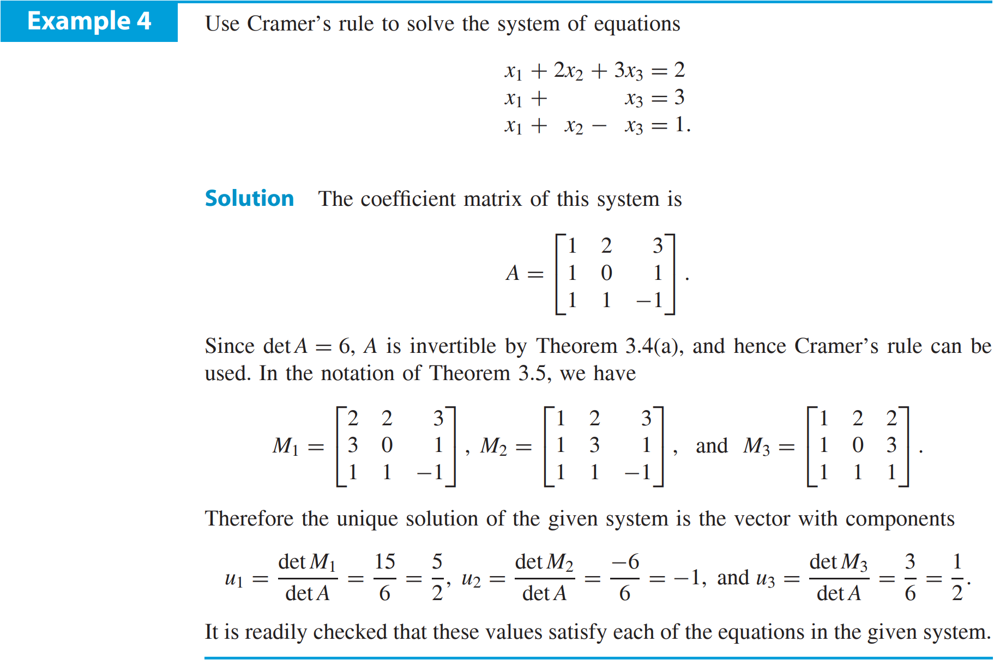

[Back to Linear Algebra Main](../../../main.md)

# 3.2 Properties of Determinants

#### Theorem 3.3)
   

 

#### Prop.)
   

  

## 3.2.1 Four Properties of Determinants
#### Theorem 3.4)
   

 

#### Theorem) Cramer's Rule
   
- e.g.)   
     

  

- [Exercises 3.2](./exercises.md)

  

[Back to Linear Algebra Main](../../../main.md)