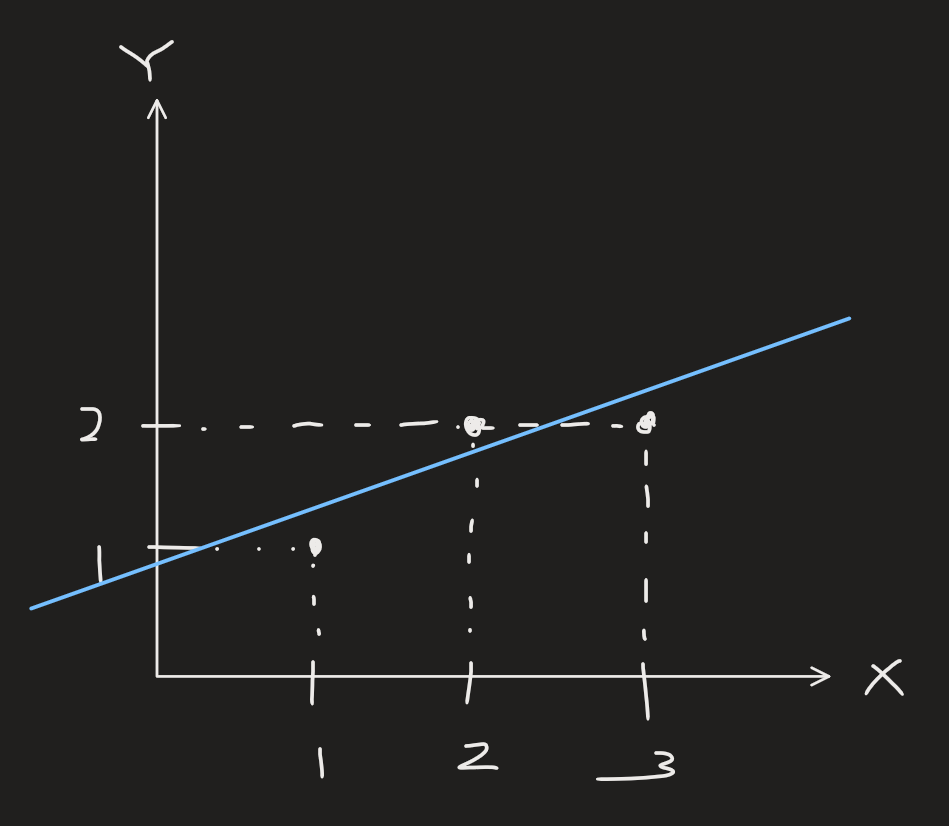

[Back to Linear Algebra main](../../main.md)

# 16. Projection Matrices and Least Squares / 17. Orthogonal Matrices and Gram-Schmidt
### Concept) Linear Regression
- e.g.)
  |Problem|Graphics|
  |:-|:-:|
  |- Consider the following three points : $`(1,1), (2,2), (2,3)`$  - We want to draw a line that best approximate them : $`\hat{y} = C + Dx`$|||
  - The system can be represented as   
    $`\begin{bmatrix} 1 & 1 \\ 1 & 2 \\ 1 & 3 \end{bmatrix}\begin{bmatrix} C \\ D \end{bmatrix} = \begin{bmatrix} 1 \\ 2 \\ 2 \end{bmatrix} : Ax = b`$
  - The above system is does not have solution.
  - Instead, using the [projection](1415.md#concept-projection-on-rn) we can derive $`p`$ that best approximates $`b`$
    - i.e.) Find $`p\in\mathbb{R}^2`$ s.t. $`A\hat{x} = p`$
      - We called this the projection of $`b`$ on $`A`$.
  - How?)
    - [Recall](1415.md#concept-projection-on-rn) that $`\hat{x} = (A^\top A)^{-1}(A^\top b)`$.
    - Since $`A`$ has independent columns, $`A^\top A`$ is non-singular.
    - Thus, $`(A^\top A)\hat{x} = (A^\top b)`$.
  - Using the above formula, we can derive $`\hat{x}`$ as   
    $`\begin{bmatrix} 1&1&1 \\ 1&2&3 \end{bmatrix} \begin{bmatrix} 1 & 1 \\ 1 & 2 \\ 1 & 3 \end{bmatrix} \begin{bmatrix} C \\ D \end{bmatrix} = \begin{bmatrix} 1&1&1 \\ 1&2&3 \end{bmatrix} \begin{bmatrix} 1 \\ 2 \\ 2 \end{bmatrix}`$   
    - which can be simplified as   
      $`\begin{aligned}
        \Rightarrow & \begin{bmatrix} 3 & 6 \\ 6 & 14 \end{bmatrix}\begin{bmatrix} C \\ D \end{bmatrix} = \begin{bmatrix} 5 \\ 11 \end{bmatrix} \\
        \Rightarrow & C = \frac{2}{3}, \quad D = \frac{1}{2}
      \end{aligned}`$   
  - $`\displaystyle \therefore \hat{y} = \frac{2}{3} + \frac{1}{2} x`$
    - cf.) 
      - Consider two equations w.r.t. $`C, D`$ : $`\begin{bmatrix} 3 & 6 \\ 6 & 14 \end{bmatrix}\begin{bmatrix} C \\ D \end{bmatrix} = \begin{bmatrix} 5 \\ 11 \end{bmatrix}`$.
      - They are the partial derivatives of the MSE loss.   
        - i.e.) $`\displaystyle \frac{\partial e}{\partial C} = 0, \frac{\partial e}{\partial D} = 0,`$     
        $`\begin{aligned}
            \text{where } e &= \sum_{i=1}^3 (\hat{y}_i-y_i)^2 \\ 
            &= (C+D-1)^2 + (C+2D-2)^2 + (C+2D-3)^2
        \end{aligned}`$
- Analysis)
  - We have   
    $`b = \begin{bmatrix} 1\\2\\2 \end{bmatrix}, p = \begin{bmatrix} 7/6\\5/3\\13/6 \end{bmatrix}, e = \begin{bmatrix} -1/6 \\ 2/6 \\ -1/6 \end{bmatrix}`$
  - Then...
    - $`b = p+e`$
      - $`\because b = \begin{bmatrix} 1\\2\\2 \end{bmatrix} = \begin{bmatrix} 7/6\\5/3\\13/6 \end{bmatrix}+\begin{bmatrix} -1/6 \\ 2/6 \\ -1/6 \end{bmatrix} = p+e`$
    - $`p \in C(A)`$
      - $`\displaystyle\because A\hat{x} = \begin{bmatrix} 1 & 1 \\ 1 & 2 \\ 1 & 3 \end{bmatrix}\begin{bmatrix} \hat{C} \\ \hat{D} \end{bmatrix} = \begin{bmatrix} 1 & 1 \\ 1 & 2 \\ 1 & 3 \end{bmatrix}\begin{bmatrix} \frac{2}{3} \\ \frac{1}{2} \end{bmatrix} = \underbrace{\frac{2}{3} \begin{bmatrix} 1 \\ 1 \\ 1 \end{bmatrix} + \frac{1}{2}\begin{bmatrix} 1 \\ 2 \\ 3 \end{bmatrix}}_{\in C(A)} = \begin{bmatrix} 7/6\\5/3\\13/6 \end{bmatrix} = p`$
    - $`e \perp C(A)`$
      - $`\because A^\top e = \begin{bmatrix} 1&1&1 \\ 1&2&3 \end{bmatrix} \begin{bmatrix} -1/6 \\ 2/6 \\ -1/6 \end{bmatrix} = \begin{bmatrix} 0\\0 \end{bmatrix}`$

 

### Concept) Orthonormal Vectors
- Def.)
  - $`q_i^\top \cdot q_j = \begin{cases}
    0 & \text{if } i\ne j \quad (\text{i.e. Orthogonal!}) \\
    1 & \text{if } i=j  \quad (\text{i.e. } \Vert q_i \Vert^2 = 1 \Leftrightarrow \text{Unit Vector (Normalized!)})
  \end{cases}`$ 
  - i.e.) Orthogonal Unit Vectors!
- Why needed?)
  - Simplifies the problem.
  - No over/underflow!

 

### Concept) Orthogonal Matrix (Orthonormal Matrix)
- Def.)
  - $`Q = \begin{bmatrix} q_1 & q_2 & \cdots & q_n \end{bmatrix}`$ where $`q_i`$ is an [orthonormal vector](#concept-orthonormal-vectors).
    - cf.) Conventionally, $`Q \in\mathbb{R}^{n\times n}`$ but not necessar y.
- Prop.)
  - $`Q^\top Q = I_n`$
    - i.e.) $`Q^\top = Q^{-1}`$
  - The projection matrix on $`Q`$ is $`I`$ if $`Q`$ is a square matrix.
    - Pf.)
      - Recall that $`P = Q(Q^\top Q)^{-1}Q^\top = QQ^\top = I`$

 

### Concept) Gram-Schmidt Process
- Goal)
  - Making a matrix [orthonormal](#concept-orthonormal-vectors)!
- How?)
  - Two vector case)
    - Suppose we have two independent vectors $`a, b\in\mathbb{R}^n`$.
      - Then the initial matrix is $`\begin{bmatrix} a & b \end{bmatrix}`$.
    - Find $`A, B`$ s.t. $`A\perp B`$.
      - Let $`a = A`$.
      - Then, we can get $`\displaystyle B = b - \text{proj}_A(b) = b - \left(\frac{A^\top b}{A^\top A}\right)A`$
    - Normalize them into $`\frac{A}{\Vert A\Vert}, \frac{B}{\Vert B \Vert}`$
    - Finally, $`\begin{bmatrix} a & b \end{bmatrix} \rightarrow \begin{bmatrix} \frac{A}{\Vert A\Vert} & \frac{B}{\Vert B \Vert} \end{bmatrix} = Q`$
  - Three vector case)
    - Suppose we have two independent vectors $`a, b, c\in\mathbb{R}^n`$.
      - Then the initial matrix is $`\begin{bmatrix} a & b & c \end{bmatrix}`$.
    - Find $`A, B`$ s.t. $`A\perp B`$.
      - Referring to the two vector case, we have   
        $`\begin{cases}
            A = a \\
            B = b - \left(\displaystyle\frac{A^\top b}{A^\top A}\right)A
        \end{cases}`$
    - Find $`C`$ s.t. $`A\perp C \wedge B\perp C`$.
      - WLOG, we may get   
        $`\displaystyle C = c - \left(\frac{A^\top c}{A^\top A}\right)A - \left(\frac{B^\top c}{B^\top B}\right)B`$
    - Normalize them into $`\frac{A}{\Vert A\Vert}, \frac{B}{\Vert B \Vert}, \frac{C}{\Vert C \Vert}`$
    - Finally, $`\begin{bmatrix} a & b & c \end{bmatrix} \rightarrow \begin{bmatrix} \frac{A}{\Vert A\Vert} & \frac{B}{\Vert B \Vert} & \frac{C}{\Vert C \Vert} \end{bmatrix} = Q`$
- Prop.)
  - Suppose we derived orthonormal matrix $`Q`$ from A.
    - Then $`\exist R`$ an upper triangular matrix s.t. $`A = QR`$
      - Why?)
        - Put $`A = \begin{bmatrix} a_1 & \cdots & a_n \end{bmatrix}`$, $`Q = \begin{bmatrix} q_1 & \cdots & q_n \end{bmatrix}`$
        - Recall that $`Q^{-1} = Q^\top`$.
        - Thus,   
          $`\begin{aligned}
            R 
            &= Q^{-1} A = Q^\top A \\
            &= \begin{bmatrix} q_1 \\ \vdots \\ q_n \end{bmatrix}\begin{bmatrix} a_1 & \cdots & a_n \end{bmatrix} \\
            &= \begin{bmatrix} q_1\cdot a_1 & q_1\cdot a_2 & \cdots & q_1\cdot a_n \\ q_2\cdot a_1 & q_2\cdot a_2 & \cdots & q_2\cdot a_n \\ \vdots & \vdots & \ddots & \vdots \\ q_n\cdot a_1 & q_n\cdot a_2 & \cdots & q_n\cdot a_n \\ \end{bmatrix} \\
            &= \begin{bmatrix} q_1\cdot a_1 & q_1\cdot a_2 & \cdots & q_1\cdot a_n \\ 0 & q_2\cdot a_2 & \cdots & q_2\cdot a_n \\ \vdots & \vdots & \ddots & \vdots \\ 0 & 0 & \cdots & q_n\cdot a_n \\ \end{bmatrix} & (\because q_i \perp a_j, i\lt j)
          \end{aligned}`$

 

[Back to Linear Algebra main](../../main.md)