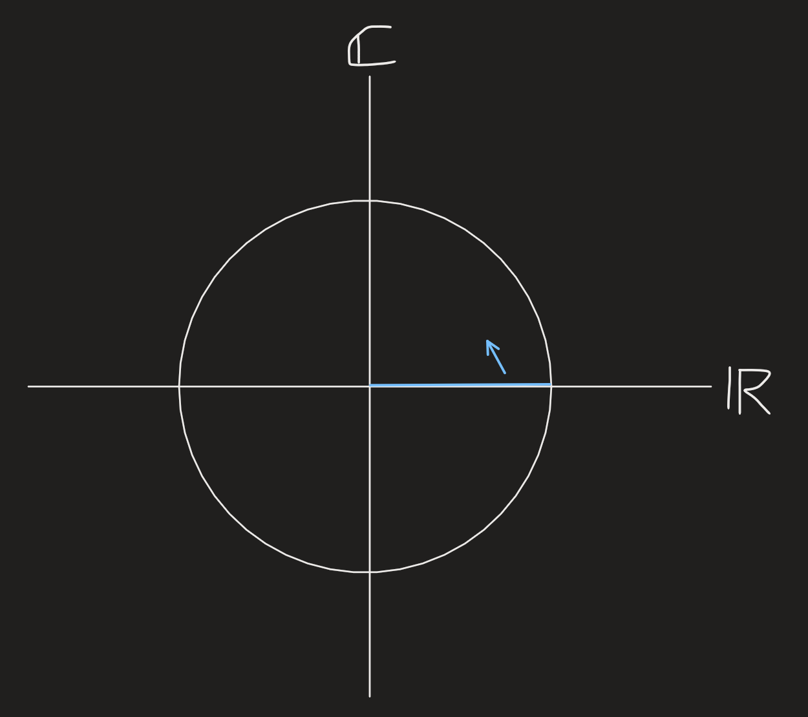
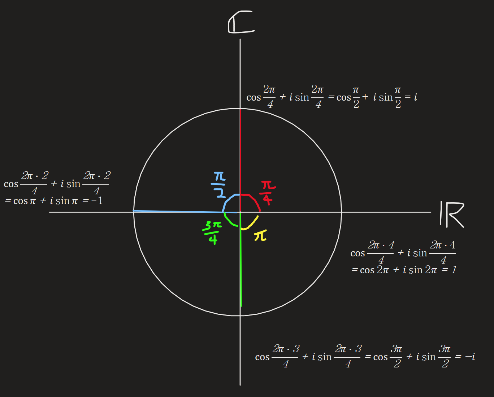
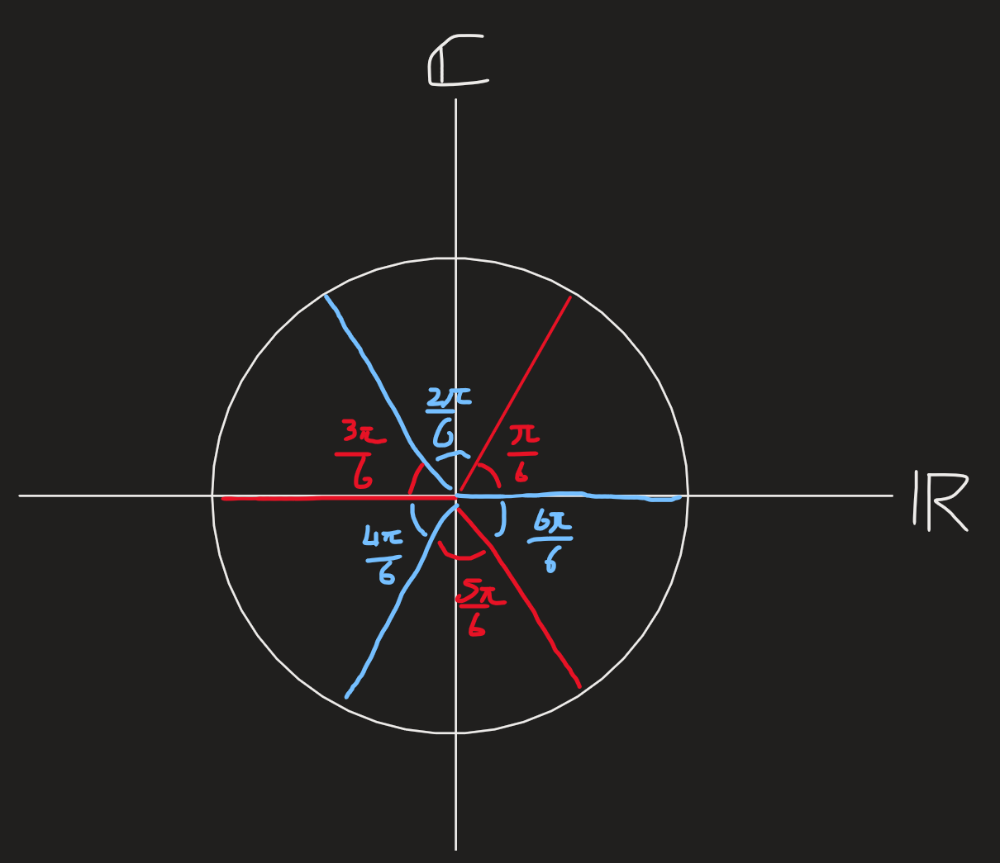

[Back to Linear Algebra main](../../main.md)

# 25. Symmetric Matrices and Positive Definiteness / 26. Complex Matrices; Fast Fourier Transform
### Concept) Symmetric Matrix
- Def.)
  - $`A = A^\top`$
- Prop.)
  - The eigenvalues are real.
  - The eigenvectors are perpendicular (orthogonal).
  - Diagonalization : $`A = Q\Lambda Q^\top`$
    - Why?)
      - Recall that the diagonalization of a usual matrix goes $`A = S\Lambda S^{-1}`$.
      - Here, $`S`$ was the matrix that columns were the eigenvectors of $`A`$.
      - For the symmetric matrix, each eigenvectors are orthogonal.
      - By choosing the ones that have unit sizes, we can have $`Q`$ with orthonormal vectors.
        - i.e.) $`\exists Q\in\mathbb{R}^{n\times n}$ s.t. $`A=Q\Lambda Q^{-1} \wedge Q\text{ is orthonormal.}`$
      - Also, recall that $`Q^{-1} = Q^\top.`$
      - Therefore, $`A = Q\Lambda Q^\top`$
  - Every symmetric matrix is a combination of perpendicular projection matrices.
    - Why?)
      - Consider that   
        $`\begin{aligned}
            A &= Q\Lambda Q^\top \\
            &= \begin{bmatrix} q_1&q_2&\cdots&q_n \end{bmatrix} \begin{bmatrix} \lambda_1 & 0 & \cdots & 0 \\ 0 & \lambda_2 & \cdots & 0 \\ \vdots & \vdots & \ddots & \vdots \\ 0 & 0 & \cdots \lambda_n \end{bmatrix} \begin{bmatrix} q_1^\top \\ q_2^\top \\  \vdots \\ q_n^\top \\  \end{bmatrix} \\
            &= \sum_{i=1}^n \lambda_i q_i q_i^\top
        \end{aligned}`$
      - Here, $`q_i q_i^\top\in\mathbb{R}^{n\times n}`$ was the projection matrix on the $`i`$-th basis.
    - Signs of pivots are same as signs of $`\lambda`$'s pivots.

 

### Concept) Positive Definite Matrix
- Def.)
  - For a [symmetric matrix](#concept-symmetric-matrix) $`A\in\mathbb{R}^{n\times n}`$
    - $`A`$ is positive definite iff. 
      - all eigenvalues of $`A`$ are positive.
      - all pivots are positive.
        - How to check?)
          - Recall that $`\det A = \prod_{i=1}^n \lambda_i`$.
          - We can find the sign with this.
- Prop.)
  - $`\det A \gt 0`$
  - All subdeterminants are positive.
    - e.g.) For $`\begin{bmatrix} 5&2\\2&3 \end{bmatrix}$, the subdeterminants are $`\vert 5\vert \text{ and } \left\vert\begin{matrix} 5&2\\2&3 \end{matrix}\right\vert`$

 

### Concept) Complex Vector
- Def.)
  - $`z = \begin{bmatrix}
    z_1 \\ z_2 \\ \vdots \\ z_n
  \end{bmatrix}\in\mathbb{C}^n`$
- Prop.)
  - $`z^H x \equiv \bar{z}^\top x`$ is the inner product where $`z^H`$ is the [Hermitian](#concept-hermitian-h) of $`z`$.
    - Why?)
      - Recall that the inner product of a real vector was the length.
      - In the complex vector case, $`z^\top z`$ does not properly denote the length.
        - $`\bar{z}^\top z = \begin{bmatrix} a_1^2 + b_2^2 \\ \vdots \\ a_n^2 + b_n^2 \end{bmatrix}`$, $`z^\top z = \begin{bmatrix} a_1^2 - b_2^2 \\ \vdots \\ a_n^2 - b_n^2 \end{bmatrix}`$

 

### Concept) Complex Matrix
- Def.)
  - $`A\in\mathbb{C}^{n\times n}`$
- Prop.)
  - The symmetric matrix is defined by the [Hermitian matrix](#concept-hermitian-h)
    - $`A = A^H \equiv \overline{A}^\top`$

 

#### Concept) Conjugate
- Def.)
  - Let $`c=a + bi \in\mathbb{C}`$
    - Then the conjugate of $`c`$ is denoted by $`\overline{c} = a-bi`$

 

### Concept) Hermitian (H)
- Hermitian Vector
  - For a [complex vector](#concept-complex-vector) $`z = \begin{bmatrix}
    z_1 \\ z_2 \\ \vdots \\ z_n
  \end{bmatrix}\in\mathbb{C}^n`$, 
    - The Hermitian of $`z`$ is denoted by $`z^H = \begin{bmatrix}
    \overline{z_1} \\ \overline{z_3} \\ \vdots \\ \overline{z_n}
  \end{bmatrix}\in\mathbb{C}^n`$
      - i.e.) the elements are the [conjugates](#concept-conjugate) of the original.
- Hermitian Matrix
  - For a [complex matrix](#concept-complex-matrix) $`A\in\mathbb{C}^{n\times n}`$
    - The Hermitian of $`A`$ is denoted by $`A^H = \left[{A^H}_{jk}\right] = \left[\;\overline{A_{jk}} \;\right]`$
      - i.e.) the elements are the [conjugates](#concept-conjugate) of the original.

 

### Concept) Perpendicularity of Complex Vectors
- Def.)
  - Complex vector $`q_i`$ and $`q_j`$ are perpendicular iff. $`q_i^H q_j = \begin{cases}
        0 & \text{if } i\ne j \\ 1 & \text{if } i=j
    \end{cases}`$
    - where $`q_i^H`$ is the [Hermitian](#concept-hermitian-h) of $`q_i`$.

 

### Concept) Fourier Matrix
- Def.)
  - $`F_n = \begin{bmatrix}
    1 & 1 & 1 & \cdots & 1 \\
    1 & w & w^2 & \cdots & w^{n-1} \\
    1 & w^2 & w^4 & \cdots & w^{2(n-1)} \\
    \vdots & \vdots & \vdots & \ddots & \vdots \\
    1 & w^n & w^{2(n-1)} & \cdots & w^{(n-1)^2} \\
  \end{bmatrix} = \left[ w^{ij} \right]`$ for $`i,j = 0,1,\cdots, n-1`$
    - where    
      $`\begin{aligned}
        w &= e^{\frac{i 2\pi}{n}} \\
        &= \cos{\frac{2\pi}{n}} + i\sin{\frac{2\pi}{n}}
      \end{aligned}`$
- Interpretation)   
  |Consider the following coordinate between Real and Imaginary numbers.|
  |:-|
  ||

  |$`F_4`$ case|$`F_6`$ case|
  |:-:|:-:|
  |||
  |$`\begin{cases} w = i \\ w^2 = -1 \\ w^3 = -i \\ w^4 = 1 \end{cases} \Rightarrow F_4 = \begin{bmatrix} 1 & 1 & 1 & 1 \\ 1 & i & -1 & -i \\ 1 & -1 & 1 & -1 \\ 1 & -i & -1 & i \end{bmatrix}`$||
- Prop.)
  - Columns of $`F_n`$ are orthogonal.
    - e.g.) Consider the $`F_4`$ case.   
      $`F_4 = \begin{bmatrix} 1 & 1 & 1 & 1 \\ 1 & i & -1 & -i \\ 1 & -1 & 1 & -1 \\ 1 & -i & -1 & i \end{bmatrix}`$
      - Then the inner product between $`f_1`$ and $`f_2`$ goes   
        $`f_1^H f_2 = \begin{bmatrix} 1&1&1&1 \end{bmatrix} \begin{bmatrix} 1\\i\\-1\\-i \end{bmatrix} = 0`$
      - Then the inner product between $`f_2`$ and $`f_3`$ goes   
        $`f_2^H f_3 = \begin{bmatrix} 1 & i & -1 & -i \end{bmatrix}^H \begin{bmatrix} 1\\-1\\1\\-1 \end{bmatrix} = \begin{bmatrix} 1 & -i & -1 & i \end{bmatrix} \begin{bmatrix} 1\\-1\\1\\-1 \end{bmatrix} = 0`$
      - And so on...
  - Orthonormal Form : $`\displaystyle \frac{1}{\sqrt{n}} F_n`$
    - Then, $`F_n^H F_n = I_n`$

 

### Concept) Fast Fourier Transformation (FFT)
- $`F_{2n} = \begin{bmatrix} I_n & D_n \\ I_n & -D_n \end{bmatrix} \begin{bmatrix} F_n & 0  \\ 0 & F_n\end{bmatrix} P_{2n} `$
  - where    
    $`D_n = \begin{bmatrix}
      1 & 0 & 0 & \cdots & 0 \\
      0 & w & 0 & \cdots & 0 \\
      0 & 0 & w^2 & \cdots & 0 \\
      \vdots & \vdots & \vdots & \ddots & \vdots \\
      0 & 0 & 0 & \cdots & w^{n-1} \\
    \end{bmatrix}`$ : the twiddle factors   
    $`P_{2n} = \begin{bmatrix} 1 & 0 & 0 & 0 & \cdots & 0 & 0 \\ 0 & 0 & 1 & 0 & \cdots & 0 & 0 \\ \vdots & \vdots & \vdots & \vdots & \ddots & \vdots & \vdots \\ 0 & 0 & 0 & 0 & \cdots & 1 & 0 \\ 0 & 1 & 0 & 0 & \cdots & 0 & 0 \\ 0 & 0 & 0 & 1 & \cdots & 0 & 0 \\ \vdots & \vdots & \vdots & \vdots & \ddots & \vdots & \vdots \\ 0 & 0 & 0 & 0 & \cdots & 0 & 1 \end{bmatrix}\begin{matrix} \left. \begin{matrix} \\ \\ \\ \\ \end{matrix} \right\rbrace{n\text{ odd columns }} \\ \left. \begin{matrix} \\ \\ \\ \\ \end{matrix} \right\rbrace{n\text{ even columns}} \end{matrix}`$ : the permutation matrix
- This can be recursively applied as    
  $`\begin{aligned}
    F_{4n} &= \begin{bmatrix} I_{2n} & D_{2n} \\ I_{2n} & -D_{2n} \end{bmatrix} \begin{bmatrix} F_{2n} & 0  \\ 0 & F_{2n}\end{bmatrix} P_{4n} \\
    &= \begin{bmatrix} I_{2n} & D_{2n} \\ I_{2n} & -D_{2n} \end{bmatrix} 
    \begin{bmatrix} \begin{matrix} I_n & D_n \\ I_n & -D_n \end{matrix} & 0 \\ 0 & \begin{matrix} I_n & D_n \\ I_n & -D_n \end{matrix} \end{bmatrix} 
    \begin{bmatrix} \begin{matrix} F_n & 0  \\ 0 & F_n \end{matrix} & 0 \\ 0 & \begin{matrix} F_n & 0  \\ 0 & F_n \end{matrix} \end{bmatrix} 
    \begin{bmatrix} P_{2n} & 0 \\ 0 & P_{2n} \end{bmatrix} 
    P_{4n} \\
    &= \cdots
  \end{aligned}`$
- By doing this, the matrix multiplication can be done in $`O(n\log_2n)`$ time.
  - If not, it will be $`O(n^2)`$

 

[Back to Linear Algebra main](../../main.md)