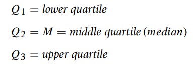
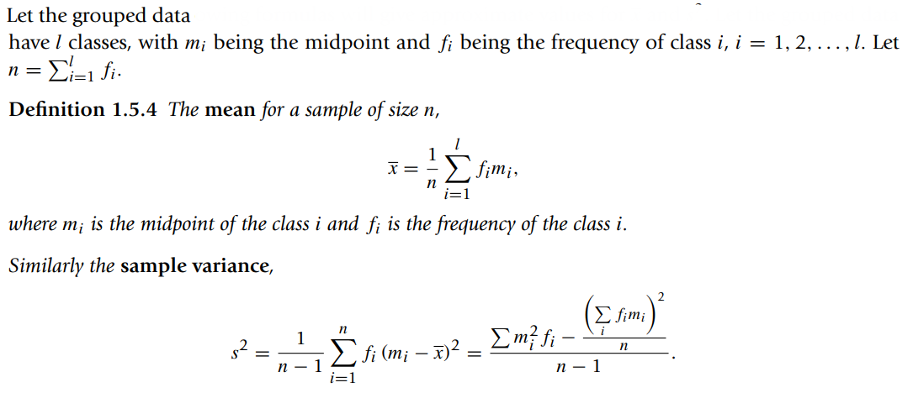
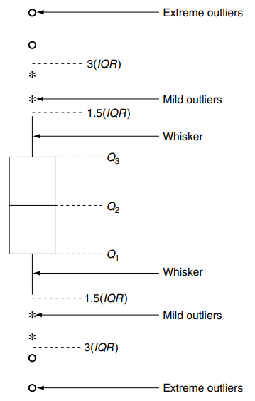

* [Back to Statistics Main](../../main.md)

## 1.5 Numerical Representation of Data
* Situation
  * Data in our own sample

#### Concept) Sample Mean & Sample Variance & Sample Standard Deviation

* Prop)
  * Mean is greatly affected by the extreme values or outliers.
    * cf) $100\alpha$% Trimmed Mean
      * For $0\le\alpha\le1$...
      * Order the data
      * Discard the lowest 100α% and the highest 100α% of the data values. 
      * Find the mean of the rest of the data values.
  * Alternatives of Standard Deviation
    * [Interquartile Range(IQR)](#concept-median--upperlower-quartile)
    * Average Deviation
    * 

 

#### Theorem 1.5.1

 

#### Concept) Median & Upper/Lower Quartile
* Def)
  * Median : the middle number of the ordered data set
    * If the data set has an even number of elements, then the median is the **average** of the middle two numbers
  * Lower quartile : the middle number of the half of the data below the median
  * Upper quartile is the middle number of the half of the data above the median
    
  * Interquartile Range (IQR) : The difference between the quartiles
    * A Possible Outlier (mild outlier)
      * Below $Q_1 - 1.5(IQR)$ 
      * Above $Q3 + 1.5(IQR)$
    *  IQR is unaffected by the positions of those observations in the smallest 25% or the largest 25% of the data.

 

#### Concept) Mode
* Def) The most frequently occurring member of the data set
  * If all the data values are different, then by definition, the data set has no mode.

  

### 1.5.1 Numerical Measures for Grouped Data
* Situation
  * Data are grouped in the form of a frequency table.
  * We do not have individual data values.
* Note
  * **Numerical Measures for Grouped Data** are only approximations to the actual values of the ungrouped data if they are available.

 

#### Def) Grouped Data Mean & Sample Variance

* Consider that exact value of each data point is not given.
* All we have are the mid-values and the frequencies of each class.
* [Example](images/01_05_06.png)

 

#### Def) Median for Grouped Data
* Settings)
  * $L$ : lower class limit of the interval that contains the median
  * $n$ : total frequency
  * $F_b$ : cumulative frequencies for all classes before the median class
  * $f_m$ : frequency of the class interval containing the median
  * $w$ : interval width of the interval that contains the median
* Then, the median $M=L+{w \over f_m}(0.5n-F_b)$

 

#### Prop.) Standard Deviation and the Bell-Shaped Curve

 

  

### 1.5.2 Box Plots
#### Prop.)
* Box Plots describes...
  * the center
  * the spread
  * the extent and nature of any departure from symmetry
  * identification of outliers
  

  

### [Exercises 1.5](./exercises.md)

  

* [Back to Statistics Main](../../main.md)