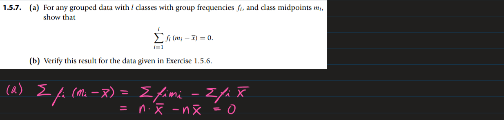
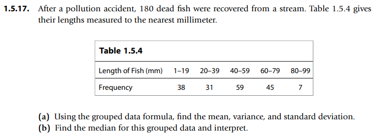

* [Back to the note](../note.md)

 

#### [Library Implemented](./scripts/library.py)

 

* [Sol](./scripts/ex01_05_001.py)

 

* [Sol](./scripts/ex01_05_002.py)

 

 

* [Sol](./scripts/ex01_05_004.py)

 

* [Sol](./scripts/ex01_05_005.py)

 

* [Sol](./scripts/ex01_05_006.py)
  
 

* [Sol](./scripts/ex01_05_007.py)
  
 

(b) [Sol](./scripts/ex01_05_008.py)

 

* [Sol](./scripts/ex01_05_009.py)

 

* [Sol](./scripts/ex01_05_010.py)

 

 

* [Sol](./scripts/ex01_05_012.py)

 

* [Sol](./scripts/ex01_05_013.py)

 

* [Sol](./scripts/ex01_05_014.py)

 

* [Sol](./scripts/ex01_05_015.py)

 
 

* [Sol](./scripts/ex01_05_016.py)

 
 

* [Sol](./scripts/ex01_05_017.py)

 

* [Back to the note](../note.md)