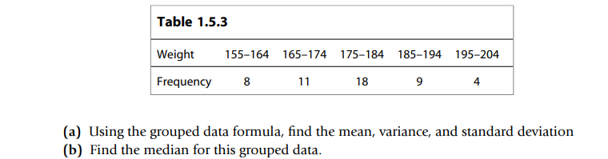

* [Back to the note](../note.md)

<br>
* Library Implemented : library.py
  
```python
def get_mean(L):
    return sum(L)/len(L)

def get_variance(L, mean=None):
    if mean is None:
        mean = get_mean(L)

    temp = 0
    for v in L:
        temp += (v-mean)**2
    return temp/(len(L)-1)

def get_standard_deviation(L, variance=None):
    if variance is None:
        variance = get_variance(L)

    return variance**.5

def get_median(SL):
    med_i = len(SL)//2

    if len(SL) % 2 == 0:
        return (SL[med_i-1] + SL[med_i]) / 2
    
    else:
        return SL[med_i]

def get_quartiles(SL):
    med_i = len(SL)//2
    return [get_median(SL[:med_i]), get_median(SL), get_median(SL[med_i:])]

def get_outliers(SL):
    q1, q2, q3 = get_quartiles(SL)
    iqr = q3-q1
    result = []
    for v in SL:
        if v < q1-1.5*iqr or v > q3+1.5*iqr:
            result.append(v)
    return result
```


* Sol
```python
from library import *

l = [176, 105, 133, 140, 305, 215, 207, 210, 173, 150, 78, 96]

mean = get_mean(l)
variance = get_variance(l, mean)

print("mean : {}, variance : {}".format(mean, variance))
```

<br>


* Sol
  ```python
    l = [7.625, 7.500, 6.625, 7.625, 6.625, 6.875, 7.375, 5.375, 7.500]

    mean = sum(l)/len(l)

    var_temp = 0
    for v in l:
        var_temp += (v-mean)**2

    variance = var_temp / (len(l)-1)

    print("mean : {}, std.dev. : {}".format(mean, variance**.5))
  ```

<br>


* Sol

<br>


```python
from library import *

l = [1188, 1050, 2882, 2802, 780, 1171, 685, 537, 519, 2523, 316, 1117, 1578, 261]

mean = get_mean(l) 
variance = get_variance(l, mean)
print("(a) mean : {}, variance : {}".format(mean, variance))

l.sort()
q1, q2, q3 = get_quartiles(l)
print("(b) upper quartile : {}, median : {} lower quartile : {},".format(q1, q2, q3))
iqr = q2-q1
print("IQR : {}".format(iqr))
print("Outliers : {}".format(get_outliers(l)))
```

<br>


* Sol
```python
from library import *

l = [105, 80, 115, 95, 100, 85, 90, 70, 135, 105, 45, 115, 40, 115, 95]

l.sort()
q1, q2, q3 = get_quartiles(l)
print("(a) upper quartile : {}, median : {} lower quartile : {},".format(q1, q2, q3))
iqr = q2-q1
print("IQR : {}".format(iqr))
print("Outliers : {}".format(get_outliers(l)))

```

<br>


```python
from library import *

classes = "0–4 5–9 10–14 15–19 20–24".split(" ")
frequencies = "5 14 15 10 6".split(" ")

# print(classes)
# print(frequencies)

data = []
for i, v in enumerate(classes):
    temp = v.split("–")
    data.append([int(temp[0]), int(temp[1]), int(frequencies[i])])

# print(data)
mean, variance = grouped_data_stats(data)
print("mean : {}, variance : {}".format(mean, variance))

```

<br>


(b)
```python
from library import *

classes = "0–4 5–9 10–14 15–19 20–24".split(" ")
frequencies = "5 14 15 10 6".split(" ")

# print(classes)
# print(frequencies)

data = []
for i, v in enumerate(classes):
    temp = v.split("–")
    data.append([int(temp[0]), int(temp[1]), int(frequencies[i])])

# print(data)
mean, variance = grouped_data_stats(data)
print("mean : {}, variance : {}".format(mean, variance))

result = 0
for i, v in enumerate(classes):
    temp = v.split("–")
    mid_val = (int(temp[0]) + int(temp[1]))/2
    result += int(frequencies[i]) * (mid_val - mean)

print("result : {}".format(result))
```

<br>


(b)
```python
from library import *

l = [105, 80, 115, 95, 100, 85, 90, 70, 135, 105, 45, 115, 40, 115, 95]

l.sort()
mean = get_mean(l)
variance = get_variance(l, mean)

print('mean : {}, variance : {}'.format(mean, variance))
r1 = 0
for v in l:
    r1 += (v-mean)**2
print('LHS : {}'.format(r1))

r2 = 0
sum = sum(l)
for v in l:
    r2 += v**2
r2 -= (sum**2)/len(l)
print('RHS : {}'.format(r2))
```

<br>


```python
from library import *

data = \
[10.25, 5.31, 11.25, 13.13, 18.00, 32.56, 37.06, 39.00,
43.25, 45.00, 40.06, 28.56, 22.75, 51.50, 47.00, 53.50,
32.00, 25.44, 22.50, 30.00, 24.75, 53.37, 51.38, 26.00,
53.50, 29.87, 32.00, 28.87, 42.19, 37.50, 30.44, 41.37]

print('(a)')
mean = get_mean(data)
variance = get_variance(data, mean)


print('\n(b)')
data.sort()
Q = get_quartiles(data)
outliers = get_outliers(data)
print('mean : {}, variance : {}'.format(mean, variance))
print('Q1 : {}, Q2 : {}, Q3 : {}'.format(Q[0], Q[1], Q[2]))
print('outliers : {}'.format(outliers))
```

<br>


```python
from library import *

strings = [\
"2.9 0.6 13.5 17.1 2.8 3.8 16.0 2.1 6.4 17.2",
"7.9 0.5 13.7 11.5 2.9 3.6 6.1 8.8 2.2 9.4",
"15.9 8.8 9.8 11.5 12.3 3.7 8.9 13.0 7.9 11.7",
"6.2 6.9 12.8 13.7 2.7 3.5 8.3 15.9 5.1 6.0",]

data = []
for s in strings:
    temp = s.split(" ")
    for v in temp:
        data.append(float(v))

# print(data)

print('(a)')
mean = get_mean(data)
variance = get_variance(data, mean)
print('mean : {}, variance : {}'.format(mean, variance))


print('\n(b)')
data.sort()
Q = get_quartiles(data)
outliers = get_outliers(data)
print('Q1 : {}, Q2 : {}, Q3 : {}'.format(Q[0], Q[1], Q[2]))
print('outliers : {}'.format(outliers))
```

<br>


<br>


```python
from library import *

sdata = "40 46 40 54 18 45 34 60 39 42"
data = [float(v) for v in sdata.split()]
# print(data)

mean = get_mean(data)
std_dev = get_standard_deviation(data)
data.sort()
Q = get_quartiles(data)
print('(a)')
print('mean : {}, std_dev : {}'.format(mean, std_dev))
print('Q1 : {}, Q2 : {}, Q3 : {}'.format(Q[0], Q[1], Q[2]))

print('\n(b)')
b_result = 0
for v in data:
    b_result += v - mean
print('result : {}'.format(b_result))
```

<br>


```python
from library import *

sdata = "6.3 2.9 4.5 1.1 1.8 4.0 1.2 3.1 2.0 4.0 \
7.0 2.8 4.3 5.3 2.9 8.3 4.4 2.8 3.1 5.6 \
4.5 4.5 5.7 0.5 6.2 3.7 0.9 2.4 3.0 3.5"

data = [float(v) for v in sdata.split()]
# print(data)

mean = get_mean(data)
variance = get_variance(data, mean)
std_dev = get_standard_deviation(data, variance)
data.sort()
Q = get_quartiles(data)
print('(a)')
print('mean : {}, variance : {}, std_dev : {}'.format(mean, variance, std_dev))
print('Q1 : {}, Q2 : {}, Q3 : {}'.format(Q[0], Q[1], Q[2]))

print('\n(b)')
frequency_table = {}
total_length = data[-1] - data[0]
delta = total_length / 5
curr_lower = data[0]
i = 0
for j in range(5):
    cnt = 0
    while i < len(data) and data[i] <= curr_lower + delta:
        cnt += 1
        i += 1
    frequency_table[(curr_lower, curr_lower+delta)] = cnt
    curr_lower += delta
print(frequency_table)

print('\n(c)')
group_format = []
for r in frequency_table:
    l, u = r
    cnt = frequency_table[r]
    group_format.append([l, u, cnt])
# print(group_format)
group_stats = grouped_data_stats(group_format)
# print(group_stats)
print('mean : {}, variance : {}, std_dev : {}'.format(group_stats[0], group_stats[1], (group_stats[1]**.5)))
```

<br>


```python
from library import *

sdata = "85 51 41 90 91 40 39 69 45 47 \
42 12 70 38 97 34 94 77 88 91 \
79 90 43 40 89 85 71 30 25 21"

data = [float(v) for v in sdata.split()]
# print(data)

mean = get_mean(data)
variance = get_variance(data, mean)
std_dev = get_standard_deviation(data, variance)
data.sort()
Q = get_quartiles(data)
print('(a)')
print('mean : {}, variance : {}, std_dev : {}'.format(mean, variance, std_dev))
print('Q1 : {}, Q2 : {}, Q3 : {}'.format(Q[0], Q[1], Q[2]))

print('\n(b)')
frequency_table = {}
total_length = data[-1] - data[0]
delta = total_length / 5
curr_lower = data[0]
i = 0
for j in range(5):
    cnt = 0
    while i < len(data) and data[i] <= curr_lower + delta:
        cnt += 1
        i += 1
    frequency_table[(curr_lower, curr_lower+delta)] = cnt
    curr_lower += delta
print(frequency_table)

print('\n(c)')
group_format = []
for r in frequency_table:
    l, u = r
    cnt = frequency_table[r]
    group_format.append([l, u, cnt])
# print(group_format)
group_stats = grouped_data_stats(group_format)
# print(group_stats)
print('mean : {}, variance : {}, std_dev : {}'.format(group_stats[0], group_stats[1], (group_stats[1]**.5)))
```

<br>


* Can't find the table.

<br>
<br>





<br>

* [Back to the note](../note.md)