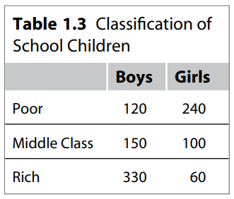
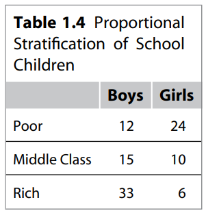
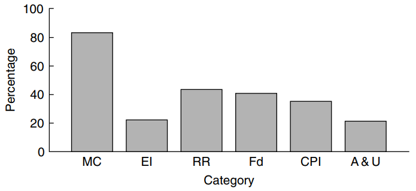
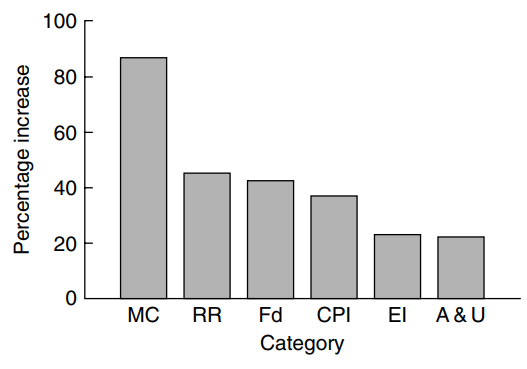
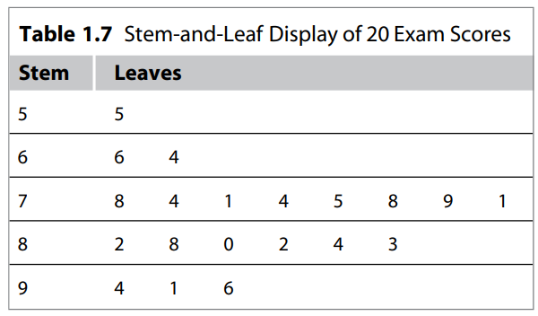
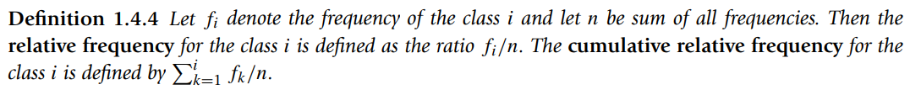
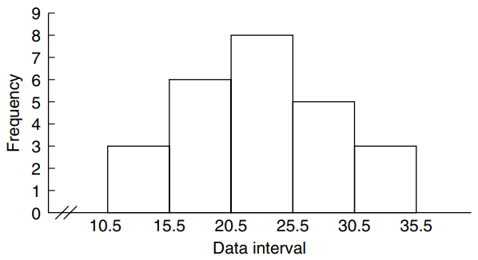
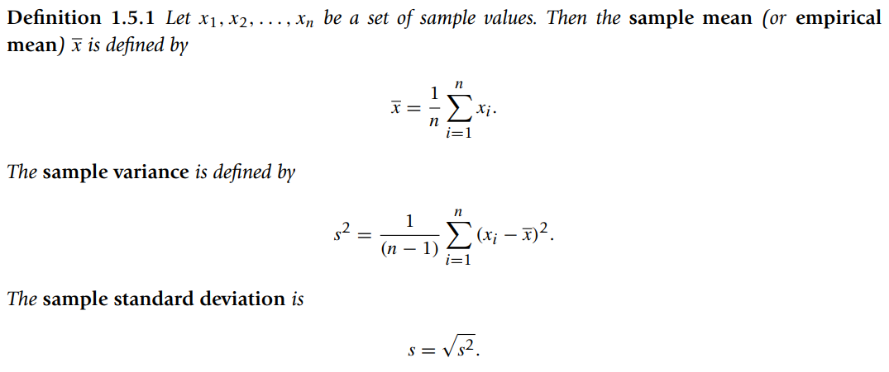
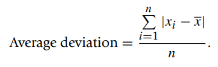
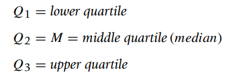

* [Back to Statistics Main](../main.md)

# Chapter 1. Descriptive Statistics

## 1.2 Basic Concepts

#### Def) Population
* A population is the collection or set of all objects or measurements that are of interest to
the collector

#### Def) Sample
* The sample is a subset of data selected from a population. The size of a sample is the
number of elements in it

#### Def) Descriptive Statistics
* The methods consisting mainly of organizing, summarizing, and presenting data in the form of tables, graphs, and charts

#### Def) Inferential Statistics
* The methods of drawing inferences and making decisions about the population using the sample

#### Def) Statistical Inference
* An estimate, a prediction, a decision, or a generalization about the population based on information contained in a sample

 

### 1.2.1 Types of Data

#### Concept) Quantitative vs Qualitative(Categorical) 
* Def) Quantitative Data
  * Observations measured on a numerical scale. 
* Def) Categorical data(Qualitative)
  * Nonnumerical data that can only be classified into one of the groups of categories
  * Types)
    1. Nominal Data : Data groups that do not have a specific order
    2. Ordinal Data : Data groups that should be listed in a specific order

#### Concept) Cross-sectional vs Time-series
* Def) Cross-sectional Data
  * Data collected on different elements or variables at the same point in time or for the same period of time
* Def) Time-series Data
  * Data collected on the same element or the same variable at different points in time or for different periods of time

  

## 1.3 Sampling Schemes

#### Concept) Census Study
* A study in which the entire population is included.
* It is usually not possible to obtain information on the entire population

#### Concept) Sample
  * Props)
    * Obtained by collecting information from only some members of the population
    * A good sample must reflect all the characteristics (of importance) of the population.
  * Types
    * Based on the quality
      1. Representative Sample
         * A sample that accurately reflects its population characteristics
      2. Biased Sample
         * A sample that is not representative of the population characteristics
    * Based on the way of sampling
      1. [Simple Random Sampling](#concept-simple-random-sample)
      2. [Systemic Sampling](#concept-simple-random-sample)
      3. [Stratified Sampling](#concept-stratified-sample)
      4. [Cluster Sampling (Area Sampling)](#concept-cluster-sampling-area-sampling)
      5. [Multiphase sampling](#concept-multiphase-sampling)

#### Concept) Simple Random Sample
* Def)
  * A sample selected in such a way that every element of the population has an equal chance of being chosen
* Advantages)
  1. Ensures against possible investigator biases.
  2. Analytic computations are relatively simple, and probabilistic bounds on errors can be computed in many cases.
  3. Possible to estimate the sample size for a prescribed error level when designing the sampling procedure.

#### Concept) Systemic Sample
* Def)
  * A sample in which every $K$-th element in the sampling frame is selected after a suitable random start for the first element
* How?
  * List the population elements in some order 
    * e.g.) alphabetical order
  * Choose the desired sampling fraction.
    1. Number the elements of the population from 1 to N.
    2. Decide on the sample size, say $n$, that we need.
    3. Choose $K = N/n$.
    4. Randomly select an integer between 1 to $K$ .
    5. Then take every $K$-th element
* Advantage)
  * Easy to implement
* Disadvantage)
  * Possibility of bias in case...
    * $\exists$ correlation or association between successive elements
    * $\exists$ periodic structure

#### Concept) Stratified Sample
* Def) 
  * A sample obtained by stratifying (dividing into nonoverlapping groups) the sampling frame based on some factor or factors and then selecting some elements from each of the strata
* How to)
  1. Decide on the relevant stratification factors (sex, age, income, etc.).
  2. Divide the entire population into strata (subpopulations) based on the stratification criteria. Sizes of strata may vary.
  3. Select the requisite number of units using simple random sampling or systematic sampling from
  each subpopulation. The requisite number may depend on the subpopulation sizes.
* Prop)
  * A modification of simple random sampling and systematic sampling
  * Designed to obtain a more representative sample, but at the cost of a more complicated procedure.
* Advantages)
  * Reduces sampling error compared to random sampling
* Ex.) Sampling 100 children out of 1000.
  
  

#### Concept) Cluster Sampling (Area Sampling)
* Def) 
  * The sampling unit contains groups of elements called clusters instead of individual elements of the population
* Prop.) 
  * The clusters naturally exist and are not formed by the researcher for data collection.
* How to)
  * Take a simple random sample of groups and then sample all elements within the selected clusters
* Advantage)
  * Convenient
  * May be less precise than simple random sampling
    * why?)
      * It is likely that units in a cluster will be relatively homogeneous.

#### Concept) Multiphase Sampling
* Def)
  * Involve collection of some information from the whole sample and additional information either at the same time or later from subsamples of the whole sample. 
  * Basically a combination of the techniques presented earlier

 

### 1.3.1 Errors in Sample Data
* Prop.)
  * Sample observations are prone to various sources of error that may seriously affect the inferences about the population.
* Classification
  * Sampling Error
    * Occur because the sample is not an exact representative of the population
  * Nonsampling Error
    * Occur in the collection, recording and processing of sample
    * Due to the differences between the characteristics of the population and those of a sample from the population data

 

### 1.3.2 Sample Size
* Concept) Sample Size Determination
  * Points to consider
    * Variation in the population 
    * Population size
    * Required reliability of the results
      * i.e.) the amount of error that can be tolerated.

  

## 1.4 Graphical Representation of Data
* Common Graphical displays
  * [Bar Graph](#concept-bar-graph)
  * [Pareto Chart](#concept-bar-graph)
  * [Pie Chart](#concept-pie-chart)
  * [Stem-and-Leaf Plot](#concept-stem-and-leaf-plot)
  * [Frequency Table](#concept-frequency-table)
  * [Histogram](#concept-histogram)

 

#### Concept) Bar Graph
* Def) A graph of bars whose heights represent the frequencies (or relative frequencies) of respective categories is called a bar graph   
  
  * Cf.) Pareto Chart
    * A bar graph with the height of the bars proportional to the contribution of each factor. 
    * The bars are displayed from the most numerous category to the least numerous category.   
    

 

#### Concept) Pie Chart
* Def) A circle divided into sectors that represent the percentages of a population or a sample that belongs to different categories is called a pie chart.   
* 

 

#### Concept) Stem-and-Leaf Plot
* Def) Each data value is split into a **stem** and a **leaf**.
  * **leaf** : usually the last digit of the number
  * **stem** : Formed with the other digits to the left of the **leaf**   
  )
* Advantages)
  * A simple way of summarizing quantitative data and is well suited to computer applications
  * Useful when data sets are relatively small
  * Useful when data distribution is symmetrical
* Prop)
  * Can be used only with quantitative data

 

#### Concept) Frequency Table
* Def) A table that divides a data set into a suitable number of categories (classes)
* Prop.)
  * Provides only a count of those observations
  * Grouped Data : Data presented in the form of a frequency table
  * Class Mark : the center of each class
  * Class Boundaries : the end points of each class interval
  * Def) Relative Frequency / Cumulative Relative Frequency   
    

 

#### Concept) Histogram
* Def) A graph in which classes are marked on the horizontal axis and either the frequencies, relative frequencies, or percentages are represented by the heights on the vertical axis.   

* Prop)
  * The bars are drawn adjacent to each other without any gaps.

  

## 1.5 Numerical Representation of Data

#### Concept) Sample Mean & Sample Variance & Sample Standard Deviation

* Prop)
  * Mean is greatly affected by the extreme values or outliers.
    * cf) $100\alpha$% Trimmed Mean
      * For $0\le\alpha\le1$...
      * Order the data
      * Discard the lowest 100α% and the highest 100α% of the data values. 
      * Find the mean of the rest of the data values.
  * Alternatives of Standard Deviation
    * Interquartile Range(IQR)
    * Average Deviation
    * 

 

#### Theorem 1.5.1

 

#### Concept) Median & Upper/Lower Quartile
* Def)
  * Median : the middle number of the ordered data set
    * If the data set has an even number of elements, then the median is the **average** of the middle two numbers
  * Lower quartile : the middle number of the half of the data below the median
  * Upper quartile is the middle number of the half of the data above the median
    
  * Interquartile Range (IQR) : The difference between the quartiles
    * A Possible Outlier (mild outlier)
      * Below $Q_1 - 1.5(IQR)$ 
      * Above $Q3 + 1.5(IQR)$
    *  IQR is unaffected by the positions of those observations in the smallest 25% or the largest 25% of the data.

 

#### Concept) Mode
* Def) The most frequently occurring member of the data set
  * If all the data values are different, then by definition, the data set has no mode.

* [Back to Statistics Main](../main.md)