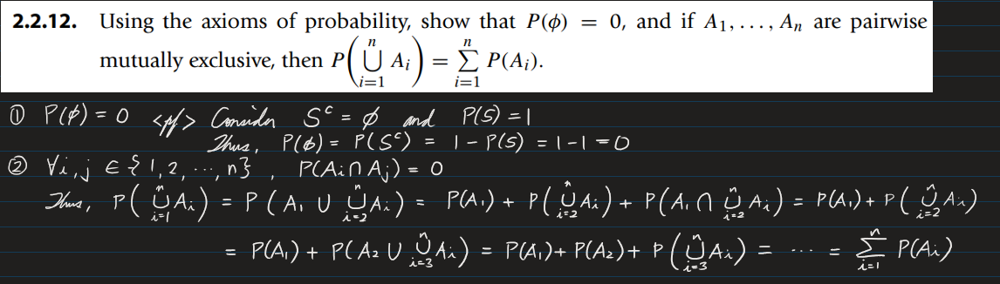

* [Back to the note](./note.md)


[Sol.](./scripts/ex007.py)


[Sol.](./scripts/ex008.py)


[Sol.](./scripts/ex009.py)


```python
from math import perm

print(1/perm(3,3))
```


sol.) ${p+2q}\over{p+2q+r}$




* [Back to the note](./note.md)