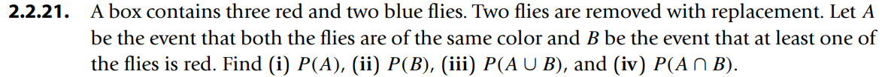

* [Back to the note](./note.md)


[Sol.](./scripts/ex007.py)


[Sol.](./scripts/ex008.py)


[Sol.](./scripts/ex009.py)


```python
from math import perm

print(1/perm(3,3))
```


sol.) ${p+2q}\over{p+2q+r}$


(a) $A \subset B \Rightarrow A\cup B = B$.   
Thus, $P(B) = P(A \cup B) \ge P(A)$

(b) Let $A' = (A \cup B) - B$ and $B' = (A \cup B) - A$.   
Because $A'$ and B are mutually exclusive, $P(A \cup B) = P(A')+P(B)$.   
Likewise, $P(A \cup B) = P(A)+P(B')$.   
Consider that $A \cup B = A' \cup B' \cup (A \cap B)$.   
Since $A'$, $B'$, and $(A \cap B)$ are mutually exclusive, $P(A \cup B) = P(A') + P(B') + P(A \cap B) = P(A \cup B) - P(B) + P(A \cup B) - P(A) + P(A \cap B)$.   
Therefore, $P(A \cup B) = P(A)+P(B)-P(A \cap B)$.


<pf.>   
Consider that $P(A \cup B) = P(A)+P(B)-P(A \cap B)$.   
Thus, $P(A \cup B \cup C) = P(A \cup B) + P(C) + P((A \cup B) \cap C) = P(A)+P(B)-P(A \cap B)+ P(C)-P((A \cup B) \cap C)$.  
Put $A'$ and $B'$ where $A \cup B = A' \cup B' \cup (A \cap B)$ and $A'$, $B'$, and $(A \cap B)$ are mutually exclusive.  
Then, $(A \cup B) \cap C = (A' \cup B' \cup (A \cap B)) \cap C = (A' \cap C) \cup (B' \cap C) \cup (A \cap B \cap C)$.   
Thus, $P((A \cup B) \cap C) = P(A' \cap C) + P(B' \cap C) + (A \cap B \cap C)$.   
Also $A = A' \cup (A \cap B) \Rightarrow A \cap C = (A' \cap C) \cup (A \cap B \cap C) \Rightarrow P(A' \cap C) = P(A \cap C) - P(A \cap B \cap C)$. Likewise, $P(B' \cap C) = P(B \cap C) - P(A \cap B \cap C)$.   
Hence, $P((A \cup B) \cap C) = P(A \cap C) - P(A \cap B \cap C) + P(B \cap C) - P(A \cap B \cap C) + (A \cap B \cap C) = P(A \cap C)+P(B \cap C)-(A \cap B \cap C)$.   
$\therefore P(A \cup B \cup C)=P(A)+P(B)+ P(C)-P(A \cap B)-P(A \cap C)-P(B \cap C)+(A \cap B \cap C)$


   
(a) Consider that $S \supset (A \cup B) \Rightarrow P(S) \ge P(A \cup B)$ and $P(S)=1$.   
$\therefore P(A \cap B) = P(A) + P(B) - P(A \cup B) \ge P(A) + P(B) -1$.   

(b) Case1) $P(A_1 \cap A_2) = \emptyset$; $P(\cup{A_i})=P(\Sigma{A_i})$.   
Case2) $P(A_1 \cap A_2) \ne \emptyset$; $P(\cup{A_i}) = P(A_1)+P(A_2)-P(A_1 \cap A_2) \le P(A_1)+P(A_2)$.


   
(a) 0.17 + 0.46 = 0.63   
(b) 1 - 0.17 = 0.83   
(c) $P(A^c \cup B^c) = P({(A \cap B)}^c) = 1$   
(d) 1      
(e) $P(A^c \cap B^c) = P({(A \cup B)}^c) = 0.37$   


   
(a) 0.24 + 0.67 - 0.09 = 0.82    
(b) 1 - 0.82 = 0.18    
(c) $P(A^c \cup B^c) = P({(A \cap B)}^c) = 0.91$     
(d) 0.91    
(e) $P(A^c \cap B^c) = P({(A \cup B)}^c) = 0.18$     


   
* 0.65625
  * [Sol.](./scripts/ex018.py)  


   
(i) 0.55   
(ii) 0.3   
(iii) 0.45   
* [Sol](./scripts/ex019.py)


  
1. {(b, b), (b, g)}
2. 0.5


  
1. $P(A) = {{{}_3C_2+{}_2C_2}\over{{}_5C_2}} = 0.4$
2. $P(B) = 1 - {{{}_2C_2}\over{{}_5C_2}} = 0.9$
3. $P(A \cap B) = 0.3 \Rightarrow P(A \cup B) = 0.4+0.9-0.3 = 1$
4. $P(A \cap B) = 0.3$


* [Back to the note](./note.md)