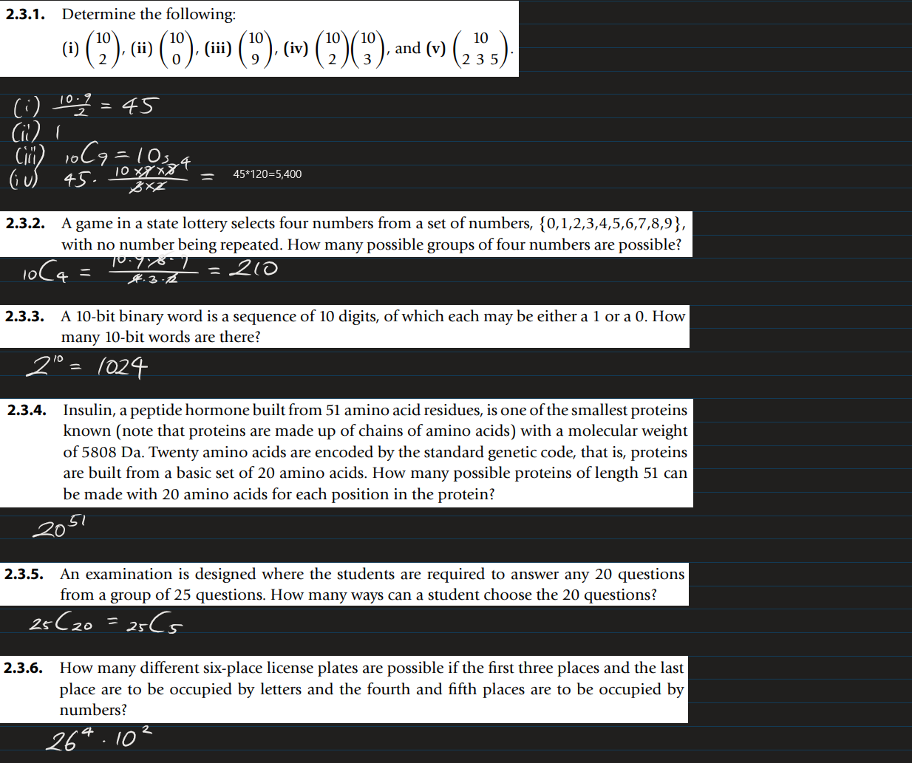
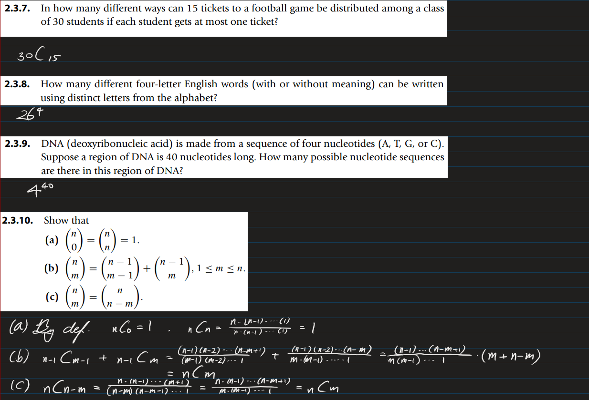
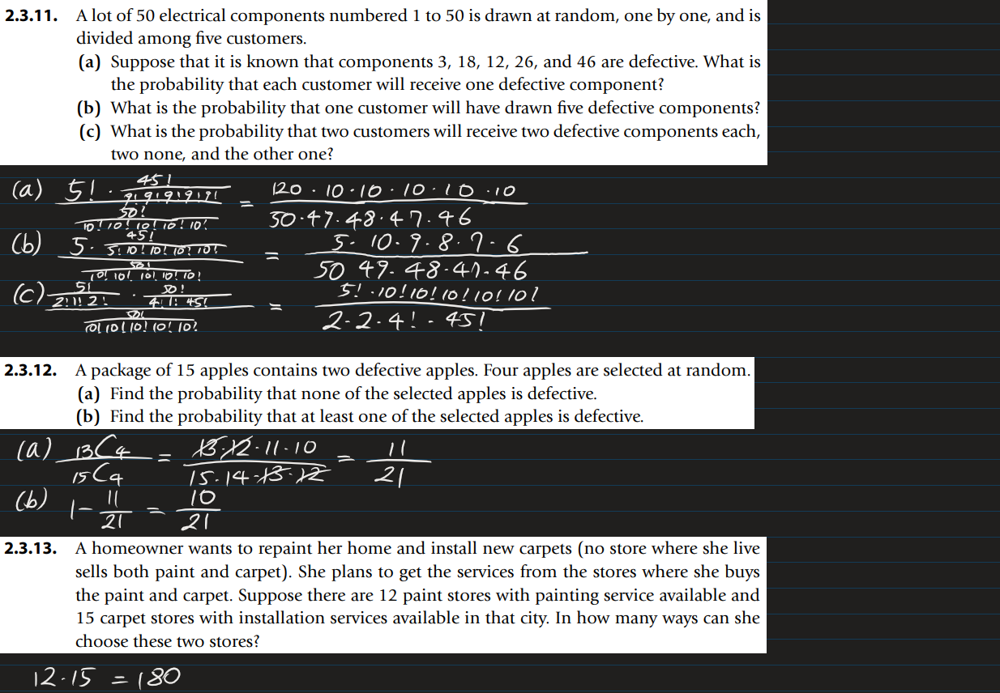
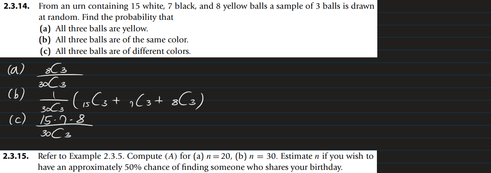
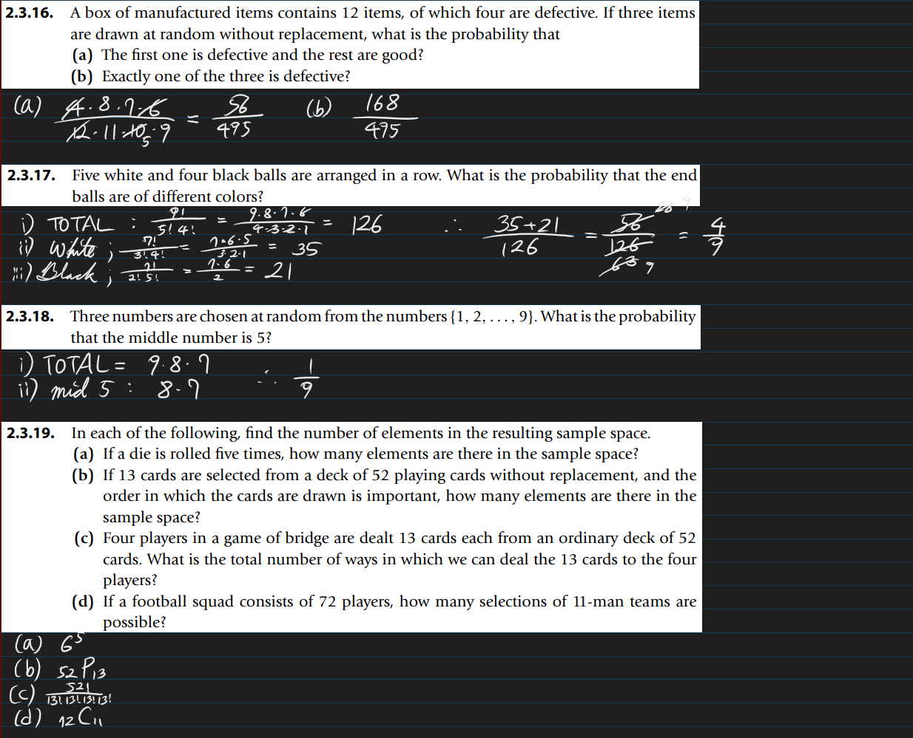
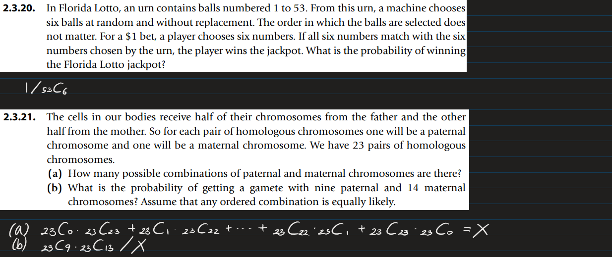

* [Back to the note](./note.md)

* Sol.
  * n=20; P(A) = 0.41143838358058016
  * n=30; P(A) = 0.7063162427192686
  * Estimated n = 23
* [Script 2.3.15](./scripts/ex015.py)

* [Back to the note](./note.md)