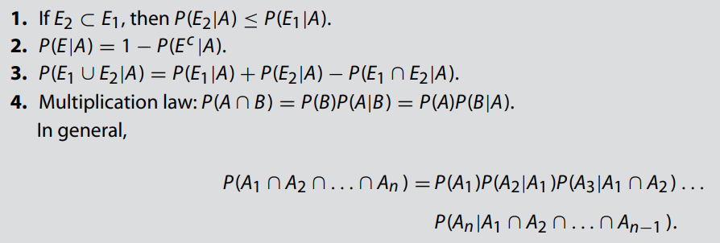
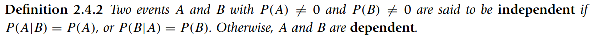
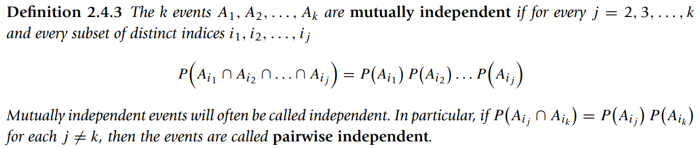
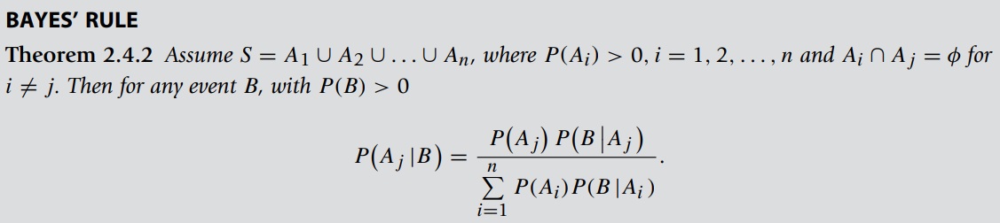
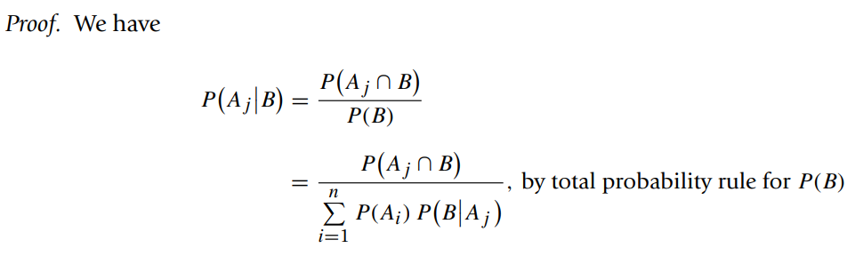

* [Back to Statistics Main](../../main.md)

## 2.4 The Conditional Probability, Independence, and Bayes' Rule   
If we know that an event has already occurred or we have some partial information about the event, then this knowledge may affect the probability of the event of interest. This leads to the idea of **conditional probability**.

 

#### Def. 2.4.1) Conditional Probability
The conditional probability of an event $A$, given that an event $B$ has occurred, denoted
by $P(A|B) = \frac{P(A \cap B)}{P(B)}$ where $P(B) \gt 0$

 

#### Props.)

 

Or, $P(A \cap B) = P(A)P(B)$

 

* cf.) The set $A_1, A_2, \dots, A_n$ are the partition of $S$

 

* pf.)
  
* Terms
  * $P(A_i)$ : Prior Probability or A Priori Probability
  * $P(A_i|B)$ : Posterior Probability
  * $A_1, A_2, \dots, A_n$ : States of Nature

  

### [Exercises 2.4](./exercises.md)

  

* [Back to Statistics Main](../../main.md)