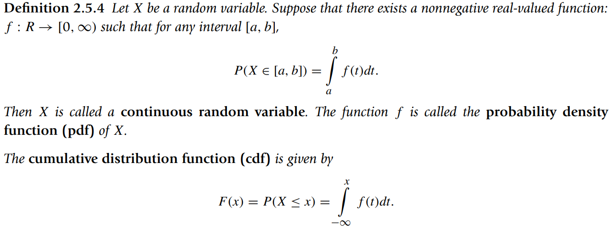

* [Back to Statistics Main](../../main.md)

## 2.5 Random Variables and Probability Distributions
#### Def. 2.5.1) Random Variable
A random variable $X$ is a function defined on a sample space, $S$, that associtates a real number $X(w) = x$, with each outcome $w$ in $S$.
* Ex) Tossing two coins
  * $S = \lbrace HH, HT, TH, TT \rbrace$ : the sample space
  * $X(w) = \begin{cases} 0, & if w=(TT) \\ 1, & if w \in \lbrace HT, TH \rbrace \\ 2, & if w=(HH) \end{cases}$

 

#### Def. 2.5.2) Discrete Random Variable
A random variable X is said to be **discrete** if it can assume only a finite or countably infinite number of distinct values.

 

#### Def. 2.5.3) Discrete & Cumulative Probability Functions
The **discrete probability mass function(pmf)** of a discrete random variable $X$ is the function   
* $p(x_i)=P(X=x_i), i=1,2,3, \dots$   
  * Simply called a **probability function**
* Props.)
  * $p(x)$ is non-negative.
  * $\Sigma_{i=1}^{\infty}p(x_i)=1$
  * $p(x)$ is defined only for a set of discrete values $x_1, x_2, \dots$

The **cumulative distribution function(cdf)** $F$ of a random variable $X$ is defined by
* $F(x)=P(X \le x) = \Sigma_{all y \le x}{p(y)}, for -\infty \lt x \lt \infty$
  * Also called a **probability distribution function** or **distribution function**
* Props.)
  * $F(x)$ is defined for all real values $x \in X$.

 

#### Def. 2.5.4) Continuous Random Variable, PDF, and CDF

* Props.)
  * $f(x) \ge 0, \forall x$
  * $\int_\infty^\infty f(x)dx = 1$

  

### [Exercises](./exercises.md)

  

* [Back to Statistics Main](../../main.md)