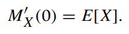

Recall the Maclaurin series of the function $e^{tx}$ is   

   

Thus, the MGF can be denoted as   

    

Taking the derivative of the MGF, we obtain   

   

Evaluating the derivative at $t=0$, we have   

   

Taking the second derivative and evaluating at $t=0$,   

   

Continuing in this manner, we obtain all the moments to be   

   