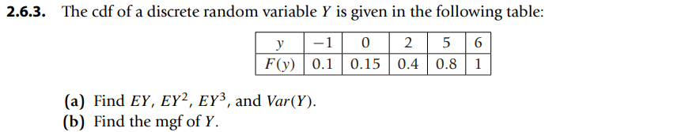
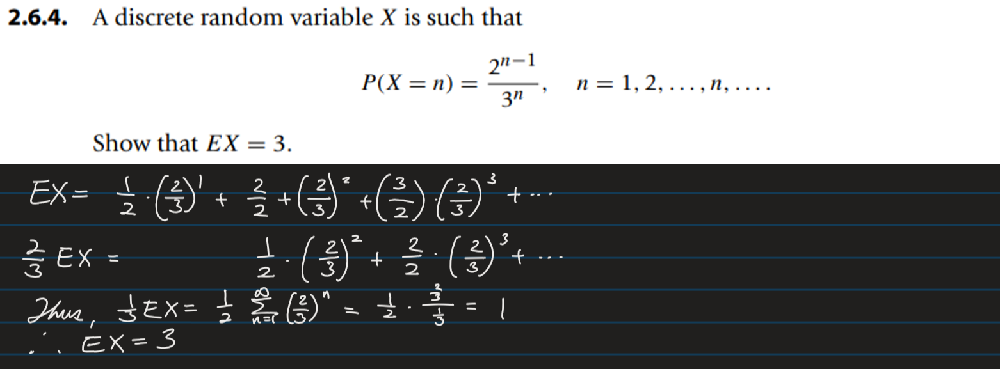
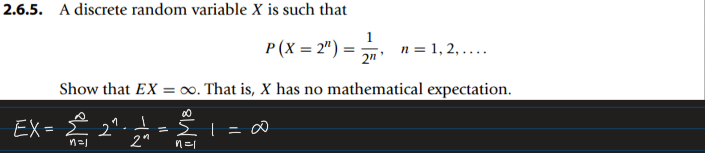

* [Back to the note](./note.md)

   
(a) 79.66666666666669, 214.4888888888889 ([Sol](scripts/ex002.py))   
(b) 

  
(a) EY = 3.5999999999999996
EY^2 = 18.299999999999997   
EY^3 = 95.1   
VAR(Y) = 5.34    
[Sol.](scripts/ex003.py)   

(b)    

  

  

* [Back to the note](./note.md)