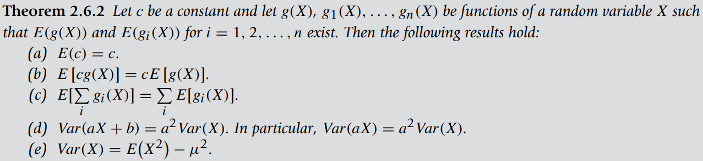
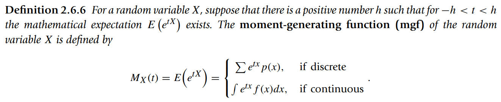
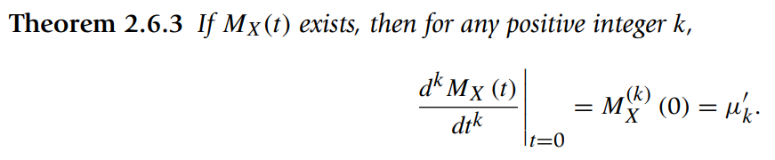
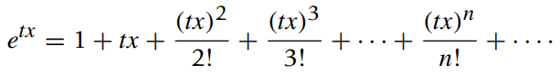
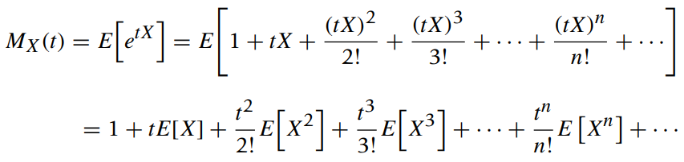
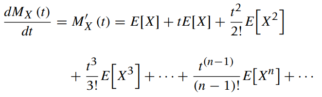
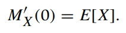
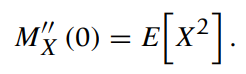
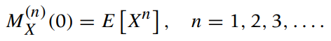
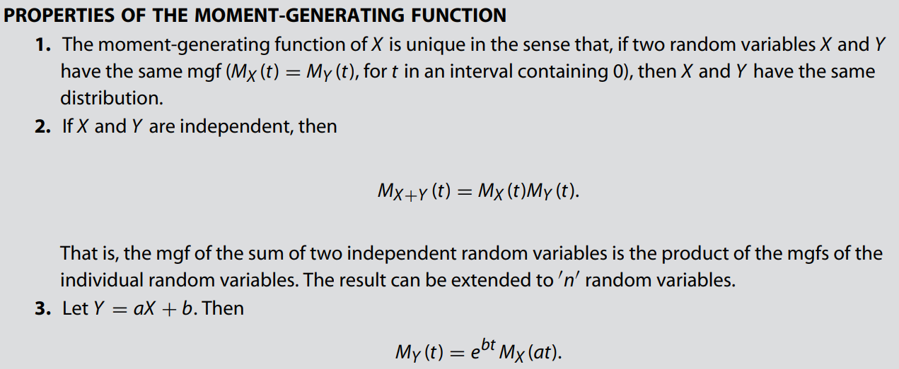

* [Back to Statistics Main](../../main.md)

## 2.6 Moments and Moment-Generating Functions
#### Def. 2.6.1) Expected Value
Let $X$ be a discrete random variable with pf $p(x)$. Then the expected value of $X$, denoted by $E(X)$, is defined by
* $\mu = E(X) = \Sigma_x{xp(x)}$
  * provided $\Sigma_x{|x|p(x)} \lt \infty$

 

#### Def. 2.6.2) Expected Value for a Continuous Random Variable
The expected value of a continuous random variable $X$ with pdf $f(x)$ is defined by
* $\mu = E(X) = \int_{-\infty}^\infty xf(x)dx$
  * provided $\int_{-\infty}^\infty |x|f(x)dx \lt \infty$

 

#### Def. 2.6.3) Variance and Standard Deviation
The variance of a random variable $X$ is defined by 
* $\sigma^2 = Var(X) = E(X-\mu)^2$   

The squared root of variance, denoted by $\sigma$, is called the standard deviation. 

 

#### Theorem 2.6.1) Expectation of Function of a Random Variable
Let $g(X)$ be a function of $X$, then the expected value of $g(X)$ is
* $`E[g(X)] = \left \lbrace \begin{array}{ll} {\Sigma_xg(x)p(x)} & {if \space X \space is \space discrete} \\ {\int_{-\infty}^\infty{g(x)f(x)dx}} & {if \space X \space is \space continuous} \end{array} \right.`$ 

 

#### Theorem 2.6.2) Some Properties of Expected Value and Variance

  

### 2.6.1 Skewness and Kurtosis
#### Def. 2.6.4) The k-th Moment about the Origin
* The $k$-th moment about the origin of a random variable $X$ is defined as $EX^k$ and denoted by $\mu'_k$, whenever exists.
* The $k$-th moment about the mean (or central $k$-th moment) of a random variable $X$ is defined as $E[(X-\mu)^k]$ and denoted by $\mu_k$, $k=2,3,4, \dots$, whenever exists.

 

#### Def. 2.6.5) Skewness and Kurtosis
* The standardized third moment about mean is called the **skewness** of the distribution of $X$.
  * $\alpha_3 = \frac{E(X-\mu)^3}{\sigma^3} = \frac{\mu_3}{\mu_2^{\frac{3}{2}}}$
  * Prop.)
    * Used as a measure of the asymmetry (lack of symmetry) of a density function about its mean.
      * $\alpha_3 = 0$; the distribution is symmetric about the mean, 
      * $\alpha_3 \gt 0$; the distribution has a longer right tail, 
      * $\alpha_3 \lt 0$; the distribution has a longer left tail.
* The standardized fourth moment about mean is called the **kurtosis** of the distribution of $X$.
  * $\alpha_4 = \frac{E(X-\mu)^4}{\sigma^4}$
  * Prop.)
    * Used as a measure of whether the distribution is peaked or flat relative to a normal distribution.
    * Based on the size of a distribution’s tails.
      * $\alpha_4 \gt 0$; **platokurtic** : too few observations in the tails
      * $\alpha_4 \lt 0$; **leptokurtic** : too many observations in the tail of the distribution.
    * The standard normal distribution : $\alpha_4 = 3$

 

#### Def. 2.6.6) Moment Generating Function (MGF)

 

#### Theorem 2.6.3)

* Derivation
  * Recall the Maclaurin series of the function $e^{tx}$ is   
    
  * Thus, the MGF can be denoted as   
    
  * Taking the derivative of the MGF, we obtain   
    
  * Evaluating the derivative at $t=0$, we have   
    
  * Taking the second derivative and evaluating at $t=0$,   
    
  * Continuing in this manner, we obtain all the moments to be   
    

 

#### Ex. 1) Binomial Random Variable
* $p(x) = \left( \begin{array}{c} n \\ x \end{array} \right) p^x(1-p)^{n-x}$ where $x=0,1,2, \dots, n$
* Show that $M_X(t)=[(1-p)+pe^t]^n$

 

#### Ex. 2) Poisson Random Variable

 

#### Ex. 3) Beta Random Variable

 

#### Ex. 4) Standard Normal Random Variable

 

#### Props.)

  

### [Exercises](./exercises.md)

  

* [Back to Statistics Main](../../main.md)