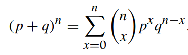

* [Back to Statistics Main](../../main.md)

## 3.2 Special Distribution Functions
### 3.2.1 The Binomial Probability Distribution
#### Concept) Bernoulli Probability Distribution
- Def.)
  - $`p(x) = P(X=x) = \left \lbrace \begin{array}{cc} p^x(1-p)^{1-x}, & x=0,1 \\ 0, & otherwise \end{array} \right.`$
- Prop.)
  - Characterized by the single parameter $p$.
  - $E[X] = p$
  - $Var[X] = p(1-p)$
  - $M_X(t) = pe^t+(1-p)$

 

#### Def.) Binomial Experiment
A binomial experiment is one that has the following properties:
1. The experiment consists of $n$ identical trials.
2. Each trial results in one of the two outcomes, called success $S$ and failure $F$.
3. The probability of success on a single trial is equal to $p$ and remains the same from trial to trial. The probability of failure is $1-p=q$.
4. The outcomes of the trials are independent.
5. The random variable $X$ is the number of successes in $n$ trials.
   - cf.) $x$ successes in $n$ trials
     - $`{}_nC_x=\frac{n!}{x!(n-x)!}`$

 

#### Concept) Binomial Probability Distribution
- Def.)
  - A random variable $X$ is said to have binomial probability distribution with parameters $(n,p)$ if and only if
    - $`P(X=x)=p(x)={}_nC_xp^xq^{n-x}=\left\lbrace \begin{array}{cc} \frac{n!}{x!(n-x)!}p^xq^{n-x}, & x=0,1,2,\dots,n, \space 0 \le p \le 1, \space q=1-p \\ 0, & otherwise \end{array} \right.`$
- Notation)
  - The cumulative probability
    - $B(x,n,p) = \Sigma_{i=0}^x b(i,n,p)$
    - Consider that $n$ and $p$ are independent.
- Prop.)
  - $\Sigma_{i=0}^x \space {}_nC_x p^xq^{n-x}=1=1$
    - pf.)   
      
      - Also, $p+q=1$.

  

### 3.2.2 Poisson Probability Distribution

  

### 3.2.3 Uniform Probability Distribution

  

### 3.2.4 Normal Probability Distribution

  

### 3.2.5 Gamma Probability Distribution

  

### [Exercises](./exercises.md)

  

* [Back to Statistics Main](../../main.md)