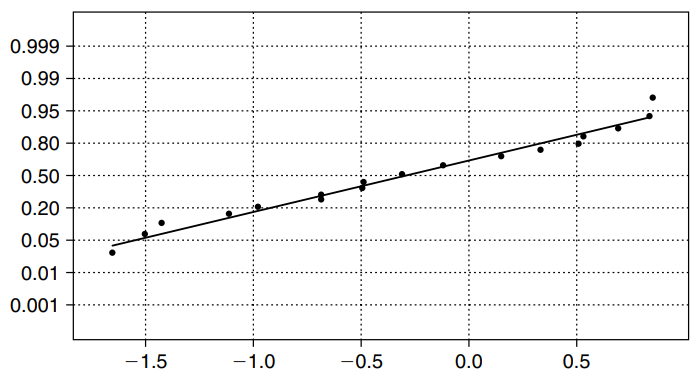
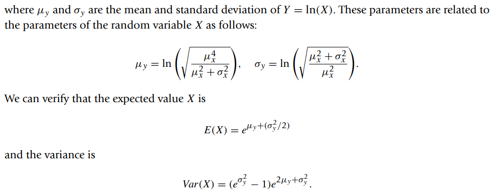
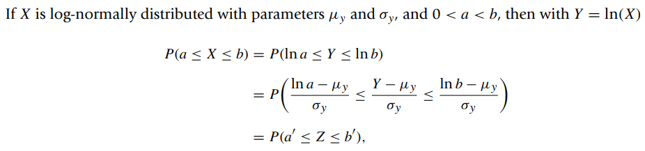
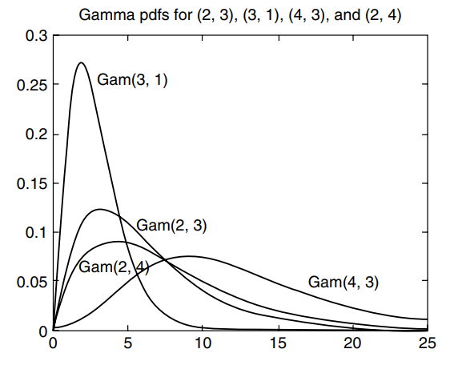
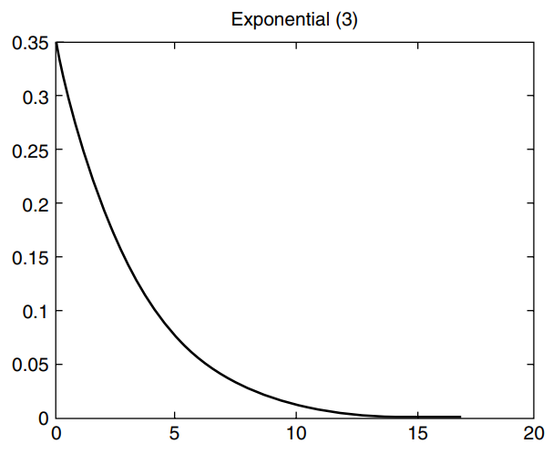
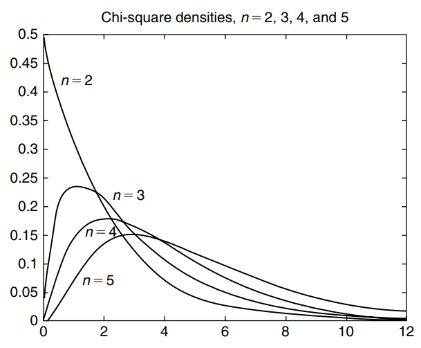

* [Back to Statistics Main](../../main.md)

## 3.2 Special Distribution Functions

#### Before listing various distributions...
- How do we know which distribution to use in a given physical
problem?
  - There is no simple and direct answer to this question. One intuitive way is to construct a histogram from the information at hand; from the shape of this histogram, we decide whether the random variable follows a particular distribution such as gamma distribution. 
  - Once we decide that it follows a particular distribution, then the parameters of this distribution, such as α and β, must be statistically estimated.

### 3.2.1 The Binomial Probability Distribution
#### Concept) Bernoulli Probability Distribution
- Def.)
  - $`p(x) = P(X=x) = \left \lbrace \begin{array}{cc} p^x(1-p)^{1-x}, & x=0,1 \\ 0, & otherwise \end{array} \right.`$
- Prop.)
  - Characterized by the single parameter $p$.
  - $E[X] = p$
  - $Var[X] = p(1-p)$
  - $M_X(t) = pe^t+(1-p)$

 

#### Def.) Binomial Experiment
A binomial experiment is one that has the following properties:
1. The experiment consists of $n$ identical trials.
2. Each trial results in one of the two outcomes, called success $S$ and failure $F$.
3. The probability of success on a single trial is equal to $p$ and remains the same from trial to trial. The probability of failure is $1-p=q$.
4. The outcomes of the trials are independent.
5. The random variable $X$ is the number of successes in $n$ trials.
   - cf.) $x$ successes in $n$ trials
     - $`{}_nC_x=\frac{n!}{x!(n-x)!}`$

 

#### Concept) Binomial Probability Distribution
- Def.)
  - A random variable $X$ is said to have binomial probability distribution with parameters $(n,p)$ if and only if
    - $`P(X=x)=p(x)={}_nC_xp^xq^{n-x}=\left\lbrace \begin{array}{cc} \frac{n!}{x!(n-x)!}p^xq^{n-x}, & x=0,1,2,\dots,n, \space 0 \le p \le 1, \space q=1-p \\ 0, & otherwise \end{array} \right.`$
- Notation)
  - The cumulative probability
    - $B(x,n,p) = \Sigma_{i=0}^x b(i,n,p)$
    - Consider that $n$ and $p$ are independent.
- Prop.)
  - $\Sigma_{i=0}^x \space {}_nC_x p^xq^{n-x}=1=1$
    - pf.)   
      - Consider that $(p+q)^n=\Sigma_{i=0}^x \space {}_nC_x p^xq^{n-x}$
      - Also, $p+q=1$.
  - $E(X)=\mu=np$
  - $Var(X)=\sigma^2=np(1-p)$
  - $M_X(t) = \left[ pe^t + (1-p) \right]^n$

  

### 3.2.2 Poisson Probability Distribution
- Def.)
  - A discrete random variable $X$ is said to follow the Poisson probability distribution with parameter $\lambda \gt 0$, denoted by $Poisson(\lambda)$, if
    - $P(X=x) = f(x, \lambda) = f(x) = \frac{e^{-\lambda} \lambda^x}{x!}, x=0,1,2, \cdots$
- Props.)
  - $E(X) = \lambda$
  - $Var(X) = \lambda$
  - $M_X(t) = e^{\lambda(e^t-1)}$
    - Refer to the Maclaurin's expansion, $e^\lambda = \Sigma_{i=0}^\infty (\lambda^i / i!)$
- When to use?)
  - In rare events!
  - Refer to the [Theorem 3.2.3](#theorem-323-poisson-approximation-to-the-binomial-probability-distribution) for this issue.

 

#### Theorem 3.2.3) Poisson Approximation to the Binomial Probability Distribution
If $X \sim B(n, p)$, a binomial random variable, then for each value $x=0,1,2, \cdots$ and as $p \rightarrow 0, n \rightarrow \infty$ with $np = \lambda$ constant,
- $\lim_{n \rightarrow \infty} {}_nC_x p^x(1-p)^{n-x}=\frac{e^{-\lambda} \lambda^x}{x!}$   

Thus, we use Poisson probability distribution in rare events.
- When $p$ is small and $n$ is large
  - More precisely...
    - $p \le 0.1$ and $n \ge 40$
    - $np \lt 5$

  

### 3.2.3 Uniform Probability Distribution
- Def.)
  - A random variable $X$ is said to have a uniform probability distribution on $(a, b)$, denoted by $U(a, b)$, if the density function of $X$ is given by
    - $`f(x)=\left\lbrace \begin{array}{cc} \frac{1}{b-a}, & a \le X \le b \\0, & otherwise. \end{array} \right.`$
- Props.)
  - $E(X) = \frac{a+b}{2}$
  - $Var(X) = \frac{(b-a)^2}{12}$
  - $M_X(t) = \left\lbrace \begin{array}{cc} \frac{e^{tb}-e^{ta}}{t(b-a)}, & t \ne 0 \\ 1, & t=0 \end{array} \right.$
- When to use?)
  - Useful as a “first guess” if no other information about a random variable $X$ is known, other than that it is between $a$ and $b$ ($a \le X \le b$).

  

### 3.2.4 Normal Probability Distribution
- Def.)
  - A random variable $X$ is said to have a normal probability distribution with parameters $\mu$ and $\sigma^2$, if it has a probability density function given by
    - $f(x) = \frac{1}{\sigma\sqrt{2\pi}} e^{-\frac{(x-\mu)^2}{2\sigma^2}}$
      - where $-\infty \lt x, \mu \lt \infty$ and $\sigma \gt 0$.
    - $X \sim N(\mu, \sigma^2)$
  - Concept) Standard Normal Random Variable
    - $\frac{X-\mu}{\sigma} = Z \sim N(0, 1)$
- Prop.)
  - $E(X) = \mu$
  - $Var(X) = \sigma^2$
  - $M_X(t) = e^{t\mu + \frac{1}{2}t^2\sigma^2}$
  - [The Relationship with the Chi-Square Distribution](../../ch04/02/note.md#421-chi-square-distribution)
- When to use?)
  - Simply...
    1. The data can be capped with a bell-shaped curve.
    2. If the stem-and-leaf diagram is fairly symmetrical with respect to its center.
  - In practice...
    - When a large number of small effects are present and acting additively.
      - Still, additional visualization is desirable.
        - e.g) histogram, box-plot, [QQ plot](#concept-qq-plot), etc.

 

#### Concept) QQ plot (A Quantile Quantile)
- Def.)
  - A scatterplot with the quantiles of the scores on the horizontal axis and the expected normal scores on the vertical axis. 
  -  The expected normal scores are calculated by taking the $z$-scores of $(r_i−0.5)/n$, where $r_i$ is the rank $i$-th observation in increasing order.
- How to construct)
  - First, we sort the data in an ascending order. 
    - If the plot of these scores against the expected normal scores is a straight line, then the data can be considered normal. 
  - Any curvature of the points indicates departures from normality.
- e.g.)
  - Normal Probability Plot   
    
  - Various Distributions     
    
 

#### Concept) Log-Normal Distribution
- A variable might be modeled as log-normal if it can be thought of as the **multiplicative** effect of many small independent factors.
  - Recall that **additive** was the normal distribution.

- Def.)   

   
   

- Prop.)

- When to use?)
  - When the domain of the variate, $X$, is greater than zero and its histogram is markedly skewed.
  - For $Y \sim N(\mu, \sigma^2)$, $\exp{(Y)}$ has a log-normal distribution.

  

### 3.2.5 Gamma Probability Distribution
#### Concept) Gamma Function
- Def.)
  - $\Gamma(a) = \int_0^\infty e^{-x}x^{a-1}dx, a \gt 0$
- Props.)
  - $\Gamma(a) = (a-1)\Gamma(a-1)$
  - $\Gamma(n) = (n-1)!$

 

#### Concept) Gamma Probability Distribution
- Def.)
  - A random variable $X$ is said to possess a gamma probability distribution with parameters $\alpha \gt 0$ and $\beta \gt 0$ if it has the pdf given by
    - $`f(x) = \left\lbrace \begin{array}{cc} \frac{1}{\beta^\alpha \Gamma(\alpha)} x^{\alpha -1}e^{\frac{-x}{\beta}} & if \space x \gt 0 \\ 0, & otherwise \end{array} \right.`$
- Notation)
  - $X\sim Gamma(\alpha, \beta)$
    - $\alpha$ : a shape parameter
    - $\beta$ : a scale parameter
- Props.)
  - Mean : $E(X)=\alpha\beta$
  - Variance : $Var(X)=\alpha\beta^2$
  - MGF : $M_X(t)=\frac{1}{(1-\beta t)^\alpha}, t \lt \frac{1}{\beta}$
  - Varying $\alpha$ and $\beta$ will generate different members of the gamma family.
    - e.g.)
      - Erlang distribution : $\alpha$ is a positive integer

  

#### Concept) Exponential Probability Distribution
- Def.)
  - A random variable $X$ is said to possess a gamma probability distribution with parameters $\beta \gt 0$ if it has the pdf given by
    - $`f(x) = \left\lbrace \begin{array}{cc} \frac{1}{\beta} e^{\frac{-x}{\beta}} & if \space x \ge 0 \\ 0, & otherwise \end{array} \right.`$
- Prop.)
  - An Gamma Probability Distribution with $\alpha=1$.
  - Often used to model the lifetimes of electronic components such as fuses, for survival analysis, and for reliability analysis, among others
  - Used in developing models of insurance risks
  - Mean : $E(X)=\beta$
  - Variance : $Var(X)=\beta^2$
  - MGF : $M_X(t)=\frac{1}{(1-\beta t)}, t \lt \frac{1}{\beta}$

  

#### Concept) Chi-Square Distribution
Let $n$ be a positive integer. A random variable, $X$, is said to have a chi-square($\chi^2$) distribution with $n$ degrees of freedom if and only if $X$ is a gamma random variable with parameters $\alpha=\frac{n}{2}$ and $\beta = 2$. We denote this by $X \sim \chi^2(n)$.
- Hence, the probability density function of a chi-square distribution with $n$ degrees of freedom is given by
  - $`f(x) = \left\lbrace \begin{array}{cc} \frac{1}{\Gamma(\frac{n}{2}) 2^{\frac{n}{2}}} x^{\frac{n}{2} -1}e^{\frac{-x}{2}} & if \space x \ge 0 \\ 0, & otherwise \end{array} \right.`$
- Props.)
  - Mean : $E(X)=n$
  - Variance : $Var(X)=2n$
  - MGF : $M_X(t)=\frac{1}{(1-2t)^\frac{n}{2}}, t \lt \frac{1}{2}$
  - [The Relationship with the Normal Distribution](../../ch04/02/note.md#421-chi-square-distribution)

  

#### Concept) Beta Distribution
- Def.)
  - A random variable $X$ is said to have a beta distribution with parameters $\alpha$ and $\beta$ if and only if the density function of $X$ is
    - $`f(x)=\left\lbrace \begin{array}{cc} \frac{x^{\alpha - 1}(1-x)^{\beta - 1}}{B(\alpha, \beta)} & \alpha,\beta \gt 0, 0 \le x \le 1 \\ 0, & otherwise \end{array} \right.`$
      - where $B(\alpha, \beta) = \int_0^1 x^{\alpha - 1} (1-x)^{\beta -1} dx$
- Props.)
  - $B(\alpha, \beta) = \frac{\Gamma(\alpha) \Gamma(\beta)}{\Gamma(\alpha + \beta)}$
  - Mean : $E(X) = \frac{\alpha}{\alpha+\beta}$
  - Variance : $Var(X) = \frac{\alpha\beta}{(\alpha+\beta)^2(\alpha+\beta+1)}$
  - Used as a prior distribution for binomial or geometric proportions

  

### [Exercises](./exercises.md)

  

* [Back to Statistics Main](../../main.md)