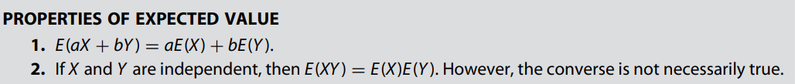

* [Back to Statistics Main](../../main.md)

# 3.3 Joint Probability Distributions
#### Concept) Bivariate Distribution
Two random variables and their joint distributions
- cf.) Univariate Distribution

 

#### Def.) Joint Probability Distribution
1. Let $X$ and $Y$ be random variables. If both $X$ and $Y$ are discrete, then the joint probability function (joint pmf) of $X$ and $Y$ is...
   - $f(x,y) = P(X=x, Y=y)$
2. If both $X$ and $Y$ are continuous then $f(x, y)$ is called the joint probability density function (joint pdf) of $X$ and $Y$ if and only if
   - $P(a \le X \le b, c \le Y \le d) = \int_a^b\int_c^d f(x,y)dxdy$

 

#### Theorem 3.3.1)
If $X$ and $Y$ are two random variables with joint probability function $f(x, y)$, then
1. $f(x,y) \ge 0, \forall x,y$.
2. If $X$ and $Y$ are discrete, then $\Sigma_{x,y}f(x,y)=1$.   
where the sum is over all values $(x,y)$ that are assigned nonzero probabilities. If $X$ and $Y$ are continuous, then
   - $\int_{-\infty}^\infty\int_{-\infty}^\infty f(x,y) dxdy = 1$

 

#### Def.) Marginal PMF / PDF

 

#### Def.) Conditional Probability Distribution

 

#### Def.) Independency
Let $X$ and $Y$ have a joint pmf or pdf $f(x, y)$. Then $X$ and $Y$ are independent if and only if
- $f(x,y) = f_X(x)f_Y(y), \forall x, y$

 

#### Def.) Expected Value of Bivariate Distribution

- Prop.)   
  

 

#### Def.) Conditional Expectation

 

#### Theorem 3.3.2)
1. $E(X)=E[E(X|Y)]$
2. $Var(X) = E[Var(X|Y)] + Var[E(X|Y)]$

  

## 3.3.1 Covariance and Correlation
#### Def.) Covariance 
The **covariance** between two random variables $X$ and $Y$ is defined by
- $\sigma_{XY} = Cov(X,y) = E(X-\mu_X)(Y-\mu_Y) = E(XY) - \mu_X\mu_Y$
  - where $\mu_X=E(X)$, $\mu_Y=E(Y)$.

 

#### Def.) Correlation
The correlation coefficient, $\rho=\rho(x,y)$ is defined by
$\rho = \frac{Cov(X,Y)}{\sqrt{Var(X)Var(Y)}}$

- Props.)   
  

 

#### Def.) Joint Moment-Generating Function

  

### [Exercises](./exercises.md)

  

* [Back to Statistics Main](../../main.md)