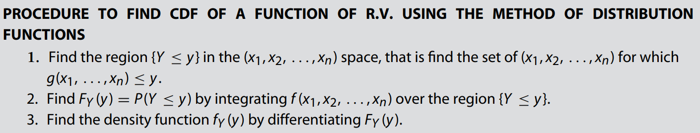
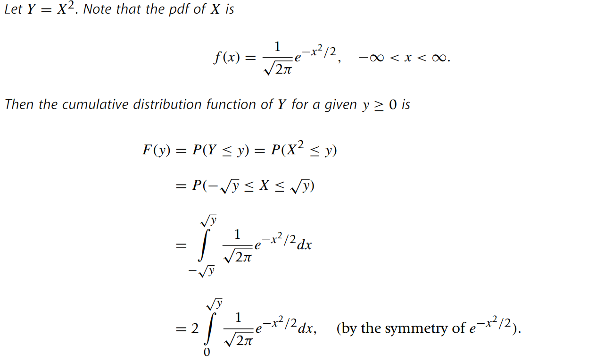
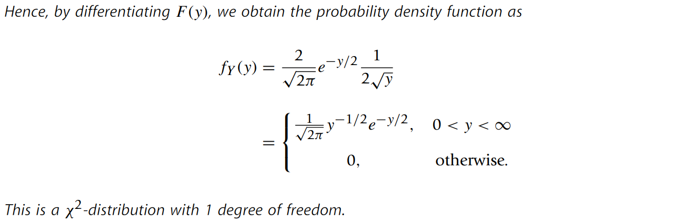
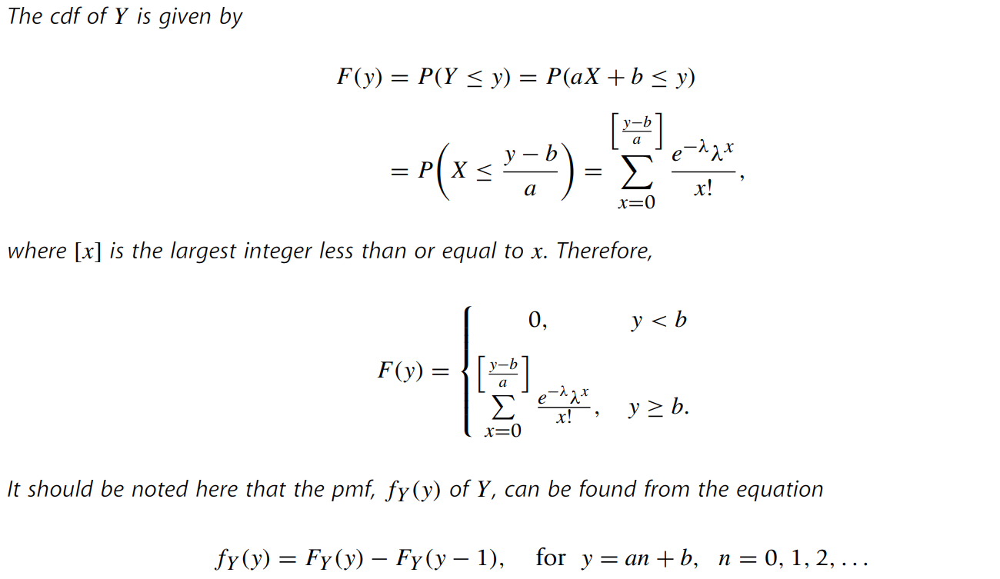
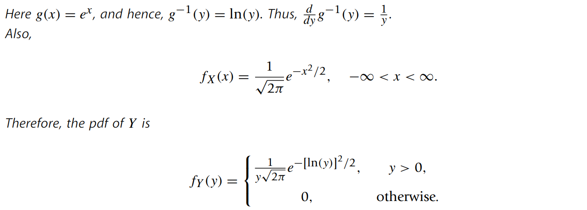
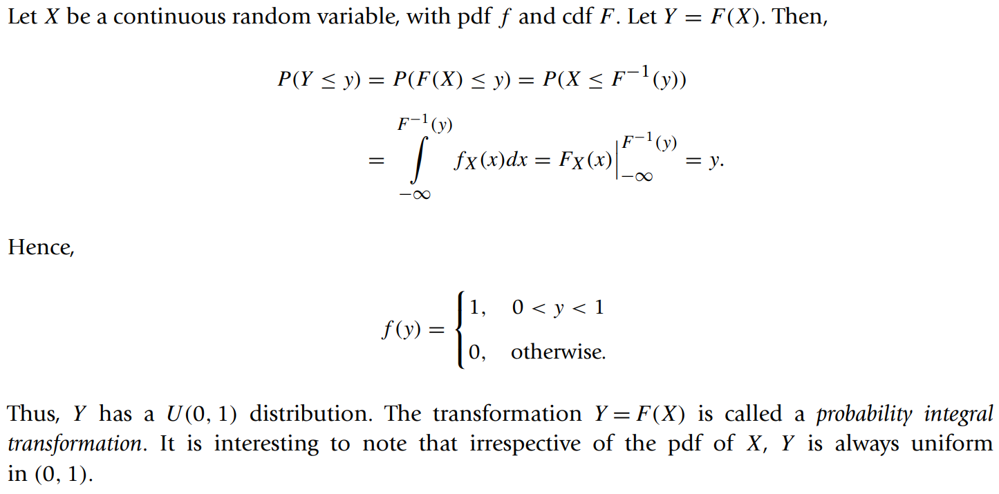
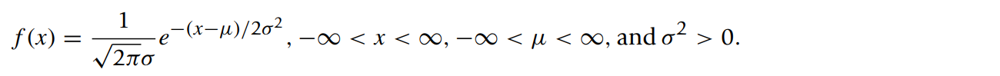
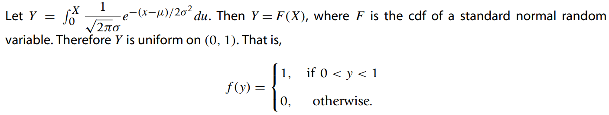
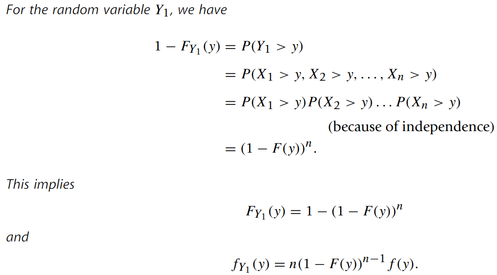
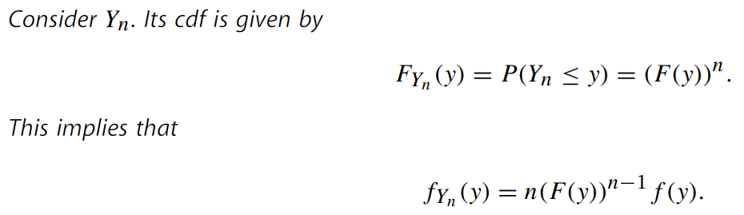

* [Back to Statistics Main](../../main.md)

# 3.4 Functions of Random Variables
#### Objective)
- The methods of finding the probability distribution of a function of a
random variable $X$.
  - e.g.)
    - Suppose the velocity $V$ of a gas molecule behaves as a gamma-distributed random variable.
    - Then what is the distribution of $E = mV^2$.
      - i.e.) This is a problem of finding the distribution of a function of a random variable $E = g(V)$.

  

## 3.4.1 Method of Distribution Functions
- Desc.)
  - If $X$ is a random variable with pdf $f_X(x)$ and if $Y$ is some function of $X$, then we can find the cdf $F_Y(y) = P(Y \le y)$ directly by integrating $f_X(x)$ over the region for which $\lbrace Y \le y\rbrace$.
- Procedure)   

#### Examples)
- Continuous Case)
   - Let $X \sim N(0,1)$. Find the pdf of $X^2$.
      - Sol.)   

   
   

- Discrete Case)
   - Let $X \sim Poisson(\lambda)$. Find the cdf of $Y=aX+b$.
      - Sol.)    

   

  

## 3.4.2 The pdf of Y=g(X), Where g is Differentiable and Monotone Increasing or Decreasing
- Settings)
  - $Y=g(X)$ a random variable
    - where $X$ is a continuous random variable with pdf $f_X(x)$.
    - and $g$ is differentiable and the inverse function $g^{-1}$ of $g$ exists.
- Derivation)
  - Then, $X = g^{-1}(Y)$.
  - Let $f_X(x)$ the pdf of $X$.
  - Then $f_Y(y)$, the pdf of $Y$, is...
    - $f_Y(y) = f_X(g^{-1}(y))\cdot\frac{d}{dy}g^{-1}(y)$
- Example)
  - Let $X \sim N(0,1)$. Find the pdf of $Y=e^X$.
    - Sol.)   

  

## 3.4.3 Probability Integral Transformation

- Example)
  - Let $X \sim N(\mu,\sigma^2)$.
    - Sol.)
      - Then   

  

## 3.4.4 Functions of Several Random Variables: Method of Distribution Functions
- i.e.) $Y$ is a function of several random variables.
  - $Y=g(X_1, \cdots, X_n)$

#### Example : min/max function
1. $Y_1 = min(X_1, \cdots, X_n)$

 

2. $Y_n = max(X_1, \cdots, X_n)$

  

## 3.4.5 Transformation Method

### [Exercises](./exercises.md)

  

* [Back to Statistics Main](../../main.md)