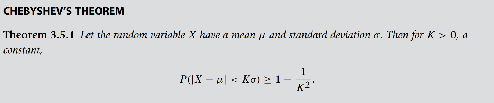
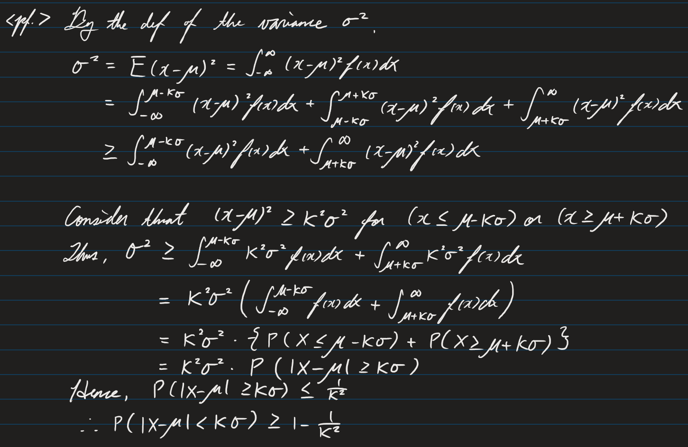
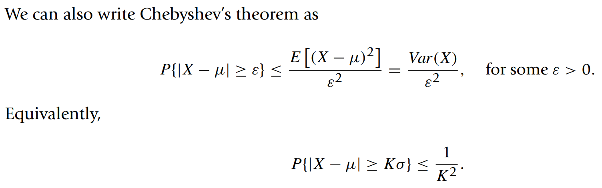

* [Back to Statistics Main](../../main.md)

# 3.5 Limit Theorems 
### Theorem) Chebyshev's Theorem
   
   

Chebyshev’s inequality states that the probability that a random variable X differs from its mean by at least K standard deviations is less than or equal to $\frac{1}{K^2} (K\ge2)$.

 

#### Prop.) Chebyshev's Theorem
  
  - Why?)   
    

  

### [Exercises](./exercises.md)

  

* [Back to Statistics Main](../../main.md)