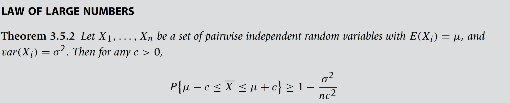

* [Back to Statistics Main](../../main.md)

# 3.5 Limit Theorems 
### Theorem) Chebyshev's Theorem
   
   

Chebyshev’s inequality states that the probability that a random variable $X$ differs from its mean by at least K standard deviations is less than or equal to $\frac{1}{K^2} (K\ge2)$.

 

#### Props.) Chebyshev's Theorem
- Another form
  
  - Why?)   
    
- The Chebyshev's Theorem can be used **regardless of the distribution** of the underlying population, as long as we know its mean and variance.
- If the population distribution is **bell shaped**, we have a better result than Chebyshev’s theorem, namely, the empirical rule that states the following
  1. Approximately 68% of the observations lie within one standard deviation of the mean.
  2. Approximately 95% of the observations lie within two standard deviations of the mean.
  3. Approximately 99.7% of the observations lie within three standard deviations of the mean.

 

#### Example) Chebyshev's Theorem
For any data set (regardless of the shape of the distribution), at least $(1−\frac{1}{K^2})100\%$ of observations will lie within $K(\ge1)$ standard deviations of the mean. 
- e.g.) 
  - At least $(1−\frac{1}{K^2})100\%$ = 75% of the data will fall in the interval $(\bar{x}−2s, \bar{x}+2s)$.
  - At least 88.9% of the observations will lie within three standard deviations of the mean.

  

### Theorem) (Weak) Law of Large Numbers
   
   
   

#### Desc.) (Weak) Law of Large Numbers
Without any knowledge of the probability distribution function of $S_n$, the (weak) law of large numbers states that the sample mean, $\bar{X}=\frac{S_n}{n}$, will differ from the population mean by less than an arbitrary constant, $\epsilon \gt 0$, with probability that tends to 1 as $n$ tends to $\infty$.

  

### Theorem) Central Limit Theorem (CLT)
   
- Prop.)   
     
     
  - How large the n should be for this normal approximation to work depends on the distribution of the original distribution.
  - A rule of thumb is that the sample size n must be at least 30.

  

### [Exercises](./exercises.md)

  

* [Back to Statistics Main](../../main.md)