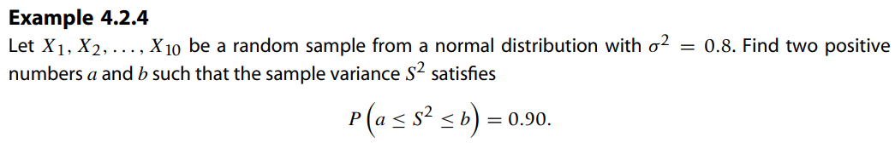

* [Back to Statistics Main](../../main.md)

# 4.2 Sampling Distributions Associated with Normal Populations

### Concepts)
|Concept|Def. & Desc.|
|:-|:-|
|Sample|- A set of observable random variables $X_1,\cdots,X_n$ - The number $n$ is called the **sample size**.|
|Identical Distribution|The random variables $X_1,\cdots,X_n$ are identically distributed if every $X_i$ has the same probability distribution.|
|Random Sample|a set of n **independent and identically distributed (iid)** observable random variables $X_1,\cdots,X_n$|
|Sample Statistic|- A function $T$ of observable random variables $X_1,\cdots,X_n$ that does not depend on any unknown parameters  - e.g.) $\bar{X}=\frac{1}{n}\Sigma_{i=1}^n X_i$ : the sample mean|
|Sampling Distribution| - The probability distribution of a **sample statistic** - It provides the link between probability theory and statistical inference. - The sampling distribution of a statistic provides a theoretical model of the relative frequency histogram for the likely values of the statistic that one would observe through repeated sampling.|

  

### Theorem 4.1.1)
- Let $X_1,\cdots,X_n$ be a random sample of size $n$ from a population with mean $\mu$ and variance $\sigma^2$.
  - Then $E(\bar{X}) = \mu$ and $Var(\bar{X})=\frac{\sigma^2}{n}$
- $\sigma_{\bar{X}}=\frac{\sigma}{\sqrt{n}}$ : standard error of the mean

  

### Theorem 4.1.2) Finite Population Case
- Let $\lbrace c_1, \cdots, c_N\rbrace$ be a finite population of size $N$
  - where $\mu = \frac{1}{N}\Sigma c_i$ and $\sigma^2 = \frac{1}{N}\Sigma (c_i-\mu)^2$
- If $X_1,\cdots,X_n$ is a sample of size $n$ from the population $\lbrace c_1, \cdots, c_N\rbrace$,
  - then $E(\bar{X}) = \mu$ and $Var(\bar{X})=\frac{\sigma^2}{n}\left(\frac{N-n}{N-1}\right)$
    - cd.) $\frac{N-n}{N-1}$ : the finite population correction factor
      - Close to 1 unless the sample amounts to a significant portion of the population
      - Not used in the derivation of sampling distribution, unless it is absolutely necessary

  

### Theorem 4.2.1)
- Let  
  - $X_i \sim N(\mu_i, \sigma_i^2) \textrm{ for } i=1,2,\cdots,n$
    - i.e.) $n$ independent random variables
  - $`\displaystyle Y=\sum_{i=1}^n{a_iX_i}, \exists a_1, \;\cdots, a_n \in \mathbb{R}`$
- Then $Y \sim N(\mu_Y, \sigma_Y^2)$
  - where $\displaystyle \mu_Y=\sum_{i=1}^n{a_i\mu_i}$ and $\displaystyle\sigma_Y^2=\sum_{i=1}^n{a_i^2\sigma_i^2}$

  

### Corollary 4.2.2)
- Let $X_1,\cdots,X_n \sim N(\mu, \sigma^2)$
- Then $\displaystyle \bar{X}=\frac{1}{n}\sum_{i=1}^n{X_i} \sim N(\mu, \frac{\sigma^2}{n})$
- pf.)
  - From [Theorem 4.4.1](#theorem-421), put $a_i=\frac{1}{n}, \mu_i=\mu, \sigma_i=\sigma, \forall i$

  

## 4.2.1 Chi-Square Distribution
- Recall that [the Chi-Square Distribution](../../ch03/02/note.md#concept-chi-square-distribution) was a special case of [a gamma distribution](../../ch03/02/note.md#concept-gamma-probability-distribution) with $\alpha = \frac{n}{2}$ and $\beta=2$ 
  - where $n \gt 0$ was the degree of freedom.
- The mgf was $M(t)=(1-2t)^{-\frac{n}{2}}$.
- The mean was $n$ and the variance was $2n$.

 

### Theorem 4.2.3)
- Let $X_i \sim \chi^2(n_i) \textrm{ for } i=1,2,\cdots k$ be the $k$ independent chi-square random variables.
- Then $`\displaystyle V=\sum_{i=1}^k{X_i} \sim \chi^2\left(\sum_{i=1}^k{n_i}\right)`$

 

### Theorem 4.2.4)
- Let
  - $X_1$ and $X_2$ be independent random variables.
  - $X_1 \sim \chi^2(n_1)$
  - $`Y=X_1+X_2\sim \chi^2(n), \; n \gt n_1`$
- Then $X_2 = Y-X_1 \sim \chi^2(n-n_1)$

 

### Theorem 4.2.5)
- Let $X \sim \Gamma(\alpha, \beta)$.
- Then $Y=\frac{2X}{\beta}\sim\chi^2(2\alpha)$

 

### Theorem 4.2.6)
- Let $X \sim N(0,1^2)$.
- Then $X^2\sim\chi^2(1)$

   
- Figure 4.1   
     

 

### Theorem 4.2.7)
- Let $X_i \sim^{iid} N(\mu, \sigma^2), \textrm{ for } i=1,2,\cdots, n$.
- Then 
  - $Z_i=\frac{X_i-\mu}{\sigma}\sim^{iid} N(0, 1^2)$
  - $\displaystyle \sum_{i=1}^n Z_i^2=\sum_{i=1}^n \left(\frac{X_i-\mu}{\sigma}\right)^2 \sim^{iid} \chi^2(n)$ 

 

### Theorem 4.2.8)
- If $X_i \sim^{iid} N(\mu, \sigma^2), \textrm{ for } i=1,2,\cdots, n$,
- Then 
  - (a) the random variable
  - (b) $\displaystyle\frac{1}{\sigma^2}\sum_{i=1}^{n}(X_i-\bar{X})^2=\frac{(n-1)S^2}{\sigma^2} \sim \chi^2(n-1)$.
  - (c) And $\bar{X}$ and $S^2$ are independent.

- Usage)   
  
  - Sol)   
    

  

## 4.2.2 Student t-Distribution
- Desc.)
  - Let $X_1, \cdots, X_n \sim N(\mu, \sigma^2)$.
  - If $\sigma$ is known, $\frac{\bar{X}-\mu}{\sigma\sqrt{n}} \sim N(0,1)$.
  - Suppose $\sigma$ is not known.
    - Then we should use the sample standard deviation, $s$.
  - If the sample size is large enough, we may assume $\sigma \approx s$.
  - However, if the sample size is small, $\frac{\bar{X}-\mu}{\sigma\sqrt{n}}$ is given by the Student t-Distribution

#### Def. 4.2.2) Student t-Distribution
- Let 
  - $Y$ and $Z$ be independent random variables.
  - $Y\sim\chi^2(n)$
  - $Z\sim N(0,1)$
- Then $T=\frac{Z}{\sqrt{Y/n}}$ is said to have a Student t-Distribution with $n$ degrees of freedom.
  - $T\sim T_n$

#### Props.)
- The Probability Density of $T\sim T_n$ is given by
  - $`\displaystyle f(t) = \frac{\Gamma\left(\frac{n+1}{2}\right)}{\Gamma\left(\frac{n}{2}\right)\sqrt{\pi n}}\left(1+\frac{t^2}{n}\right)^{-\frac{n+1}{2}}, -\infty \lt t \lt \infty`$

- As the degree of freedom tends to infinity, the t-distribution tends to a standard normal distribution.
  

- Symmetric
  - $E(T) = 0$
- If $n \gt 2$, then $Var(T) = n/(n-2)$.

 

### Theorem 4.2.9)
- If $\bar{X}$ and $S^2$ are the mean and the variance of a random sample of size $n$ from a normal population with the mean $\mu$ and variance $\sigma^2$
- then $T=\frac{\bar{X}-\mu}{S/\sqrt{n}}$ has a t-distribution with $(n-1)$ degrees of freedom.

  

### [Exercises](./exercises.md)

  

* [Back to Statistics Main](../../main.md)