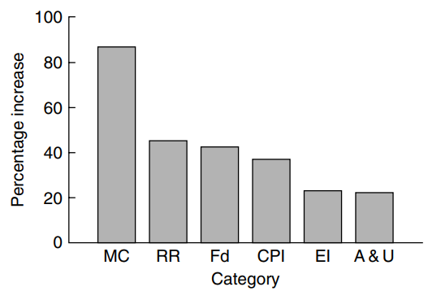
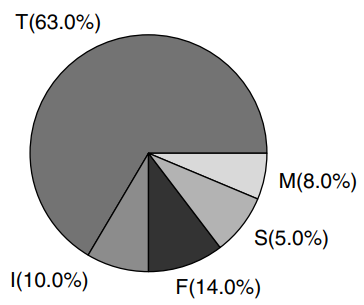
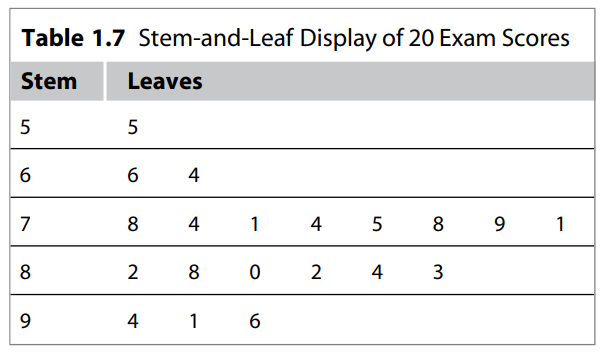
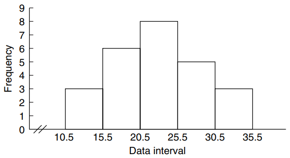

* [Back to Statistics Main](../../main.md)

## 1.4 Graphical Representation of Data
* Common Graphical displays
  * [Bar Graph](#concept-bar-graph)
  * [Pareto Chart](#concept-bar-graph)
  * [Pie Chart](#concept-pie-chart)
  * [Stem-and-Leaf Plot](#concept-stem-and-leaf-plot)
  * [Frequency Table](#concept-frequency-table)
  * [Histogram](#concept-histogram)

 

#### Concept) Bar Graph
* Def) A graph of bars whose heights represent the frequencies (or relative frequencies) of respective categories is called a bar graph   
  
  * Cf.) Pareto Chart
    * A bar graph with the height of the bars proportional to the contribution of each factor. 
    * The bars are displayed from the most numerous category to the least numerous category.   
    

 

#### Concept) Pie Chart
* Def) A circle divided into sectors that represent the percentages of a population or a sample that belongs to different categories is called a pie chart.   
* 

 

#### Concept) Stem-and-Leaf Plot
* Def) Each data value is split into a **stem** and a **leaf**.
  * **leaf** : usually the last digit of the number
  * **stem** : Formed with the other digits to the left of the **leaf**   
  
* Advantages)
  * A simple way of summarizing quantitative data and is well suited to computer applications
  * Useful when data sets are relatively small
  * Useful when data distribution is symmetrical
* Prop)
  * Can be used only with quantitative data

 

#### Concept) Frequency Table
* Def) A table that divides a data set into a suitable number of categories (classes)
* Prop.)
  * Provides only a count of those observations
  * Grouped Data : Data presented in the form of a frequency table
  * Class Mark : the center of each class
  * Class Boundaries : the end points of each class interval
  * Def) Relative Frequency / Cumulative Relative Frequency   
    

 

#### Concept) Histogram
* Def) A graph in which classes are marked on the horizontal axis and either the frequencies, relative frequencies, or percentages are represented by the heights on the vertical axis.   

* Prop)
  * The bars are drawn adjacent to each other without any gaps.

* [Back to Statistics Main](../../main.md)