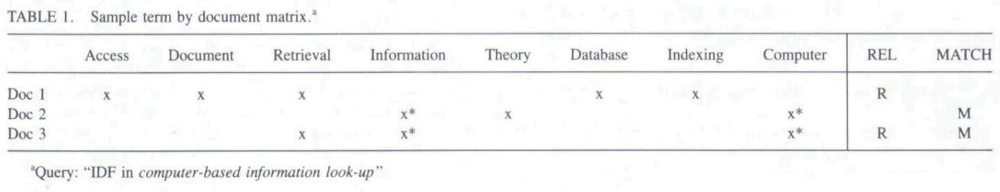

* [Back to Main](../README.md)
---

# Indexing by Latent Semantic Analysis
#### Scott Deerwester, Susan T. Dumais, George W. Furnas, and Thomas K. Landauer, Richard Harshman

* [Read Paper](../papers/230906%20lsa.pdf)

---
## 0. Introduction
#### Goal) Describing a new approach to automatic indexing and retrieval
* Why doing this?
  * A fundamental problem in matching **words of queries** with **words of documents**
  * Users want to retrieve on the basis of **conceptual content**
  * **Individual words** provide unreliable evidence about the conceptual topic or meaning of a document. 
  * So the **literal terms** in a user's query may not match those of a relevant document.
  * Most words have **multiple meanings**, so terms in a user's query will literally match terms in documents that are not of interest to the user.
  
#### Sol.) Treating the **unreliability** of observed term-document association data as a **statistical problem**
  * Assumption) 
    * There is some underlying **latent semantic structure** in the data that is partially obscured by the **randomness of word choice** with respect to retrieval.
  * Tools Used) 
    1. **Statistics**
         * To estimate this latent structure
         * To get rid of the obscuring "noise."
    2. **Singular-value decomposition**
         * Desc.
           * One sort of latent semantic indexing(LSI)
         * How it works?
           * Take a large matrix of term-document association data 
           * Construct a **semantic space**
             * Concept) Semantic Space
               * Terms and documents that are closely associated are **placed** near one another
           * **Position** in the space then serves as the new kind of semantic indexing.
           * Retrieval proceeds by using the terms in a query to identify a point in the space, and documents in its **neighborhood** are returned to the user.
         * Advantage)
           * It can arrange the space to reflect the major **associative patterns** in the data
           * Ignore the smaller, less important influences
         * Effect)
           * Terms that did not actually appear in a document may still end up close to the document, if that is consistent with the major patterns of association in the data

---
## 1. Deficiencies of Current Automatic Indexing and Retrieval Methods

#### Concept) A Problem in current information retrieval methods 
* (words that searchers use often) $\neq$ (words indexed by the information searchers seek)
  * Two concepts in this issue
    1. Synonymy
       * Meaning)
         * There are many ways to refer to the same object.
         * Users in different contexts, or with different needs, knowledge, or linguistic habits will describe the same information using different terms.
       * Result)
         * The prevalence of synonyms tends to **decrease the "recall" performance of retrieval systems**.
    2. Polysemy
       * Meaning)
         * Most words have more than one distinct meaning (homography).
         * In different contexts or when used by different people the same term takes on varying referential significance.
       * Result)
         * The use of a term in a search query does not necessarily mean that a document containing or labeled by the same term is of interest.
         * Polysemy is one factor underlying **poor "precision."**
  * Three Factors that incurs current automatic indexing's failure
    1. The way **index terms** are identified is incomplete.
        * How?
          * The terms used to describe or index a document typically **contain only a fraction** of the terms that users look it up under.
        * Why it happens?
          * The documents themselves do not contain all the terms users will apply
          * Term selection procedures intentionally omit many of the terms in a document.
        * Current Approach to the Problem)
          * Intellectual or automatic **term expansion**
            * e.g.) construction of a thesaurus
            * Drawback) Some added terms may have different meaning from that intended (the polysemy effect) leading to rapid degradation of precision.
    2. The lack of an adequate **automatic method** for dealing with polysemy.
        * Common Approaches)
          1. Use controlled vocabularies and human intermediaries to act as translators.
             * Drawbacks
               * Extremely expensive
               * Not effective
          2. Boolean intersection or coordination with other terms to disambiguate meaning.
             * Limits
               * Inability to think of appropriate limiting terms if they do exist
               * Such terms may not occur in the documents or may not have been included in the indexing.
    2. Failure to take redundancy into account.
       * Why?)
         * In current automatic indexing and retrieval systems, each word type is treated as **independent** of any other.
           * e.g.) Boolean or coordination level searches
         * Thus, matching (or not) both of two terms that almost always occur together is counted as heavily as matching two that are rarely found in the same document.
           * i.e.) There is no weight in matching results
       * Result)
         * Failure to take redundancy into account
         * Distortion of results to an unknown degree.

---
## 2. Rationale of the Latent Semantic Indexing (LSI) Method

### Description) Retrieval Problems
* Target)
  * Term-based information retrieval system
* Experiment
  
  * How to interpret
    * A frictional query is given to a DB
      * Two Key Terms in the Query : Information, Computer
    * Three documents will be considered compared with the query above.
      * x : Denotes the terms appeared in a certain document
      * x* : Denotes the terms appeared both in the query and the document
    * REL : Marked R if the document is considered to be RELEVANT to the query by the human observer.
    * MATCH : Marked M if the document matches the query and would have been returned to the user.
      * In the example above, a document with the term "Information" and "Computer" will match the query : Doc 2 and Doc 3
  * Result)
    * Doc 1 : Relevant and ~Matched
    * Doc 2 : ~Relevant and Matched
    * Doc 3 : Relevant and Matched
  * Analysis
    * **Synonymy Problem**
      * Doc 1 Case
        * Doc 1 did not match
        * In order to match, the document should have contained the term "look-up" or the query should have contained the term "access" or "retrieval."
      * Why it happened?
        * In the document's perspective...
          * Any document contains only the **small selection** from the complete discourse that might have been written on its topic.
          * Thus, **the text from which we extract index terms** is a fallible observation from which to infer what terms actually apply to its topic.
        * In the query's perspective
          * Any query is only one sample description of the intended documents.
          * It could have contained many different terms from the ones it does.
      * Sol.) Latent Semantics
        * Goal)
          * Building a retrieval system that finds some way to predict what terms "really" are implied by a query or apply to a document on the basis of the fallible sample actually found there.
        * Assumption)
          * If a great deal of structure exists between certain terms, we may assume that they have strong correlation.
          * If the terms have strong correlation, we may use them to correct each other.
          * Ex)
            * Suppose the term "access" and "retrieval" occurred together in 100 documents.
            * Then, we may assume that they are strongly correlated.
            * Occurrence is one of the examples of a great-deal-of-structure.
        * Term)
          * (A great-deal-of-structure) = (An implicit higher-order structure) = (A latent structure)

---
* [Back to Main](../README.md)