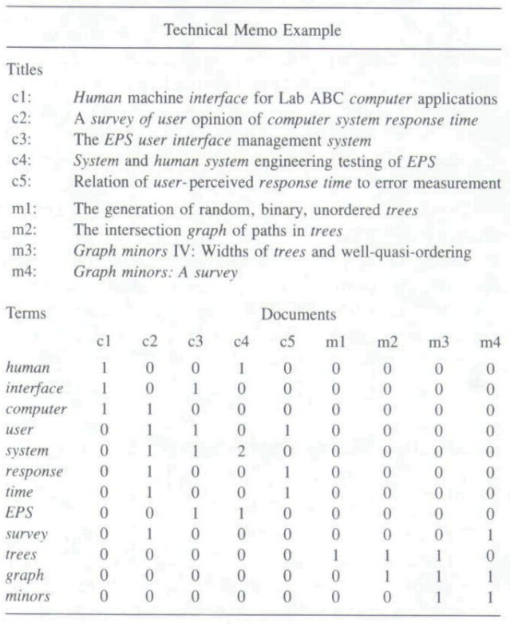
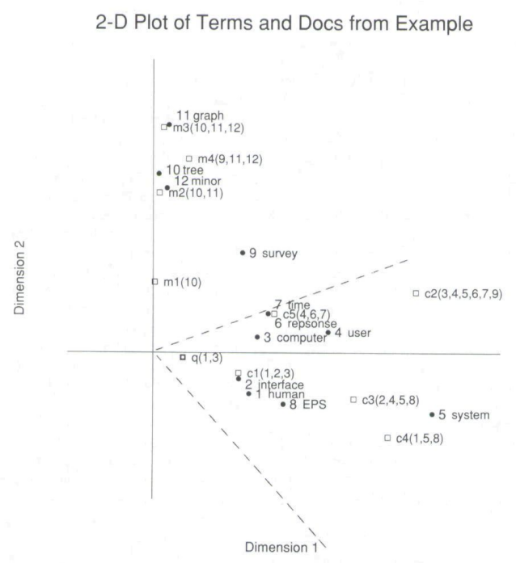
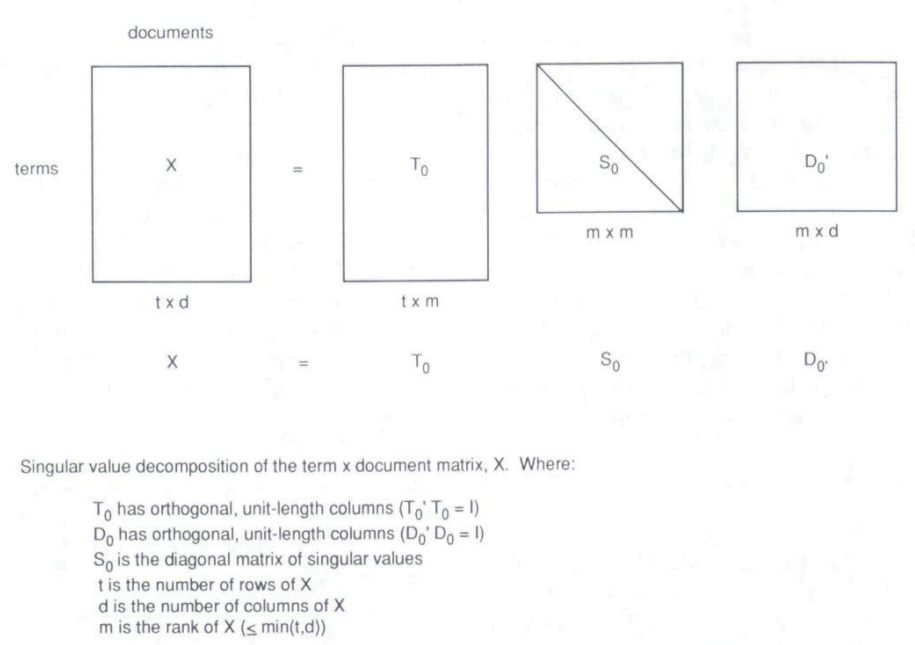
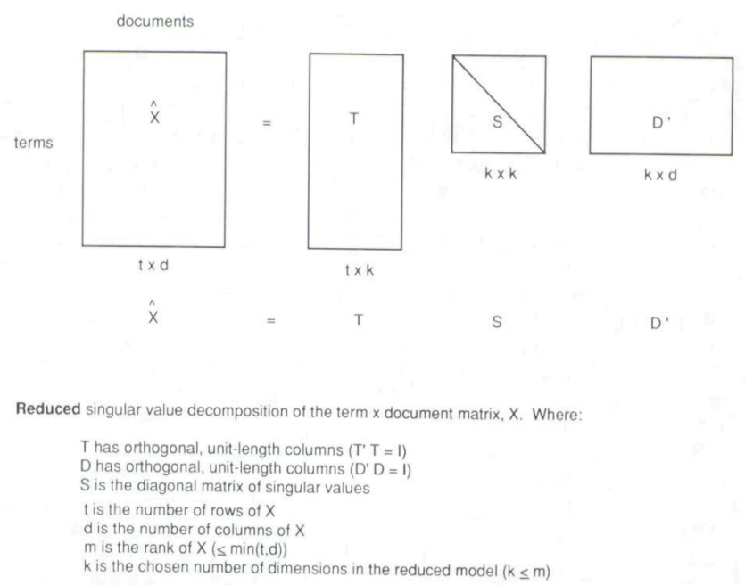

* [Back to Main](../README.md)
---

# Indexing by Latent Semantic Analysis
#### Scott Deerwester, Susan T. Dumais, George W. Furnas, and Thomas K. Landauer, Richard Harshman

* [Read Paper](../papers/230906%20lsa.pdf)

---
## 0. Introduction
#### Goal) Describing a new approach to automatic indexing and retrieval
* Why doing this?
  * A fundamental problem in matching **words of queries** with **words of documents**
  * Users want to retrieve on the basis of **conceptual content**
  * **Individual words** provide unreliable evidence about the conceptual topic or meaning of a document. 
  * So the **literal terms** in a user's query may not match those of a relevant document.
  * Most words have **multiple meanings**, so terms in a user's query will literally match terms in documents that are not of interest to the user.
  
#### Sol.) Treating the **unreliability** of observed term-document association data as a **statistical problem**
  * Assumption) 
    * There is some underlying **latent semantic structure** in the data that is partially obscured by the **randomness of word choice** with respect to retrieval.
  * Tools Used) 
    1. **Statistics**
         * To estimate this latent structure
         * To get rid of the obscuring "noise."
    2. **Singular-value decomposition**
         * Desc.
           * One sort of latent semantic indexing(LSI)
         * How it works?
           * Take a large matrix of term-document association data 
           * Construct a **semantic space**
             * Concept) Semantic Space
               * Terms and documents that are closely associated are **placed** near one another
           * **Position** in the space then serves as the new kind of semantic indexing.
           * Retrieval proceeds by using the terms in a query to identify a point in the space, and documents in its **neighborhood** are returned to the user.
         * Advantage)
           * It can arrange the space to reflect the major **associative patterns** in the data
           * Ignore the smaller, less important influences
         * Effect)
           * Terms that did not actually appear in a document may still end up close to the document, if that is consistent with the major patterns of association in the data

  

## 1. Deficiencies of Current Automatic Indexing and Retrieval Methods

### 1.1 A Problem in current information retrieval methods 
* (words that searchers use often) $\neq$ (words indexed by the information searchers seek)
  * Two concepts in this issue
    1. Synonymy
       * Meaning)
         * There are many ways to refer to the same object.
         * Users in different contexts, or with different needs, knowledge, or linguistic habits will describe the same information using different terms.
       * Result)
         * The prevalence of synonyms tends to **decrease the "recall" performance of retrieval systems**.
    2. Polysemy
       * Meaning)
         * Most words have more than one distinct meaning (homography).
         * In different contexts or when used by different people the same term takes on varying referential significance.
       * Result)
         * The use of a term in a search query does not necessarily mean that a document containing or labeled by the same term is of interest.
         * Polysemy is one factor underlying **poor "precision."**
  * Three Factors that incurs current automatic indexing's failure
    1. The way **index terms** are identified is incomplete.
        * How?
          * The terms used to describe or index a document typically **contain only a fraction** of the terms that users look it up under.
        * Why it happens?
          * The documents themselves do not contain all the terms users will apply
          * Term selection procedures intentionally omit many of the terms in a document.
        * Current Approach to the Problem)
          * Intellectual or automatic **term expansion**
            * e.g.) construction of a thesaurus
            * Drawback) Some added terms may have different meaning from that intended (the polysemy effect) leading to rapid degradation of precision.
    2. The lack of an adequate **automatic method** for dealing with polysemy.
        * Common Approaches)
          1. Use controlled vocabularies and human intermediaries to act as translators.
             * Drawbacks
               * Extremely expensive
               * Not effective
          2. Boolean intersection or coordination with other terms to disambiguate meaning.
             * Limits
               * Inability to think of appropriate limiting terms if they do exist
               * Such terms may not occur in the documents or may not have been included in the indexing.
    2. Failure to take redundancy into account.
       * Why?)
         * In current automatic indexing and retrieval systems, each word type is treated as **independent** of any other.
           * e.g.) Boolean or coordination level searches
         * Thus, matching (or not) both of two terms that almost always occur together is counted as heavily as matching two that are rarely found in the same document.
           * i.e.) There is no weight in matching results
       * Result)
         * Failure to take redundancy into account
         * Distortion of results to an unknown degree.

  

## 2. Rationale of the Latent Semantic Indexing (LSI) Method

### 2.1 Retrieval Problems
* Target)
  * Term-based information retrieval system
* Experiment
  
  * How to interpret
    * A frictional query is given to a DB
      * Two Key Terms in the Query : Information, Computer
    * Three documents will be considered compared with the query above.
      * x : Denotes the terms appeared in a certain document
      * x* : Denotes the terms appeared both in the query and the document
    * REL : Marked R if the document is considered to be RELEVANT to the query by the human observer.
    * MATCH : Marked M if the document matches the query and would have been returned to the user.
      * In the example above, a document with the term "Information" and "Computer" will match the query : Doc 2 and Doc 3
  * Result)
    * Doc 1 : Relevant and ~Matched
    * Doc 2 : ~Relevant and Matched
    * Doc 3 : Relevant and Matched
  * Analysis
    * **Synonymy Problem**
      * Doc 1 Case
        * Doc 1 did not match
        * In order to match, the document should have contained the term "look-up" or the query should have contained the term "access" or "retrieval."
      * Why it happened?
        * In a document's perspective...
          * Any document contains only the **small selection** from the complete discourse that might have been written on its topic.
          * Thus, **the text from which we extract index terms** is a fallible observation from which to infer what terms actually apply to its topic.
        * In a query's perspective
          * Any query is only one sample description of the intended documents.
          * It could have contained many different terms from the ones it does.
      * Sol.) Latent Semantics
        * Goal)
          * Building a retrieval system that finds some way to predict what terms "really" are implied by a query or apply to a document on the basis of the fallible sample actually found there.
        * Assumption)
          * If a great deal of structure exists between certain terms, we may assume that they have strong correlation.
          * If the terms have strong correlation, we may use them to correct each other.
          * Ex)
            * Suppose the term "access" and "retrieval" occurred together in 100 documents.
            * Then, we may assume that they are strongly correlated.
            * Occurrence is one of the examples of a great-deal-of-structure.
        * Term)
          * (A great-deal-of-structure) = (An implicit higher-order structure) = (A latent structure)

 

### 2.2 The Choice of Method for Uncovering Latent Semantic Structure

* Goal)
  * To find and fit a useful model of the **relationships** between terms and documents.
  
* How to)
  1. Estimate parameters of an underlying model
     * By using the matrix of observed occurrences of terms applied to documents
  2. With the model, estimate what the observed occurrences really should have been.
  3. Predict that a given term should be associated with a document, even though, because of variability in word use, no such association was observed.
   
#### 2.2.1 Past Models Review
1. **Hierarchical Classification Analysis (X)**
   * Assumptions in Document Clustering
     * Distance
       * Two documents are considered close to the   extent that they contain the same terms.
   * How it works)
     * The matrix of document-to-document distances is   then subjected to a clustering analysis to find a   **hierarchical** classification for the documents
     * **Retrieval** is made based on exploring   neighborhoods of this structure.
   * **Weakness of the model**
     * Hierarchies are far too limited to capture the   rich semantics of most document sets.
     * Hierarchical clusterings permit no cross   classifications
     * Have very few free parameters
       * $n$ parameters for $n$ objects
     * Empirically, clustering improves the computational efficiency of search; whether or not it **improves retrieval success is unclear.**
2. **Factor analysis ($\Delta$)**
   * How it works)
     * Set a square symmetric matrix of similarities between pairs of documents 
       * Based on statistical term overlap or human judgments
     * Use linear algebra to construct a **low dimensional spatial model** wherein similar documents are placed near one another.
   * Advantage)
     * Has the potential of much greater richness than the clustering model (a $k$ dimensional model for $n$ points has $nk$ parameters)
   * Drawbacks)
     1. Computationally expensive
     2. Past attempts considered only the restricted versions
        * Using very low dimensionalities
        * Converting the factor analysis results to a simple binary clustering
     3. Some attempts have relied on excessively tedious **data gathering techniques**, requiring the collection of thousands of **similarity judgments from humans**

#### 2.2.2 Model Selection : Two-Mode Factor Analysis
* This paper's distinction from the previous models.
  1. Examine problems of reasonable size.
     * 1000-2000 document abstracts
     * 5000-7000 index terms) 
  2. Use a rich, high-dimensional representation  to capture term-document relations. 
     * About 100 dimensions
  3. Use a mathematical technique which explicitly represents both terms and documents **in the same space**.
  4. Retrieve documents from query terms directly, without rotation or interpretation of the underlying axes and without using intermediate document clusters.
* Required Criteria
  1. Adjustable representational richness
     * Why? 
       * Needs a model with **sufficient power** to represent the underlying semantic structure
     * Sol.) Dimensional Models
       * e.g.) multidimensional scaling and **factor analysis**
       * why?)
         * Representational power can be controlled by choosing the number, $k$, of dimensions
         * i.e.) $k$ parameters per object
  2. Explicit representation of both terms and documents
     * How?)
       * Use **proximity**-based latent structure paradigm
       * Place a new object corresponding to the query in the semantic structure and finding those documents that are close by.
       * Let terms and documents have positions in the structure.
       * Then a query can be placed at the centroid of its term points
     * Models that can be considered
       1. Two-Mode Proximity Methods
          * How?
            * Set a rectangular matrix and construct explicit representations of both row and column objects
          * Advantage)
            * Both **terms** and **documents** would appear as points in a **single space** with similarity related monotonically to Euclidean distance.
       2. **Two-Mode Factor Analysis (O)**
          * How?
            * Terms and documents would again be represented as points in a space
            * **Similarity is given by the inner product between points.** 
          * Prop.)
            * A generalization of the familiar factor analytic model based on singular value decomposition (SVD)
            * SVD represents both terms and documents as vectors in a space of choosable dimensionality, and the dot product or cosine between points in the space gives their similarity.
       3. Unfolding in Trees
          * How?
            * Both terms and documents would appear as **leaves** on a tree
            * **Path length distance** through the tree would give the similarity.
            * Add or fold-in new terms or documents not in the original matrix. 
            * New terms can be placed at the centroid of the documents in which they appear.
            * New documents can be placed the centroid of their constituent terms.
          * e.g.)
            * Simultaneous hierarchical clustering of both terms and documents
          * Disadvantage)
            * Too representationally restrictive
            * Too computationally expensive
  3. Computational tractability for large datasets
     * Consider that the considered models are complex.
     * Requiring computation that goes up with $N^4$ or $N^5$

  

## 3. SVD or Two-Mode Factor Analysis

### 3.1 Comparison : One-Mode vs Two-Mode Factor Analysis
#### 1) [One-Mode Factor Analysis](#221-past-models-review) Procedure
1. Build a **symmetric square matrix** of associations between all pairs of one type of object
   * Depends on the human judgement
2. Decompose the **symmetric square matrix** with **eigen-analysis**
   * Result) These special matrices show a breakdown of the original data into linearly independent components or "**factors**."
     * Factors are very small in general
     * Leads to an approximate model that contains many fewer factors.
3. Approximate the similarity between the original documents by their values on this **smaller number of factors**.
4. Geometric Representation
   * Dot product or cosine between vectors representing two documents corresponds to their estimated similarity

 

#### 2) Two-Mode Factor Analysis Procedure
1. Build an **arbitrary rectangular matrix** with different entities on the rows and columns 
    * a matrix of terms
    * a matrix of documents
2. Decompose the rectangular matrices into three other matrices of a very special form with **singular-value-decomposition (SVD)**.
    * The resulting matrices contain "singular vectors" and "singular values."
    * These special matrices show a breakdown of the original relationships into linearly independent components or **factors**.
      * Many of these components are very small.
      * May be ignored
      * Leads to an approximate model that contains many fewer dimensions.
        * **Dimension Reduction** enables the mapping of different profiles of term usage into the same vector of factor values.
    * **Factors** may be thought of as artificial concepts
      * Represents extracted common meaning components of many different words and documents.
      * $k$ factor values (the location of a vector in the $k$-space) : Express the meaning of a particular term, query, or document
        * Economical because $k$ surrogates $N$
          * why?) $k \lt N$ where $N$ is the number of original index terms
3. Approximate the similarity between the original documents by their values on this **smaller number of dimensions**.
   1. Form a pseudo-document formed from the query 
       * A query can be represented as the weighted sum of its component term vectors
         * why?) Query is a set of words, just like documents.
   3. Compare the pseudo-document with all the documents
   4. Return a set of potential candidate documents with the highest cosines (the nearest vectors).
4. Geometric Representation
   * Dot product or cosine between vectors representing two documents corresponds to their estimated similarity

 

### 3.2 SVD Example
* Description
  * Nine Documents : c1 ~ m4
    * *Human Computer Interface* related : c1 ~ c5
    * *Graph Theory related* : m1 ~ m4
  * Words occurring in more than one title were selected for indexing.
  * Numbers : Frequencies each term occurred in each document.

</img>

* Experiment)
  * Query : human computer interface
    * This will generate a **pseudo document** with terms *human*, *computer*, and *interface*.

* Result
  * Two-dimensional geometric representation for terms and documents that resulted from the SVD analysis.
    * Filled Circles : Terms
    * Open Squares : Documents
    * Point **q** : Pseudo Document of the query *human computer interface*
    * Dash Line : Border of the area within 0.9 cosine distance from the point **q**
  

* Interpretation
  * Without SVD (Rough estimation)
    * Suppose we simply count the numbers in the [table](#ex-svd-example).
    * Then, we may return c1, c3, and c5, which have the terms *human*, *computer*, and *interface*.
    * However, we may not choose c2 and c5, which should also be returned.
  * With SVD
    * c1, c3, c3 : Within the 0.9 cosine area
    * c2 and c5 : Within the 0.9 cosine area
      * This is the one that the above method could not achieve.

 

### 3.3 Technical Details 
#### 3.3.1 The Singular Value Decomposition (SVD) Model 

|1) Initial Model|>|2) Approximated Model|
|-------|--|-------------|
||>||

#### 1) Set a model.
* Goal)
  * Set a proper model that we can simplify and reduce the dimension using approximation.
* Setting
  * Let $X$ : A rectangular matrix with the size $t \times d$
    * Representing a term or a document
  * Then $\exists T_0, D_0$ such that $X=T_0S_0D_0'$
    * where $T_0$ : a matrix of the left singular vectors
    * $D_0$ : a matrix of the right singular vectors
    * $S_0$ : a diagonal matrix of singular values
      * By convention, the diagonal elements of $S_0$, are constructed to be all positive and ordered in decreasing magnitude.    
* Prop.)
  * Singular value decomposition (SVD) is unique up to certain row, column and sign permutations
  * Relationship between SVD and eigenvectors/eigenvalues
    * Let $Y$ a square matrix such that
      * $Y=XX'$
      * $\exists V,L$ where $Y=VLV'$
        * $V$ is orthonormal 
        * $L$ is diagonal
    * Then,
      * $T_0$ is the matrix of eigenvectors of the square symmetric matrix $Y = XX'$.
      * $D_0$ is the matrix of eigenvectors of $Y = X'X$.
      * $S_0^2$ would be the matrix, $L$, of eigenvalues.
  * In general, for $X=T_0S_0D_0'$ the matrices $T_0$, $D_0$, and $S_0$ must all be of full rank.
* Advantage)
  * It allows a simple strategy for optimal approximate fit using smaller matrices.
  * WE CAN [APPROXIMATE](#2-approximate)!

 

#### 2) Approximate
* Goal)
  * $X\approx\hat{X}=TSD'$
* Derivation)
  1. The singular values in $S_0$ are ordered by size.
     * Recall [the setting and the convention](#1-set-a-model)!
     * Then, the first $k$ largest may be kept and the remaining smaller ones set to zero.
  2. Let $\hat{X}$, the product of the resulting matrices.
     * $\hat{X}$ is only approximately equal to $X$
     * $\hat{X}$ is of rank $k$.
  3. Let $S$, a diagonal matrix obtained by deleting the zero rows and columns of $S_0$
  4. Get $T$ and $D$, by deleting the corresponding columns of $T_0$ and $D_0$.
  5. Then, $X\approx\hat{X}=TSD'$
* Prop.)
  * A rank-$k$ model with the best possible least-squares-fit to $X$.
  * **Dimension Reduction**
    * The dimension has been reduced by the rank $k$
    * Question) How do we choose $k$?
      * The paper practically chose value of $k$ which yields good retrieval performance.

 

#### 3.3.2 Geometric Interpretation of the SVD Model

</img>

* Props)
  * **The rows of the reduced matrices of singular vectors** are taken as coordinates of points representing the documents and terms in a k dimensional space.
  * **Dot products between points in the space** can be used to compare the corresponding objects.
     * Appropriate rescaling of the axes by quantities related to the associated diagonal values of $S$ is needed

 

#### 3.3.3 Computing Fundamental Comparison Quantities from the SVD Model

* Three sorts of comparisons of interest
  1. Comparing two terms : How similar are terms $i$ and $j$?
  2. Comparing two documents : How similar are documents $i$ and $j$?
  3. Comparing a term and a document : How associated are term $i$ and document $j$?
* How?
  * Compare two rows, compare two columns, or examine individual cells of the **reduced matrix** of term by document data, $\hat{X}$
    * Why $\hat{X}$ instead of $X$?
      1. $\hat{X}$ is presumed to represent the important and reliable patterns underlying the data in $X$.
      2. Relevant quantities can be computed just using the smaller matrices $T$, $S$, and $D$ where $\hat{X} = TSD'$

---
* [Back to Main](../README.md)

