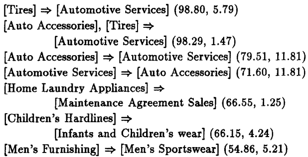
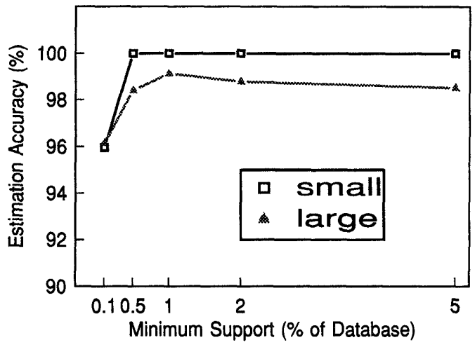
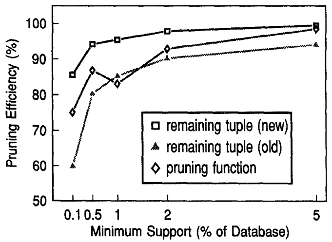

* [Back to Main](../README.md)
---

# Mining Association Rules between Sets of Items in Large Databases
### Rakesh Agrawal, Tomasz Imielinski, and Arun Swami
* [Read Paper](/papers/230926%20mining_asso.pdf)

---

## 1. Introduction
#### Purpose of this paper
1. Introduce the problem of “mining” a large collection of basket data type transactions for [association rules](#eg-association-rule) between sets of items with some minimum specified confidence 
2. Present an efficient algorithm for this purpose.

<br>

#### e.g.) Association Rule
* cf.) [Notation in this paper](#concept-association-rule)
* Statement
  * 90% of transactions that purchase bread and butter also purchase milk.
* Interpretation
  * The **antecedent** of this rule consists of bread and butter
  * The **consequent** consists of milk alone. 
  * **Confidence** of the rule : The number 90%

<br>

#### Practical Usage Examples
|Query|Usage|
|-----|-----|
|Find all rules that have “Diet Coke” as consequent.|These rules may help plan what the store should do to boost the sale of Diet Coke|
|Find all rules that have “bagels” in the antecedent.|These rules may help determine what products may be impacted if the store discontinues selling bagels|
|Find all rules that have “sausage” in the antecedent and “mustard” in the consequent.|This query can be phrased alternatively as a request for the additional items that have to be sold together with sausage in order to make it highly likely that mustard will also be sold.|
|Find all the rules relating items located on shelves A and B in the store.|These rules may help shelf planning by determining if the sale of items on shelf A is related to the sale of items on shelf B.|
|Find the “best” $k$ rules that have “bagels” in the consequent.|Here, “best” can be formulated in terms of the confidence factors of the rules, or in terms of their support, i.e., the fraction of transactions satisfying the rule.|


<br><br>


## 2. Formal Model
* Setting)
  * $I =\{I_1, I_2, ..., I_m\}$ : a set of binary attributes called items
    * $m$ : the number of items
  * $T$ : a database of transaction
    * $t\in R^m$ : a transaction represented as a binary vector
      * $`t[k]=\left\lbrace\begin{array}{cl}1&if\space bought\space the\space item\space I_k\\0&otherwise\end{array}\right.`$
      * e.g.) 
        * $t = [0\space 1\space 0\space ...\space 1]$
  * $X\subset I$ : a set of items in $I$
  * $t$ satisfies $X$ : For all items $I_k$ in $X$, $t[k]=1$.

<br>

#### Concept) Association Rule
Def.) $X\Rightarrow I_j$
  * Let $I_j$ an item not included in $X$.
  * Then the **association rule** can be denoted as $X\Rightarrow I_j$

<br>

#### Concept) Confidence Factor (c)
  * The rule of $X\Rightarrow I_j$ can be satisfied in $T$ with the confidence factor $0 \le c \le 1$
  * If and only if at least $c$% of transactions in $T$ that satisfy $X$ also satisfy $I_j$.

<br>

#### Concept) Syntactic Constraints
Restrictions on items that can appear in a rule.
* e.g.) We may be interested only in rules that have a specific item $I_x$ appearing in the consequent, or rules that have a specific item $I_y$ appearing in the antecedent.
* Combinations of the above constraints
are also possible.

<br>

#### Concept) Support Constraints
The number of transactions in $T$ that support a rule.
* Def.) The **support** for a rule 
  * The fraction of transactions in $T$ that satisfy the union of items in the consequent and antecedent of the rule.
* Note) support $\ne$ [confidence](#concept-confidence-factor-c)
  * **confidence** is a measure of the rule’s strength
  * **support** corresponds to statistical significance
    * cf.) We are usually interested only in rules with **support** above some minimum threshold for business reasons.

<br>

### 2.1 Problem Decomposition
The problem of rule mining can
be decomposed into two subproblems:
#### 1. Generate all large itemsets. 
 * Terms)
   * **large itemsets** : combinations of items that have fractional transaction support above **minsupports**
     * **minsupport** : a certain threshold for support
   * **small itemsets** : all other combinations that do not meet the threshold
 * cf.) [Syntactic constraints](#concept-syntactic-constraints) further constrain the admissible combinations.
   * i.e.) We can focus on a certain consequent $I_x$ and antecedent $I_y$.

<br>

#### 2. Generate all rules from the previous large itemset.
i.e., for a large itemset $Y=I_1I_2\dots I_k\space (k\ge2)$, generate all rules that use items from the set $\lbrace I_1, I_2, \dots , I_k \rbrace$.
   * The antecedents of these rules : $X$
     * $X\subset Y$
     * $X$ has $k-1$ items.
   * The consequents of these rules : $Y-X$
   * A rule : $X\Rightarrow I_j\space |\space c\space$, where $X=I_1I_2\dots I_{j-1}I_{j+1}\dots I_k$
     * How to generate?)
       1. Take the support of $Y$ and divide it by the support of $X$.
       2. If the ratio is greater than $c$ then the rule is satisfied with the confidence factor $c$; otherwise it is not.
     * Props.)
       * If the itemset $Y$ is large, then every subset of $Y$ will also be large.
       * All rules derived from $Y$ must satisfy the support constraint because $Y$ satisfies the support constraint and $Y$ is the union of items in the consequent and antecedent of every such rule.


<br><br>


## 3. Discovering Large Itemsets

#### Defs.)
  * $X+Y$
    * an extension of the itemset $X$ if $X \cap Y = \emptyset$
  * dbsize
    * the total number of tuples in the database
  * frontier set
    * A set that consists of those itemsets that are extended during the pass
    * [The algorithm below](#template-algorithm) makes multiple passes over the database.
  * candidate itemset
    * An itemset contained in the frontier set which support is measured
  * counter of an itemset
    * the number of transactions in which the corresponding itemset has appeared
    * initialized to zero when an itemset is created

<br>

#### Template Algorithm
```
procedure LargeItemsets

begin
  let large_set L = ∅;       -- initialized to an empty set
  let frontier_set F = {∅};  -- A set with one element of an empty set

  while F != ∅ do 
    begin
      -- make a pass over the database
      let candidate_set C = ∅;
      for database_tuples t do
        for itemsets f in F do
          if f in t then 
            begin
              let CF = candidate_itemsets that are extensions of f and contained in t;
              for itemsets cf in CF do
                if cf in C then
                  cf.count = cf.count + 1;
                else 
                  begin
                    cf.count = 0;
                    C = C + cf
                  end
              end
    
      -- consolidate
      let F = None;
      for itemsets c in C do 
        begin

          -- support of a candidate vs minsupport
          if count(c)/dbsize > minsupport then 
            L = L + c;
          if c should be used as a frontier in the next pass then
            F = F + c;
        end
    end
end
```
* Explanation
  * The frontier set consists of only one element : an empty set
  * The support for a candidate itemset is compared with minsupport to determine if it is a large itemset.
    * Also, it is determined if this itemset should be added to the frontier set for the next pass.
  * The algorithm terminates when the frontier set becomes empty. 
  * The support count for the itemset is preserved when an itemset is added to the large/frontier set.

<br><br>

### 3.1 Number of Passes vs Measurement Wastage
#### Concept) Trade-off between *Wasted Effort* and *Number of Passes* 


<table>
<tr>
<th>Algorithm</th>
<th>

Check Every Itemsets in One Database Pass (Wasted Effort)

</th>
<th>

Check $`(k+1)`$th itemsets in One Database Pass (Multiple Database Pass)

</th>
</tr>
<tr style="vertical-align: top; horizontal-align: left">
<td> Methodology
</td>
<td>
    
Check every itemsets from tuples searched in one database pass

</td>
<td>
    
1. Measure in the $`k`$th pass only those itemsets that contain exactly $k$ items.
2. Measure in $`(k+1)`$th pass only those itemsets that are 1-extensions (an itemset extended by exactly one item) of *large itemsets* found in the $`k`$th pass. 
3. Continue only if the current itemsets are large

</td>
</tr>

<tr style="vertical-align: top; horizontal-align: left">
<td> Performance Analysis
</td>
<td>

* Best Case
  * Every itemset present in any of the tuples will be measured in one pass.
* Worst Case
  * Setting up $2^m$ counters for all the subsets of the $m$ items in $I$
    * Exponential time complexity!
  * Also, this operation may be unnecessary because very few *large itemsets* will contain sufficient amount of items.

</td>
<td>

* Makes too many passes over the database
  
</td>
</tr>

</table>

* Why this trade-off exists?
  1. If we measure a large number of candidate itemsets in a pass, many of them may turn out to be small anyhow.
     * Suppose the itemset $A$ is large.
     * Then, we must measure $AB$ to determine if it is large or small.
     * However, having determined $AB$ to be small, it is unnecessary to measure $ABC$, $ABD$, $ABCD$, etc. 
  2. If we measure a small number of candidates and many of them turn out to be large then we need another pass, which may have not been necessary.

* Possible solution?
  * [Estimation](#concept-expected-support-for-an-itemset)

<br><br>

### 3.2 Determination of Candidate Itemsets
* Idea
  1. In every pass, what if we measure only the extensions of the frontier itemset that is **expected** to be *large*?
     * Limit) 
       * Additional pass over the database will be needed to determine the support of the extensions of those large itemsets.
  2. Additionally, what if we measure the extensions $X + I_j$ that are expected to be small but such that $X$ is expected to be large and $X$ contains a frontier itemset.
     * Why doing this?
       * If our predictions are correct and $X + I_j$ indeed turns out to be small then no superset of $X + I_j$ has to be measured.
     * Limit) 
       * What if the data does not behave according to our expectation and $X + I_j$ turns out to be large?
* Thus, we should rely on statistical approach!

<br>

#### Concept) Expected Support for an Itemset
Use the statistical independence assumption to estimate the support for an itemset.

* Assumptions
  * Suppose that a candidate itemset $X + Y$ is a $k$-extension of the frontier itemset $X$ and that $Y = I_1 I_2 \dots I_k$.
  * Suppose that the itemset $X$ appears in a total of $x$ tuples.
    * The value of $x$ is known since $X$ was measured in the previous psss 
      * $x$ is taken to be dbsize for the empty frontier itemset
  * Suppose that $X + Y$ is being considered as a candidate itemset for the first time after $c$ tuples containing $X$ have already been processed in the current pass.
  * Let $f(I_j)$ the relative frequency of the item $I_j$ in the database.
* Model
  * The expected support for the itemset $X+Y$ : $\bar{s}$
    * $\bar{s} = f(I_1) \times f(I_2) \times \dots \times f(I_k) \times (x-c)/dbsize$
      * Note)
        * $(x-c)/dbsize$ : the actual support for $X$ in the remaining portion of the database. 
      * Interpretation)
        * If $\bar{s}$ is less than minsupport, then we say that $X + Y$ is expected to be small.
        * Otherwise, it is expected to be large.

<br>

#### Tech.) Candidate Itemset Generation Procedure
* Logic
  * An itemset not present in any of the tuples in the database never becomes a candidate for measurement.
  * We read one tuple at a time from the database and check what frontier sets are contained in the tuple read.
  * Candidate itemsets are generated from these frontier itemset by extending them recursively with other items present in the tuple.
  * An itemset that is expected to be small is not further extended.
  * Items are ordered and an itemset $X$ is tried for extension only by items that are later in the ordering than any of the members of $X$.
    * Why?)
      * In order not to replicate different ways of constructing the same itemset
* Pseudo Code
  ```
  procedure Extend(X: itemset, t: tuple)
    begin
      let item I_j be the last item in X; -- X[-1]
      for items I_k in t do
        begin
          if I_k <= I_j then
            continue;
          
          output(X + I_k);
          if X+I_k is expected to be large then
            Extend(X+I_k, t);
        end
    end
  ```
* Itemset Generation Example
  * Setting
    * $I=\lbrace A,B,C,D,E,F \rbrace$ : All items
    * $F=\lbrace AB \rbrace$ : current frontier set
    * $t=ABCDF$ : tuple
  * Candidates
    * ABC expected large: continue extending
    * ABCD expected small: do not extend any further
    * ABCF expected large: cannot be extended further
    * ABD expected small: do not extend any further
    * ABF expected large: cannot be extended further

<br><br>

### 3.3 Determination of the Frontier Set
* Idea) What if we choose the maximal *large itemset*?
  * Answer : Incorrect
    * A counter example of missing some *large sets*
      * Suppose current frontier set : $\lbrace AB \rbrace$ and our database tuple $t:ABDF$
      * After the database pass, both $ABD$ and $ABCD$ turned out to be large.
      * Then, $ABCD$ will be chosen under this rule.
      * This is a mistake because we should have chosen $ABD$ to reach $ABDF$
  * What we should consider
    * Candidate itemsets that are expected to be small but may turn out to be large in the current pass.
    * These sets are the only itemsets that should be included in the next frontier set.

<br>

#### Lemma for the Frontier Set Selection
If the candidate itemset $X$ is expected to be small in the current pass over the database, then no extension $X+I_j$ of $X$, where $I_j \gt I_k, \space \forall I_k$ in $X$ is a candidate itemset in this pass.

<br>

#### Frontier Set Selection Rule
1. Itemsets that are expected to be small in the current pass are not measured in the current pass.
2. Thus, they should be included in the frontier set so that they can be measured in the next passes.
3. By the [lemma](#lemma-for-the-frontier-set-selection), none of extensions of these *expected to be small itemsets* are measured in the previous passes. $\Rightarrow$ No Redundancy!
4. Therefore, we may not miss any possibly *largest itemset* ultimately.

<br><br>

### 3.4 Memory Management
**Goal)** Handle the situation that we may not have enough memory to store all the frontier and candidate itemsets in a pass   

**Assumption)** We have enough memory to store any itemset and all its 1-extensions.   

**Settings)** 
* $t$ : a tuple
* $X$ : a frontier itemset
* $Z = parent(U)$ : $U$ is 1-extension of $Z$
* $siblings(U)$ : All the 1-extensions of $Z$

**Case)** 
* Consider the case of insufficient memory for the extension of $X+Y$.   

**Pseudo Code)**
```
procedure ReclaimMemory
  begin
    -- first obtain memory from the frontier set

    while enough memory has not been reclaimed do
      if there is an itemset X in the frontier set for which no extension has been generated then
        move X to disk;
      else
        break;
    
    if enough memory has been reclaimed then 
      return;
    
    -- now obtain memory by deleting some
    -- candidate itemsets

    find the candidate itemset U having maximum number of items;
    discard U and all its siblings;

    let Z = parent(U);

    if Z is in the frontier set then
      move Z to disk;
    else
      disable future extensions of Z in this pass;
  end
```

**Explanation)**
1. Make a room for the new itemset by writing those frontier itemsets that have not yet been extended to the disk.
2. If 1 is not enough, discard the candidate itemset having maximum number of items($U$). And discard all its siblings.
   * why?) The parent of this itemset will be included in the frontier set and be measured in the next pass.
     * Thus, the siblings will be included in the frontier set for the next pass.
3. Find the parent of the discarded itemset($Z$)
4. If $Z$ is the frontier set move it to disk, else disable future extension of $Z$ in this pass.


**Result)**
Following two types of itemsets will be included in the frontier set.
1. Disk-resident frontier itemsets that were not extended in the current pass
2. Candidate and frontier sets whose children were deleted to reclaim memory

<br><br>

### 3.5 Pruning Based on the Count of Remaining Tuples in the Pass
Why is pruning needed?
* We can save both memory and measurement effort if we can discard some candidate itemsets that will eventually turn out to be small.
* Pruning can enable this.
* This paper calls this pruning [remaining tuples optimization](#tech-remaining-tuples-optimization).

<br>

#### Tech) Remaining Tuples Optimization
**Settings)**
* $X$ : a frontier itemset
  * $X$ appears in $x$ tuples.
* $X+Y$ : the extension of the frontier itemset $X$
  * Among tuples that contain $X$, suppose $c$-th tuple contains $X+Y$.
  * Let $s$ : the count of tuples contain $X+Y$   

**Prop.)**
* The number of tuples that contain $X+Y$ may be at most $(x-c)$.
  * Thus, the maximum possible count of tuples that contain $X+Y$ is $(x-c+s)$.   
  
**Rule)** Compare $(x-c+s)$ with $(minsupport \times dbsize)$
* If $(x-c+s) \lt (minsupport \times dbsize)$, $X+Y$ is bound to be small, so prune it right away.
* Apply this pruning test whenever a tuple containing $X+Y$ is processed.
  * why?)
    * It is possible that a candidate itemset is not initially pruned, but it may satisfy the pruning condition after some more tuples have been processed.

<br><br>

### 3.6 Pruning Based on Synthesized Pruning Function
#### Tech.) Pruning Function Optimization
**Motivation)** Total Transaction Price   
If we know that there are **less** than $minsupport$ fraction of transactions that bought more than $\tau$ dollars worth of items, we can skip all sets of items for which their total price exceeds $\tau$.

**Derivation)**   
1. We don't know what the actual Total Transaction Price pruning function looks like.
2. Create a **synthesize pruning function** for a tuple $t$ as follows. 
   * $z(t)=w_1I_{j1} + w_2I_{j2} + \dots + w_mI_{jm} + \le \tau$
     * $I_j$ : the itemset that is ordered in the decreasing order of each item's frequency in the database
     * $I_{ji}$ : $i$-th item in $I_j$
     * $w_i$ : the weight of the $i$-th item
       * $w_i = 2^{i-1} \epsilon$, where $\epsilon \approx 0^+$
     * It can be shown that under certain mild assumptions, a pruning function with the above weights will have optimal pruning value — it will prune the largest number of candidate itemsets.
       * For every item pair $I_j$, and $I_k$ in $I$, if $frequency(I_j) \lt frequency(I_k)$, then for every itemset $X$ comprising items in $I$, it holds that $frequency(I_jX) \lt frequency(I_kX)$.
3. A separate pruning function is synthesized for each frontier itemset ($X$). These functions differ in their values for $\tau$.
   * Thus, put $\tau_X$.
   * Hence,  $z(t)=w_1I_{j1} + w_2I_{j2} + \dots + w_mI_{jm} + \le \tau_X$
     * cf.) The pruning function associated with the frontier set $X$ can be used to determine whether an expansion of $X$ should be added to the candidate itemset or whether it should be pruned right away.
     * $\because$ (transaction support of $X$) $\ge$ (transaction support of $X+Y$)
4. Given a frontier itemset $X$, we need a procedure for establishing $\tau_X$ such that $count(t |$ tuple $t$ contains $X$ and ,$`z(t) \gt \tau_X) \lt minsupport`$.
5. Collect $\tau$ information only for these itemsets and not all candidate itemsets.
   * Why doing this?)
     * We should collect information for determining $\tau$ for an itemset $X$, while $X$ is is still a candidate itemset and is being measured in anticipation that $X$ may become a frontier itemset in the next pass.
       * Why?) Otherwise, separate pass for $\tau$ will be needed. $\Rightarrow$ Waste of resource!
     * We know that only the candidate itemsets that are expected to be small are the ones that can become a frontier set.
   * How?)
     * Maintain $minsupport$ number of largest values of $z$ for tuples containing $X$. 
       * This procedure will require memory for maintaining minsupport number of values with each candidate itemset that is expected to be small.
       * If not, i.e. not using the pruning function, we may save memory at the cost of losing some precision...
       * But the paper recommends using the pruning function.
6. Finally, recall that, [when memory is limited, a candidate itemset whose children are deleted in the current pass also becomes a frontier itemset](#34-memory-management). In general, children of a candidate itemset are deleted in the middle of a pass, and we might not have been collecting $\tau$ information for such an itemset. Such itemsets inherit $\tau$ value from their parents when they become frontier.


<br><br>


## 4. Experiment
* Data
  * Sales data obtained from a large retailing company.
  * Total of 46,873 customer transactions
    * Each transaction contains the department numbers from which a customer bought an item in a visit.
  * Total of 63 departments.
* Rules
  * The algorithm finds if there is an association between departments in the customer purchasing behavior.
  * Minimum Support ($minsupport$) : 1%
  * Minimum Confidence : 50%
  * $X \Rightarrow I|(c,s)$
    * where $c$ is the confidence and $s$ is the support in percentage
* Result   
  


<br><br>

### 4.1 Effectiveness of the Estimation Procedure
* [Estimation](#concept-expected-support-for-an-itemset)
  * When $X$ is large, is its extension, $Y=X+I_j$, small?
  * $\bar{s} = f(I_1) \times f(I_2) \times \dots \times f(I_k) \times (x-c)/dbsize$
* Experiment
  * Statistic : **Accuracy of Estimation**
    * The ratio of the number of itemsets that actually turn out to be large (small) to the number of itemsets that were estimated to be large (small).
  * Setting
    * Measure accuracies for large and small itemsets for different values of $minsupport$
  * Interpretation
    * If we have a good estimation procedure, most of the itemsets expected to be large (small) will indeed turn out to be large (small).
    * Low Accuracy for the Large Itemsets
      * Wasted measurement effort : Left case in [the trade-off](#concept-trade-off-between-wasted-effort-and-number-of-passes)
      * i.e.) we are measuring too many unnecessary itemsets in a pass.
    * Low Accuracy for the Small Itemsets
      * Possible extra passes over the data : Right case in [the trade-off](#concept-trade-off-between-wasted-effort-and-number-of-passes)
      * i.e.) we are stopping too early in our candidate generation procedure and we are not measuring all the itemsets that we should in a pass.
  * Result
    


<br><br>

### 4.2 Effectiveness of the Pruning Optimization
#### 1. [Remaining Tuples Optimization](#tech-remaining-tuples-optimization) Experiment
 * Review
   * Discard some candidate itemsets that will eventually turn out to be small
   * If $(x-c+s) \lt (minsupport \times dbsize)$, discard $X+Y$.
 * Experiment
   * Statistics : Efficiency of a Pruning Technique
     * the fraction of itemsets that it prunes.
   * Setting
     * **New** : Apply the optimization to the new candidate itemsets when generated.
       * Efficiency : the ratio of the new itemsets pruned to the total number of new itemsets generated.
     * **Old** : Apply the optimization to the unpruned candidate itemsets that are added to the candidate set.
       * Efficiency : the ratio of the old candidate itemsets pruned to the total number of candidate itemsets added to the candidate set
 * Result
   
 * Analysis
   * The remaining tuple optimization prunes out a very large fraction of itemsets, both new and old.
   * The pruning efficiency increases with an an increase in $minsupport$.
     * Why?)
       * If $minsupport$ increases, each itemset should be contained in more transactions to become a *large set*.
   * The remaining tuple optimization prunes mostly those old candidate itemsets that were expected to be small;
   * A large jump in the pruning efficiency for old candidate itemsets as minsupport increases from 0.1 to 0.5
     * why?)
       * Check [the estimation experiment](#41-effectiveness-of-the-estimation-procedure).
         * There was a large increase in the fraction of itemsets expected to be small in the candidate set as minsupport increases. 

<br>

#### 2. [Pruning Function Optimzation](#tech-pruning-function-optimization) Experiment
* Setting
  * Turn off the remaining tuple optimization
* Result
  * The effectiveness of the optimization increases with an increase in $minsupport$ as we can use a smaller value for $\tau$.


<br><br>


## 5. Related Works
#### Discovering rules from data
* Quantitative Rules
  * Objective : Automate the discovery of numeric laws of the type commonly found in scientific data.
  * Optimization Problem
    * Given $m$ variables $x_1, x_2, ..., x_m$ and $k$ groups of observational data $d_1, d_2, ..., d_k$ where each $d_i$ is a set of $m$ values,
    * Find a forumla $f(x_1, x_2, ..., x_m)$ that best fits the data.
  * Hardship
    * Too many formulas might fit the given data, so the domain knowledge is generally used to provide the bias toward the formulas that are appropriate for the domain.
* Qualitative Rules
  * Objective : Find rules in data with uncertainty, generally using little or no domain knowledge. 


---
* [Back to Main](../README.md)