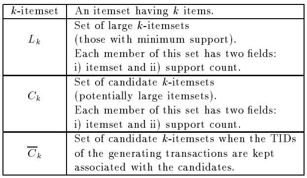

* [Back to Main](../README.md)
---

# Fast Algorithm for Mining Association Rules
### Rakesh Agrawal and Ramakrishnan Srikant
* [Read Paper](../papers/230916%20fast_mining.pdf)

---

## 1. Introduction
#### The Problem of Mining Association Rules over Basket Data
* Setting)
  * $I =\{i_1, i_2, ..., i_m\}$ : a set of literals, or items
  * $T$ : a transaction
  * $D$ : a set of transactions
    * where each transaction $T$ is a set of items s.t. $T \subseteq I$
  * $TID$ : a unique identifier of a transaction
  * $X \subseteq T$ : a transaction $T$ contains $X$, where $X$ is a set of items in $I$    
  
* Association Rule ": $X\Rightarrow Y$
  * Condition : $X\subset I$, $Y\subset I$, and $X\cap Y = \emptyset$
  * **Association Rule with Confidence**
    * Notation
      * $X\Rightarrow Y$ with confidence $c$
    * Meaning
      * $c$% of transaction set in $D$ that contain $X$ also contain $Y$
  * **Association Rule with Support**
    * Notation
      * $X\Rightarrow Y$ has support $s$
    * Meaning
      * $s$% of transactions in $D$ contain $X\cup Y$

 

#### The Problem of Mining Association Rules
* Goal)
  * Generate all association rules that have support and confidence greater than the user-specified *minimum support (minsup)* and *minimum confidence (minconf)* respectively.
* Prop.)
  * The problem in neutral with respect to the representation of $D$.
    * $D$ can be either a data file, a relational table, or the result of a relational expression.

 

### 1.1 Problem Decomposition and Paper Organization
* Subproblems of the problem of discovering all association rules
  1. Find all sets of items that have transaction *support* above minimum support.
     * the *support* for an item set
       * the number of transactions that contain the item set.
     * *large item set*
       * an item set with minimum support
     * *small item set*
       * ~ *large item set*
  2. Use the large item sets to generate the desired rules.
     * Algorithm
       * For every large item set $l$, find all non-empty subsets of $l$.
       * For every such subset $a$, output a rule of the form $a\Rightarrow (l-a)$ if the ratio of support($l$) to support($a$) is at least [minconf](#the-problem-of-mining-association-rules).

  

## 2. Discovering Large Itemsets
#### Preivious Algorithms for Discovering Large Itemsets
* Algorithms
  * AIS
  * SETM
* Props.)
  * Make multiple passes over the data
    * First Pass
      * Count the support of individual items.
      * Determine which of them are [large (having minium support)](#11-problem-decomposition-and-paper-organization) .
    * Subsequent Passes
      * Start with a seed of itemsets found to be large in the previous pass.
      * Generate candidate itemset, a potentially large itemset, from that seed.
      * Count the actual support for these candidate itemsets during the pass over the data
      * Determine which candidate itemsets are actually large.
        * If a large one exists, it becomes the seed for the next pass
    * Continue until no new large itemset is found.

 

#### Preview) Apriori and AprioriTid Algorithm
* Prop.)
  * Candidate itemsets are counted in a pass and in a way that those candidates are generated.
  * **(AprioryTid only)** An encoding of the candidate itemsets used in the previous pass is employed for counting the support of candidate itemsets after the first pass.
* Analysis)
  * Distinctive Feature from from [AIS and SETM](#preivious-algorithms-for-discovering-large-itemsets)
    * Generating and counting the itemsets are operated separately.
    * Thus, unnecessarily generates and counts too many candidate itemsets.
      * Why) 
        * Perform recursive algorithm for every itemset that it generates
        * Most of them turn out to be small, not large.
  * Intuition)
    * Any subset of a large itemset must be large.
  * Implementation)
    * Generate itemsets with $k$ items by joining itemsets with $k-1$ items.
    * Delete those that contain any subset that is not large.
  * Advantage)
    * Much smaller number of candidate itemsets are generated.

 

#### Assumptions & Notations
* Items in each transaction are kept sorted in the lexicographic order.
* The database $D$ is kept normalized and each database record is a **<TID, item>** pair.
  * **TID** : The identifier of the corresponding transaction
* size : the number of items in an itemset
* $k$-itemset : an itemset of size $k$
* $c[1] \cdot c[2] \cdot ... \cdot c[k]$ : items sorted lexicographically in a $k$-itemset.
  * $c[1] \lt c[2] \lt ... \lt c[k]$ : Due to the lexicographic sorting
* $m$-extension of $X$:
  * $c=X\cdot Y$ and $Y$ is an $m$-itemset
* A count field to store the support for an itemset   
  * Initialized to zero when the itemset is first created.   

* $\bar{C_k}$ will be used for AprioriTid

  

### 2.1 Algorithm Apriori

  

### 2.2 Algorithm AprioriTid

---
* [Back to Main](../README.md)