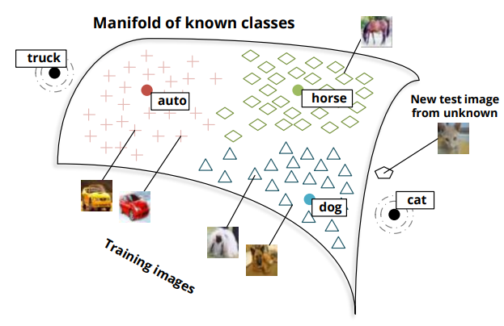
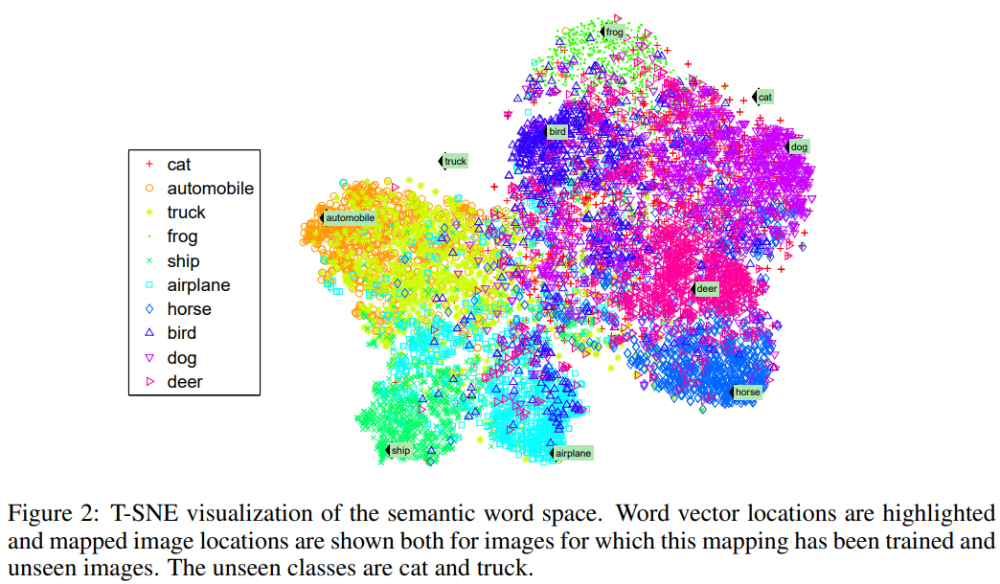

# Zero-shot learning through cross-modal transfer
### Richard Socher, Milind Ganjoo, Christopher D. Manning, Andrew Y. Ng
* [Read Paper](https://file.notion.so/f/s/979ead36-2810-4500-93c7-9672bc249f12/5027-zero-shot-learning-through-cross-modal-transfer.pdf?id=248a03b3-531c-4cb5-96cd-1e0a88d08c19&table=block&spaceId=f4f04cc2-d7ba-4dd0-bec8-86c2393d0c27&expirationTimestamp=1687543511698&signature=E99oUS3_SO12-AgM4YdLDbNJQ9Xq8P40yiGThu11aNQ&downloadName=5027-zero-shot-learning-through-cross-modal-transfer.pdf)

---
## 0. Abstract
* Target : Introduce a model that can recognize objects in images even if no training data is available for the object class.
* The model can operate on a mixture of seen and unseen classes.
* Achieved by seeing the distributions of words in texts as a semantic space for understanding what objects look like.
  * Images are mapped to be close to semantic word vectors corresponding to their classes
  * Resulting image embeddings can be used to distinguish whether an image is of a seen or unseen class.
* 2 novelty detection strategies; 
  1. Gives high accuracy on unseen classes
  2. Conservative in its prediction of novelty and keeps the seen classes’ accuracy high.

---

## 1. Introduction
### Concept) Zero-shot Learning
  * Meaning : The ability to classify instances of an unseen visual class,

### Main Goal
* Model people’s ability to identify unseen objects even if the only knowledge about that object came from **reading** about it.
  * ex) **READING** the description of a two-wheeled self-balancing electric vehicle, controlled by a stick, with which you can move around while standing on top of it, many would be able to **IDENTIFY** a Segway

### Main Ideas
1. Images are mapped into a semantic space of words that is learned by a neural network model
   * Word vectors capture distributional similarities from a large, unsupervised text corpus.
     1. Learning an image mapping into this space 
     2. The word vectors get implicitly grounded by the visual modality 
     3. They allows us to give prototypical instances for various words   
     
2. The model incorporates **novelty detection** which determines whether a new image is on the manifold of known categories
   * Why?) classifiers prefer to assign test images into classes for which they have seen training examples
   * How?)
     * Rule
       * If the image is of a known category, a standard classifier can be used.
       * Otherwise, images are assigned to a class based on the likelihood of being an unseen category.
     * Methodology
       1. Prefers high accuracy for unseen classes
       2. Prefers high accuracy for for seen classes
  

---

## 2. Related Work

### Concept) One-Shot Learning
* Meaning) Seeks to learn a visual object class by using very few training examples
* Description)
  * This paper's model is based on using **deep learning** techniques to learn low-level image features followed by a **probabilistic model** to **transfer knowledge** with the added advantage of needing **no training data** due to the cross-modal knowledge transfer from natural language.

### Concept) Knowledge and Visual Attribute Transfer
* This model has distributional features of words learned from unsupervised, nonparallel corpora and can classify between categories that have thousands or zero training images.

### Concept) Domain Adaptation
* Useful in situations in which there is a lot of training data in one domain but little to none in another.
* ex) In sentiment analysis one could train a classifier for movie reviews and then adapt from that domain to book reviews

### Concept) Multimodal Embeddings
* Meaning) A technique that relates information from multiple sources such
as sound and video or images and text

---

## 3. Word and Image Representations
### Concept) Distributional Approach
* Used for capturing semantic similarity between words. 
* Words are represented as vectors of distributional characteristics
  * Most often their co-occurrences with words in context
  * This representation is effective in NLP tasks such as...
    * sense disambiguation
    * thesaurus extraction
    * cognitive modeling
  * Use the model of Huang et al
    * Unless otherwise mentioned, all word vectors are initialized with pre-trained d = 50-dimensional word vectors from the unsupervised model

---

## 4. Projecting Images into Semantic Word Spaces
### Goal) Learn semantic relationships and class membership of images
* How?) 
  * Project the image feature vectors into the $d$-dimensional, semantic word space $F$
  * $Y$ : A set of classes $y$
    * $Y_s$ : Seen classes, i.e., classes that have training data
    * $Y_u$ : Unseen classes, i.e., zero-shot classes without any training data
  * $W$ : The set of word vectors in $R^d$
    * where $W = W_s \cup W_u$
  * All training images $x^{(i)} \in X_y$ of a seen class $y \in Y_s$ are mapped to the word vector $w_y$ corresponding to the class name.
* **Training**
  * Objective Function : $J(\Theta) = \sum_{y \in Y_s} \sum_{x^{(i)} \in X_y} {\Vert w_y - \theta^{(2)} f( \theta^{(1)} x^{(i)}) \Vert}^2$
    * $\theta^{(1)} \in R^{h \times I}$
    * $\theta^{(2)} \in R^{d \times h}$
    * $f = tanh$
    * $\Theta = (\theta^{(1)}, \theta^{(2)})$
  * The cost function is trained with standard backpropagation and L-BFGS.
* **Advantage** of projecting images into the word vector space
  * Implicitly extend the semantics with a visual grounding
  * It allows us to query the space
    * ex) for prototypical visual instances of a word.

### Experiment
  * Settings
    * The 50-dimensional semantic space with word vectors and images of both seen and unseen classes
    * The unseen classes are **cat** and **truck**.
    * The mapping from 50 to 2 dimensions was done with t-SNE.
  * Result)
    
  * Analysis
    * Most classes are tightly clustered around their corresponding word vector.
    * The **zero-shot classes** (cat and truck for this mapping) do not have close-by vectors.
    * The images of the two zero-shot classes are close to semantically similar classes.
  * Motivation
    1. Detect images of unseen classes.
    2. Classify them to the zero-shot word vectors.

---

## 5. Zero-Shot Learning Model
### Goal) Predict $p(y|x)$ and $f$
* $p(y|x)$ : the conditional probability for both seen and unseen classes $y \in Y_s \cup Y_u$ given an image from the test set $x \in X_t$
* $f \in F_t$ : the semantic vectors to which these images have been mapped to

### Settings & Conditions)
* $V \in \{s, u\}$ : a binary novelty random variable which indicate whether an image is in a seen or unseen class
* $X_s$ : the set of all feature vectors for training images of seen classes
* $F_s$ : the corresponding semantic vectors of $X_s$
* $F_y$ : the semantic vectors of class $y$
* $p(y|x, X_s, F_s, W, \theta) = \sum\limits_{V \in \{s, u\}} {P(y|V, x, X_s, F_s, W, \theta) P(V|x, X_s, F_s, W, \theta)}$
  * Marginalizing out the novelty variable $V$ allows us to first distinguish between seen and unseen classes
  * Each type of image can then be classified differently
  * The seen image classifier can be a state of the art softmax classifier
  * The unseen classifier can be a simple Gaussian discriminator

### 5.1 Strategies for Novelty Detection
#### Concept) $P(V = u|x, X_s, F_s, W, \theta)$
  * Meaning) the probability of an image being in an unseen class
  * Prop)
    * An image from an unseen class will not be very close to the existing training images but it will still be roughly in the same semantic region.
      * ex) Cat images are closest to dogs even though they are not as close to the dog word vector as most dog images are
    * We can use **outlier detection methods** to determine whether an image is in a seen or unseen class

#### Strategy 1) Use simple thresholds on the marginals assigned to each image under isometric, class-specific Gaussians.
* Idea)
  * The mapped points of seen classes are used to obtain this marginal.
  * Set certain threshold.
  * If an image from the set has low score(marginal probability) than the threshold, consider it as an outlier!
* How?)
  * For each seen class $y \in Y_s$,
  * Compute $P(x|X_y, w_y, F_y, \theta) = P(f|F_y, w_y) = \aleph(f|w_y, \Sigma_y)$
    * $\Sigma_y$ : Covariance matrix of $y$
* Assumptions)
  * The Gaussian of each class is parameterized by the corresponding semantic word vector $w_y$ for its mean and a covariance matrix $\Sigma_y$ 
    * $w_y$ and $\Sigma_y$ are estimated from all the mapped training points with that label.
  * Restrict the Gaussians to be isometric to prevent overfitting.
* Prop.)
  * $P(V=u|f, X_s, W, \theta) := \mathbb{1} \{\forall y \in Y_s : P(f|F_y, w_y) < T_y\}$
    * Meaning) For a new image $x$, the outlier detector then becomes the indicator function that is 1 if the marginal probability is below a certain threshold $T_y$ for all classes $y$.
    * The thresholds are selected to make at least some fraction of the vectors from training images above threshold
      * i.e.) To be classified as a seen class.
    * Smaller thresholds result in fewer images being labeled as unseen.
    * The main drawback of this method is that it does not give a real probability for an outlier.

#### Strategy2) Obtain an actual outlier probability in an unsupervised way.
* Source) 
  * H. Kriegel, P. Kroger, E. Schubert, and A. Zimek. *LoOP: Local Outlier Probabilities.*
* Advantage)
  * We can obtain the conditional class probability using a weighted combination of classifiers for both seen and unseen classes.
  * This method is very conservative in its assignment of novelty and therefore preserves high accuracy for seen classes
    * Why?) [Figure](https://github.com/JoonHyeok-hozy-Kim/ai_paper_study/blob/main/notes/zero-shot_learning.md#result-and-analysis) shows that many unseen images are not technically outliers of the complete data manifold.
* Modification
  * Why needed?)
    * We distinguish between training and test sets.
    * We do not want to use the set of all test images since they would then not be considered outliers anymore.
  * Settings
    * $k = 20$ : the number of nearest neighbors that are considered to determine whether a point is an outlier
    * $\lambda = 3$ : Can be roughly seen as a multiplier on the standard deviation
      * The larger it is, the more a point has to deviate from the mean in order to be considered an outlier.
    * For each point $f \in F_t$, define a context set $C(f) \subseteq F_s$ of k nearest neighbors in the training set of seen categories.
    * Compute the probabilistic set distance pdist of each point $x$ to the points in $C(f)$.
      * probabilistic set distance : $pdist_\lambda(f, C(f)) = \lambda \sqrt{\sum_{q \in C(f)} {{d(f, q)}^2} \over |C(f)|}$
        * where $d(f, q)$ : some distance function in the word space
        * Euclidean distance assumed.
    * Define the *local outlier factor*.
      * LOF : $lof_\lambda (f) ={{pidst_\lambda (f, C(f))}\over{{\mathbb{E}}_{q \sim C(f)} [pdist_\lambda (f, C(q))]}} -1$
      * LOF : $lof_\lambda (f) ={{pidst_\lambda (f, C(f))}\over{{\mathbb{E}}_{q \sim C(f)}}} -1$