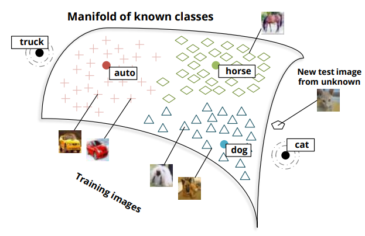
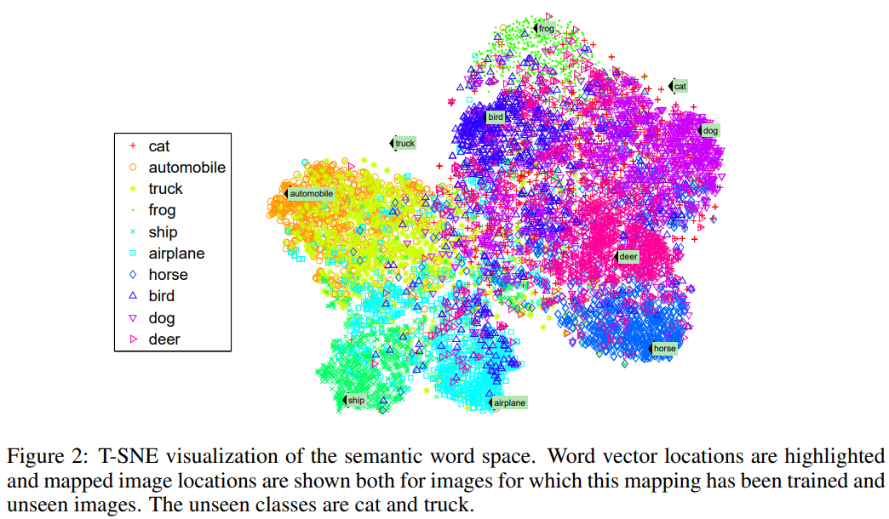
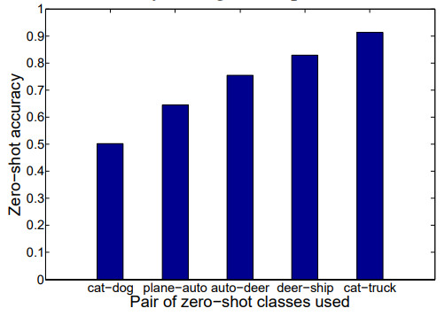
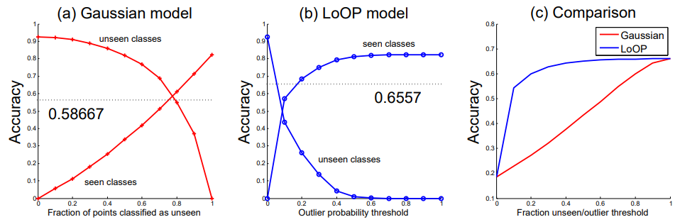
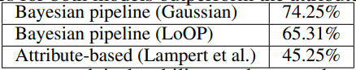
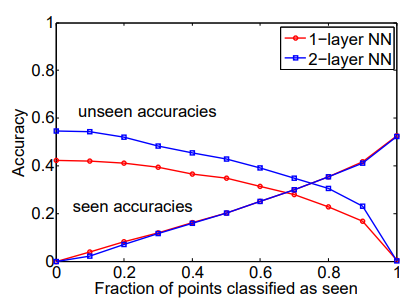

* [Back to Main](../../README.md)
---

# Zero-shot learning through cross-modal transfer
#### Richard Socher, Milind Ganjoo, Christopher D. Manning, Andrew Y. Ng
* [Read Paper](../paper_pdfs/230623%20zero-shot-learning-through-cross-modal-transfer.pdf)

---
## 0. Abstract
* Target : Introduce a model that can recognize objects in images even if no training data is available for the object class.
* The model can operate on a mixture of seen and unseen classes.
* Achieved by seeing the distributions of words in texts as a semantic space for understanding what objects look like.
  * Images are mapped to be close to semantic word vectors corresponding to their classes
  * Resulting image embeddings can be used to distinguish whether an image is of a seen or unseen class.
* 2 novelty detection strategies; 
  1. Gives high accuracy on unseen classes
  2. Conservative in its prediction of novelty and keeps the seen classes’ accuracy high.

---

## 1. Introduction
### Concept) Zero-shot Learning
  * Meaning : The ability to classify instances of an unseen visual class,

### Main Goal
* Model people’s ability to identify unseen objects even if the only knowledge about that object came from **reading** about it.
  * ex) **READING** the description of a two-wheeled self-balancing electric vehicle, controlled by a stick, with which you can move around while standing on top of it, many would be able to **IDENTIFY** a Segway

### Main Ideas
1. Images are mapped into a semantic space of words that is learned by a neural network model
   * Word vectors capture distributional similarities from a large, unsupervised text corpus.
     1. Learning an image mapping into this space 
     2. The word vectors get implicitly grounded by the visual modality 
     3. They allows us to give prototypical instances for various words   
     
2. The model incorporates **novelty detection** which determines whether a new image is on the manifold of known categories
   * Why?) classifiers prefer to assign test images into classes for which they have seen training examples
   * How?)
     * Rule
       * If the image is of a known category, a standard classifier can be used.
       * Otherwise, images are assigned to a class based on the likelihood of being an unseen category.
     * Methodology
       1. Prefers high accuracy for unseen classes
       2. Prefers high accuracy for for seen classes
  

---

## 2. Related Work

### Concept) One-Shot Learning
* Meaning) Seeks to learn a visual object class by using very few training examples
* Description)
  * This paper's model is based on using **deep learning** techniques to learn low-level image features followed by a **probabilistic model** to **transfer knowledge** with the added advantage of needing **no training data** due to the cross-modal knowledge transfer from natural language.

### Concept) Knowledge and Visual Attribute Transfer
* This model has distributional features of words learned from unsupervised, nonparallel corpora and can classify between categories that have thousands or zero training images.

### Concept) Domain Adaptation
* Useful in situations in which there is a lot of training data in one domain but little to none in another.
* ex) In sentiment analysis one could train a classifier for movie reviews and then adapt from that domain to book reviews

### Concept) Multimodal Embeddings
* Meaning) A technique that relates information from multiple sources such
as sound and video or images and text

---

## 3. Word and Image Representations
### Concept) Distributional Approach
* Used for capturing semantic similarity between words. 
* Words are represented as vectors of distributional characteristics
  * Most often their co-occurrences with words in context
  * This representation is effective in NLP tasks such as...
    * sense disambiguation
    * thesaurus extraction
    * cognitive modeling
  * Use the model of Huang et al
    * Unless otherwise mentioned, all word vectors are initialized with pre-trained d = 50-dimensional word vectors from the unsupervised model

---

## 4. Projecting Images into Semantic Word Spaces
### Goal) Learn semantic relationships and class membership of images
* How?) 
  * Project the image feature vectors into the $d$-dimensional, semantic word space $F$
  * $Y$ : A set of classes $y$
    * $Y_s$ : Seen classes, i.e., classes that have training data
    * $Y_u$ : Unseen classes, i.e., zero-shot classes without any training data
  * $W$ : The set of word vectors in $R^d$
    * where $W = W_s \cup W_u$
  * All training images $x^{(i)} \in X_y$ of a seen class $y \in Y_s$ are mapped to the word vector $w_y$ corresponding to the class name.
* **Training**
  * Objective Function : $J(\Theta) = \sum_{y \in Y_s} \sum_{x^{(i)} \in X_y} {\Vert w_y - \theta^{(2)} f( \theta^{(1)} x^{(i)}) \Vert}^2$
    * $\theta^{(1)} \in R^{h \times I}$
    * $\theta^{(2)} \in R^{d \times h}$
    * $f = tanh$
    * $\Theta = (\theta^{(1)}, \theta^{(2)})$
  * The cost function is trained with standard backpropagation and L-BFGS.
* **Advantage** of projecting images into the word vector space
  * Implicitly extend the semantics with a visual grounding
  * It allows us to query the space
    * ex) for prototypical visual instances of a word.

### Experiment
  * Settings
    * The 50-dimensional semantic space with word vectors and images of both seen and unseen classes
    * The unseen classes are **cat** and **truck**.
    * The mapping from 50 to 2 dimensions was done with t-SNE.
  * Result)
    
  * Analysis
    * Most classes are tightly clustered around their corresponding word vector.
    * The **zero-shot classes** (cat and truck for this mapping) do not have close-by vectors.
    * The images of the two zero-shot classes are close to semantically similar classes.
  * Motivation
    1. Detect images of unseen classes.
    2. Classify them to the zero-shot word vectors.

---

## 5. Zero-Shot Learning Model
### Goal) Predict $p(y|x)$ and $f$
* $p(y|x)$ : the conditional probability for both seen and unseen classes $y \in Y_s \cup Y_u$ given an image from the test set $x \in X_t$
* $f \in F_t$ : the semantic vectors to which these images have been mapped to

### Settings & Conditions)
* $V \in \{s, u\}$ : a binary novelty random variable which indicate whether an image is in a seen or unseen class
* $X_s$ : the set of all feature vectors for training images of seen classes
* $F_s$ : the corresponding semantic vectors of $X_s$
* $F_y$ : the semantic vectors of class $y$
* $p(y|x, X_s, F_s, W, \theta) = \sum\limits_{V \in \{s, u\}} {P(y|V, x, X_s, F_s, W, \theta) P(V|x, X_s, F_s, W, \theta)}$
  * Marginalizing out the novelty variable $V$ allows us to first distinguish between seen and unseen classes
  * Each type of image can then be classified differently
  * The seen image classifier can be a state of the art softmax classifier
  * The unseen classifier can be a simple Gaussian discriminator

### 5.1 Strategies for Novelty Detection
#### Concept) $P(V = u|x, X_s, F_s, W, \theta)$
  * Meaning) the probability of an image being in an unseen class
  * Prop)
    * An image from an unseen class will not be very close to the existing training images but it will still be roughly in the same semantic region.
      * ex) Cat images are closest to dogs even though they are not as close to the dog word vector as most dog images are
    * We can use **outlier detection methods** to determine whether an image is in a seen or unseen class

#### Strategy 1) Use simple thresholds on the marginals assigned to each image under isometric, class-specific Gaussians.
* Idea)
  * The mapped points of seen classes are used to obtain this marginal.
  * Set certain threshold.
  * If an image from the set has low score(marginal probability) than the threshold, consider it as an outlier!
* How?)
  * For each seen class $y \in Y_s$,
  * Compute $P(x|X_y, w_y, F_y, \theta) = P(f|F_y, w_y) = \aleph(f|w_y, \Sigma_y)$
    * $\Sigma_y$ : Covariance matrix of $y$
* Assumptions)
  * The Gaussian of each class is parameterized by the corresponding semantic word vector $w_y$ for its mean and a covariance matrix $\Sigma_y$ 
    * $w_y$ and $\Sigma_y$ are estimated from all the mapped training points with that label.
  * Restrict the Gaussians to be isometric to prevent overfitting.
* Prop.)
  * $P(V=u|f, X_s, W, \theta) := \mathbb{1} \{\forall y \in Y_s : P(f|F_y, w_y) < T_y\}$
    * Meaning) For a new image $x$, the outlier detector then becomes the indicator function that is 1 if the marginal probability is below a certain threshold $T_y$ for all classes $y$.
    * The thresholds are selected to make at least some fraction of the vectors from training images above threshold
      * i.e.) To be classified as a seen class.
    * Smaller thresholds result in fewer images being labeled as unseen.
    * The main drawback of this method is that it does not give a real probability for an outlier.

#### Strategy2) Obtain an actual outlier probability in an unsupervised way.
* Source) 
  * H. Kriegel, P. Kroger, E. Schubert, and A. Zimek. *LoOP: Local Outlier Probabilities.*
* Advantage)
  * We can obtain the conditional class probability using a weighted combination of classifiers for both seen and unseen classes.
  * This method is very conservative in its assignment of novelty and therefore preserves high accuracy for seen classes
    * Why?) [Figure](./images/04_01.png) shows that many unseen images are not technically outliers of the complete data manifold.
* Modification
  * Why needed?)
    * We distinguish between training and test sets.
    * We do not want to use the set of all test images since they would then not be considered outliers anymore.
  * Settings
    * $k = 20$ : the number of nearest neighbors that are considered to determine whether a point is an outlier
    * $\lambda = 3$ : Can be roughly seen as a multiplier on the standard deviation
      * The larger it is, the more a point has to deviate from the mean in order to be considered an outlier.
    * For each point $f \in F_t$, define a context set $C(f) \subseteq F_s$ of k nearest neighbors in the training set of seen categories.
    * Compute the probabilistic set distance pdist of each point $x$ to the points in $C(f)$.
      * probabilistic set distance : $pdist_\lambda(f, C(f)) = \lambda \sqrt{\sum_{q \in C(f)} {{d(f, q)}^2} \over |C(f)|}$
        * where $d(f, q)$ : some distance function in the word space
        * Euclidean distance assumed.
    * Define the *local outlier factor*.
      * LOF : $lof_\lambda (f) ={{pidst_\lambda (f, C(f))}\over{{\mathbb{E}} _ {q \sim C(f)} [p_\lambda (f, C(q))] }} -1$
        * Interpretation) 
          * Large LOF == Increasing outlierness.
    * Define a Normalization Factor $Z$
      * $Z_\lambda (F_s) = \lambda \sqrt{{\mathbb{E}} _ {q \sim F_s} [(lof(q))^2]}$
      * Why needed?) 
        * Can be seen as a kind of std deviation of LOF in the training set of seen classes.
    * Define the Local Outlier Probability
      * $LoOP(f) = max \\{ {0 , erf({{lof_\lambda (f)} \over {Z_\lambda (F_s)}})} \\}$
        * where, $erf$ : Gaussian Error Function
      * Interpretation) 
        * $LoOP$ can be used to weigh the seen and unseen classifiers by the appropriate amount given our belief about the outlierness of a new test image.

### 5.2 Classification
1. Case. 1) $V = s$ : the point is considered to be a known class
   * Any probabilistic classifier for obtaining $P(y|V = s, x, X_s)$ can be used.
   * This paper uses a softmax classifier on the original I-dimensional features.
2. Case. 2) $V = u$ : unseen class case
   * Assume an isometric Gaussian distribution around each of the novel class word vectors
   * Assign classes based on their likelihood

---

## 6. Experiments
### Settings
* Dataset : CIFAR-10
  * 10 classes
  * 5000 (32 X 32 X 3 RGB) images
* Feature vectors of images
  * Obtained by using unsupervised feature extraction method
  * a 12,800-dimensional feature vector for each image
* Word Vector
  * a set of 50-dimensional word vectors
  * Huang dataset
    * Correspond to each CIFAR Category
* Note
  * 2 classes are omitted and reserved for zero-shot analysis
  * Remaining categories are used for training

### Steps
1. Analyze the classification performance for seen classes and unseen classes
separately.
2. Combine images from the two types of classes
3. Discuss the trade-offs involved in our two unseen class detection strategies
   * Threshold vs LOF
4. The overall performance of the entire classification pipeline is summarized and compared to another popular approach by Lampert et al.
5. Run a few additional experiments to assess quality and robustness of our model
   

### 6.1 Seen and Unseen Classes Separately
* Goal 1) Seen Class Classification
  * Evaluate the classification accuracy when presented only with images from classes that have been used in training
    * Target : 8 classes 
      * where 2 are reserved for the zero-shot learning
  * How?)
    * Train a softmax classifier to label one of 8 classes from CIFAR-10
  * Result
    * Achieved an accuracy of 82.5% on the set of classes excluding cat and truck
    * Closely matches the SVM-based classification results in the original Coates and Ng paper that used all 10 classes.

* Goal 2) Unseen Class Zero-shot Learning
  * How?)
    * The classification is based on isometric Gaussians 
      * Compare the distances between 
        1. word vectors of unseen classes 
        2. an image mapped into semantic space
  * Result)
    * The performance is good if there is at least one **seen class similar to the zero-shot class**
      * ex 1) cat and truck are reserved.
        * **Good** performance. Cat and Truck are similar to dog and car respectively!
      * ex 2) cat and dog are reserved.
        * **Bad** performance. No similar class in 8 seen classes.
      * ex 3) car and truck are reserved.
        * **Bad** performance. No similar class in 8 seen classes.
      

### 6.2 Influence of Novelty Detectors on Average Accuracy
* Goal) Determine the performance of the classifier for the overall dataset that includes **both seen and unseen images**
* How?)
  * Compare the performance when when each image is passed through either of the two novelty detectors.
    1. [Isometric, class specific Gaussian model](#strategy-1-use-simple-thresholds-on-the-marginals-assigned-to-each-image-under-isometric-class-specific-gaussians)
        * The image is passed through the softmax classifier for seen category images
    2. [LoOP model](#strategy2-obtain-an-actual-outlier-probability-in-an-unsupervised-way)
        * The image is assigned to the class of the nearest semantic word vector for unseen category images.
* Result)
  
  1. At the LEFT extreme of the curve...
     * All images are classified as belonging to an unseen category
       * The Gaussian unseen image detector treats all of the images as unseen
       * The LoOP model takes the probability threshold for an image being unseen to be 0
     * We achieve the highest accuracies, at 90% for this zero-shot pair.
  2. At the RIGHT extreme of the curve...
     * All images are classified as belonging to a seen category
     * The softmax classifier for seen images gives the best possible accuracy for these images
  3. Between the extremes...
     * The curves for unseen image accuracies and seen image accuracies fall and rise at different rates.
       * Gaussian model
         * Liberal in designating an image as belonging to an unseen category
         * Treats more of the images as unseen
         * Hence, high unseen class accuracies continue along the curve
       * The LoOP model
         * Tries to detect whether an image could be regarded as an outlier for each class
         * Does not assign very high outlier probabilities to zero-shot images due to a large number of them being spread on inside the manifold of seen images
         * Thus, the majority of images are treated as as seen
           * High seen class accuracies continue along the curve
         * Hence, the LoOP model can be used in scenarios where...
           * Does not want to degrade the high performance on classes from the training set 
           * But allow for the possibility of unseen classes
  4. In the Graph (c)...
     * Recall that most images in the test set belong to previously seen categories.
     * Thus, the LoOP model, which is conservative in assigning the unseen label, gives better overall accuracies than the Gaussian model.
     * In general, we can choose an acceptable threshold for seen class accuracy and achieve a corresponding unseen class accuracy.
       * ex) At 70% seen class accuracy in the Gaussian model...
         * unseen classes can be classified with accuracies of between 30% to 15%, depending on the class. 
         * Random chance is 10%.

### 6.3 Combining predictions for seen and unseen classes
* Goal) 
  * Perform the full Bayesian pipeline as defined by the [equation below](https://github.com/JoonHyeok-hozy-Kim/ai_paper_study/blob/main/notes/001_zero-shot_learning.md#strategy2-obtain-an-actual-outlier-probability-in-an-unsupervised-way).
    * $LoOP(f) = max \\{ {0 , erf({{lof_\lambda (f)} \over {Z_\lambda (F_s)}})} \\}$

* How?)
  1. Gaussian Model
     * Tune a cutoff fraction for log probabilities beyond which images are classified as outliers.
     * Assign probabilities 0 and 1 to either side of this threshold.
  2. LoOP Model
     * Recall that the LoOP model outputs a probability for the image instance being an outlier
     * Use it directly.

* Result)
  * Dash-lines in the [Graphs above](./images/06_02.png)

### 6.4 Comparison to attribute-based classification
* Goal)
  * Establish a context for comparing our model performance

* How?)
  * Run the attribute-based classification approach outlined by Lampert et al. 
    1. Construct an attribute set of 25 attributes highlighting different aspects of the CIFAR-10 dataset
       * Certain aspects dealing with animal-based attributes
       * Others dealing with vehicle-based attributes
    2. Train each binary attribute classifier separately
    3. Use the trained classifiers to construct attribute labels for unseen classes.
    4. Use MAP prediction to determine the final output class.

* Result)   
     
  * In general, an advantage of our approach is the ability to adapt to a domain quickly
    * Difficult in the case of the attribute-based model
      * why?)
        * Appropriate attribute types need to be carefully picked

### 6.5 Novelty Detection in original feature space
* Goal)
  * Calculation in the word space for the **Gaussian Model** in the original feature space
* Observation)
  * In the Mapped Space...
    * Among 100 images assigned the highest probability of being an outlier, 12% of those images are false positives.
  * In the Original Feature Space...
    * The false positive rate increases to 78%.
  * Why?)
    * The mapping function gathers extra semantic information from the word vectors it is trained on
    * Images are able to cluster better around these assumed Gaussian centroids.
    * In the original space, there is no semantic information, and the Gaussian centroids need to be inferred from among the **images themselves**, which are not truly representative of the center of the image space for their classes.

### 6.6 Extension to CIFAR-100 and Analysis of Deep Semantic Mapping
* Target) CIFAR-100
  * Consists of 100 classes, with 500 32 × 32 × 3 RGB images in each class

* How?)
  * Remove 4 categories for which no vector representations were available in our vocabulary
  * Combine the CIFAR-10 dataset to get a set of 106 classes
  * Six zero-shot classes were chosen: ‘forest’, ‘lobster’, ‘orange’, ‘boy’, ‘truck’, and ‘cat’.
  * Train a neural network to map the vectors into semantic space

* Result)
  * A peak non-zero-shot accuracy of 52.7%
    * Almost near the baseline on 100 classes
  * When all images are labeled as zero shot, the peak accuracy for the 6 unseen classes is 52.7%, where c
    * Chance would be at 16.6%.

* Analysis)
  * The proximity of an image to its appropriate class vector is dependent on the quality of the mapping into semantic space.
  * We hypothesize that in this scenario a two layer neural network as described in Sec. 4 will perform better than a single layer or linear mapping.    
    
    * The zero-shot accuracy is 10% higher with a 2 layer neural net compared to a single layer with 42.2%.

### 6.7 Zero-Shot Classes with Distractor Words
* Goal)
  * Recall that the goal of zero-shot learning is to make zero-shot images to be classified correctly when there are a large number of unseen categories to choose from.
  * To evaluate such a setting with many possible but incorrect unseen classes we create a set of **distractor words**.
  
* How?)
  * Compare the 2 scenarios.
    1. Add random nouns to the semantic space
    2. Add the k nearest neighbors of a word vector
       * For the zero-shot class cat and truck, the nearest neighbors distractors include rabbit, kitten and mouse, among others.
  * Evaluate classification accuracy with each new set

* Result)
  * Scenario 1)
    * The accuracy does not change much if random distractor nouns are added.
      * This shows that the semantic space is spanned well and our zero-shot learning model is quite **robust**.
  * Scenario 2)
    * Accuracy drops as an increasing number of semantically related nearest neighbors are added to the distractor set.
      * Guessing why)
        * At first, there are not enough related categories to accurately distinguish very similar categories.
        * After a certain number, the effect of a new distractor word is small.
      * Interpretation)
        * This is consistent with our expectation that a certain number of closely-related semantic neighbors would distract the classifier
        * However, beyond that limited set, other categories would be further away in semantic space and would not affect classification accuracy.

---

## 7. Conclusion
* What we introduced)
  * A novel model for jointly doing standard and zero-shot classification based on deep learned word and image representations
  * Two key ideas
     1. Using **semantic word vector** representations can help to transfer knowledge between modalities even when these representations are learned in an **unsupervised** way
     2. The Bayesian framework that first differentiates novel unseen classes from points on the semantic manifold of trained classes can help to combine both zero-shot and seen classification into one framework.
        * If the task was only to differentiate between various zero-shot classes we could obtain accuracies of up to 90% with a fully unsupervised model.

---
* [Back to Main](../../README.md)