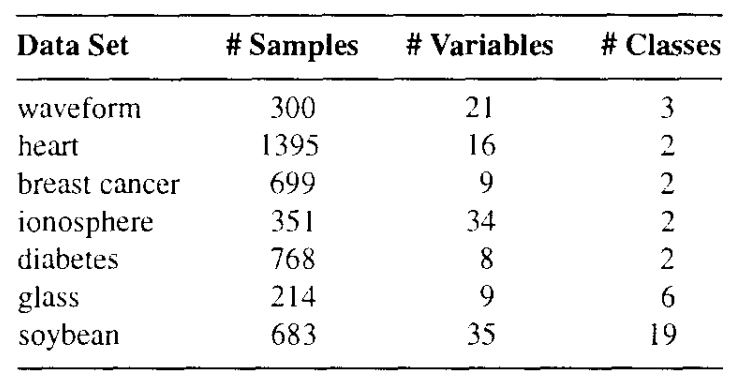
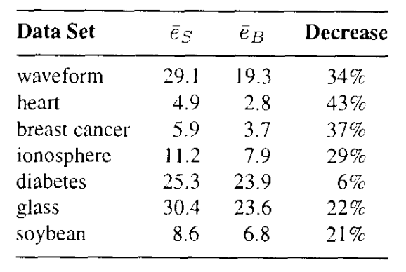
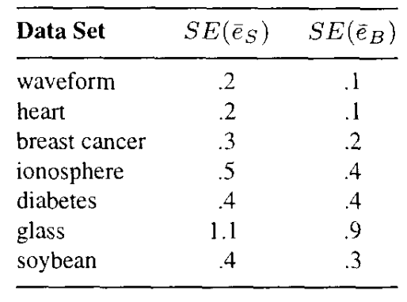
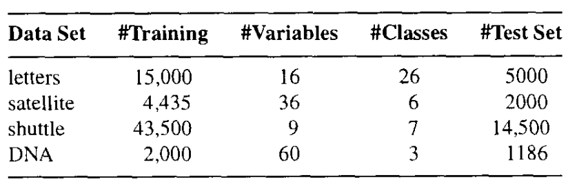
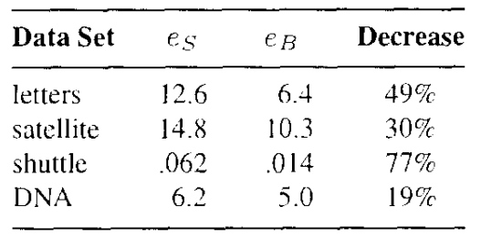
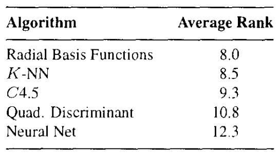
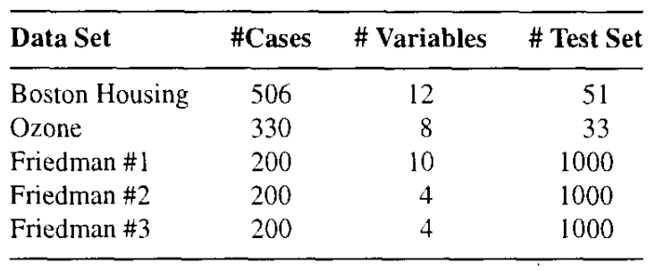
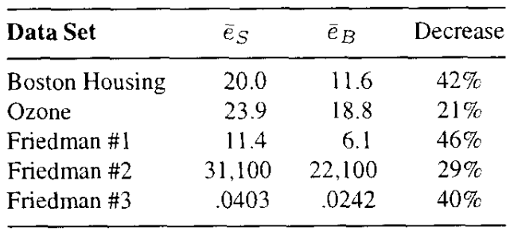

* [Back to Main](../../README.md)
---

# Bagging Predictors
### Leo Breiman
* [Read Paper](../paper_pdfs/231015%20bagging_predictors.pdf)

---
## 0. Abstract
* Objective
  * Generate an accurate predictor
* How?
  * Generate multiple predictors using the bagging predictors method.
    * Make bootstrap replicates of the learning set
    * Use these learning sets

  

## Intoduction
### The Model
#### Settings
* $L$ : a learning set
  * Consists of data $\lbrace (y_n,x_n), n=1,\dots , N\rbrace$
    * where $y$ is either a class label or a numerical response.
    * $N$ : the size of the data
* $\varphi (x, L)$ : a predictor
  * We want to generate a predictor using the data $x$ and the learning set $L$.
* $\lbrace L_k \rbrace$ : a sequence of learning sets
  * Each $L_k$ consists of $N$ independent observations from the same underlying distributions as $L$.

 

#### Our mission
Use $\lbrace L_k \rbrace$ to get a better predictor than the single learning set predictor $\varphi (x, L)$.
* Target Model
  * $\varphi_A(x)$
    * where $A$ denotes the aggregation

 

$y$ can be either a numerical or a class value
* Case 1) $y$ is numerical
  * Use the average of the predictors from $\lbrace L_k \rbrace$ 
  * $\varphi_A(x) = E_L{\varphi (x,L)}$
    * $E_L$ : expectation over $L$
* Case 2) $y$ is a class value $j \in \lbrace 1, \dots , J \rbrace$
  * Use voting.
  * $\varphi_A(x) = argmax_jN_j$ : $j$ for which $N_j$ is maximum
    * $N_j = nr \lbrace k; \varphi (x, L_k)=j \rbrace$

 

#### Bagging (**B**ootstrap **Agg**regat**ing**)
* Why needed?
  * Usually, we have a single leraning set $L$.   
  * But we need $\lbrace L_k \rbrace$ to derive $\varphi_A(x)$.
  * We can form a replicate data sets : $\lbrace L^{(B)} \rbrace$

 

$\lbrace L^{(B)} \rbrace$
* Def.)
  * Replicate data sets drawn from the bootstrap distribution approximating the distribution underlying $L$.
* Props.)
  * each consisting of $N$ cases
  * drawn at **random with replacement** from $L$
    * $(y_i, x_i)$ may appear repeated times or not at all
  * See Efron and Tibshirani, "An introduction to the Bootstrap" for the bootstrapping method. 
  * Stability of the procedure for constructing $\varphi$ improves the accuracy of bagging.
    * why?)
      * If changes in $L$ produces small changes in $\varphi$, then $\varphi_B$ will be close to $\varphi$.
    * Still, bagging works well for unstable procedures.
      * This will be covered in Section 2.

  

## 2. Bagging Classification Trees
### 2.1 Results for Moderate Sized Data Sets
#### Data used   

#### Procedures
  1. Dataset is divided into a test set $T$ and a learning set $L$.
     * Real Data : $T$ 10% vs $L$ 90%
     * Simulated Data : $T$ 1500/1800 vs $L$ 300/1800
  2. A classification tree is constructed from $L$ using 10-fold cross-validation.
     * $e_S(L, T)$ : the misclassification rate of running $T$ down this tree.
  3. A bootstrap sample $L_B$ is selected from $L$ and a tree grown using $L_B$
     * $L$ is used as test set to select the best pruned subtree.
       * Repeated 50 times giving tree classifiers : $\phi_1(x), \dots , \phi_{50}(x)$
  4. Class Determination : Calculate the bagging's accuracy.
     * If $(j_n, x_n) \in T$, then the estimated class of $x_n$ is that class having the plurality in $\phi_1(x), \dots , \phi_{50}(x)$.
     * If there is a tie, the estimated class is the one with the lowest class label.
     * $e_B(L, T)$ : the bagging misclassification rate
       * the proportion of times the estimated class differs from the true class.
  5. Repeat ramdomly dividing the data into $L$ and $T$ for 100 times.
     * $\overline{e_S}, \overline{e_B}$ : the averages over the 100 iterations.

#### Result
|Misclassification Rate (%)|Standard Errors of Misclassification|
|:-:|:-:|
|||
* Analysis
  * Bagging reduces the excess error by about two-thirds
    * $\overline{e_S} \rightarrow \overline{e_B}$
  * Special Case : diabetes data
    * The excess error did not dicrease.
    * Author's expectation
      * Bagging is pushing close to the minimal attainable error rate. 

 

### 2.2 Statlog Comparisons for Larger Data Sets
#### The Statlog Project [Michie et al., 1994] 
* Compared 22 classification methods over a wide variety of data sets. 
  * For most of these data sets, error rates were estimated using a single cross-validation. 
    * Without knowing the random subdivisions used in these cross-validations, the variability in the resulting error estimates makes comparisons chancey.
  * Still, four data sets in the project were large enough.
    * Enough to divide them into training and test sets.
    
* Bagging Application
  * Data division
    * a tree grown on the randomly chosen 90%. 
    * a random 10% of the training set was set aside 
      * Used to select the best pruned subtree. 
  * In bagging, 50 bootstrap replicates of the training set were generated and a large tree grown on each one. 
  * The original training set is used to select the best pruned subtree. 
* Result   
  
  * Bagged Trees' rank among the 22 classifiers in the Statlog Project
    * 2nd in accuracy on the DNA dataset
    * 1st in accuracy on the shuttle dataset
    * 2nd in accuracy on the satellite dataset
    * 1st in accuracy on the letters dataset
    * Average Rank : 1.8
      * Way above other classifiers in the project   
        

  

## 3. Bagging Regression Trees
* Five data sets that the paper used.   
  

#### Bagging Application
  * Divide each real data set into a test set and a learning set.
    * 10% for the test set
    * 90% for the learning set $L$
  * In three simulated data sets, 1200 cases are generated.
    * 200 are used as learning
    * 1000 as test.
  * A regression tree is constructed from $L$ using 10-fold cross-validation.
    * $e_S(L,T)$ : the misclassification rate of running $T$ down this tree.
  * A bootstrap sample $L_B$ is selected from $L$.
    * A tree grown using $L_B$ and $L$ is used to select the pruned subtree.
    * Repeat this 25 times giving tree predictors $\phi_1(x), \dots , \phi_{25}(x)$
  * For $(y_n, x_n) \in T$, the bagged predictor is $\hat{y_n} = av_k\phi_k(x_n)$
    * $e_B(L,T) = av_n(y_n-\hat{y_n})^2$ : the bagging misclassification rate
  * The random division of the data into $L$ and $T$ is repeated 100 times.
    * $\overline{e_S}, \overline{e_B}$ : the averages over the 100 iterations.
    * For the simulated data, the 1200 cases are newly generated for each repetition.

#### Result   
  |Misclassification Rate (%)|Standard Errors of Misclassification|
  |:-:|:-:|
  |||

  

## 4. Why Bagging Works
### 4.1. Numeric Prediction
#### Assumptions
* Each $(y, x)$ case in $L$ are independently drawn from the probability distribution $P$.
* $y$ is numerical.
* $\phi (x,L)$ is the predictor.
* $\phi_A (x) = E_L \phi(x,L)$ : the aggregated predictor

#### Derivation
* Take $x$ to be a fixed input value and $y$ an output value.
* Then, $E_L(y-\phi(x,L))^2$ 
  * $= y^2 - 2yE_L\phi(x,L) + E_L\phi^2(x,L)$
  * $= y^2 - 2y\phi_A (x) + E_L\phi^2(x,L)$
  * $\ge y^2 - 2y\phi_A (x) + {\phi_A (x)}^2$
    * $\because E_L\phi^2(x,L) \ge {E_L\phi(x,L)}^2 = {\phi_A (x)}^2$ <------------- (1)
* Thus, $E_L(y-\phi(x,L))^2 \ge (y-\phi_A(x))^2$
  * i.e., the mean squared error (MSE) of the aggregate predictor $\phi_A (x)$ is lower than the MSE average over $L$ of $\phi (x,L)$.

#### Interpretation
* How much the aggregate predictor($\phi_A (x)$) depends on the following inequality.
  * $[E_L\varphi(x,L)]^2 \le E_L\varphi^2(x,L)$
    * Refer to $E_L\phi^2(x,L) \ge {E_L\phi(x,L)}^2$ at (1).
* This can be interpreted as the instability.
  * If $\varphi(x,L)$ does not change too much with replicate $L$, the $[E_L\varphi(x,L)]^2 \approx E_L\varphi^2(x,L)$
    * This means that the aggregation will not help.
  * The more highly variable the $\varphi(x,L)$ is, the more the improvement aggregation may produce.
  * But $\varphi_A$ always improves on $\varphi$.

#### Dependency on the probability distribution $P$.
* $\phi_A$ depends on the underlying probability distribution $P$ as well.
  * Thus, $\phi_A=\phi_A(x,P)$.
* However, the bagged estimate $\varphi_B$ is dependent on $P_L$.
  * where $P_L$ is the distribution that concentrates mass $1/N$ at each point $(y_n,x_n) \in L$
    * or, $P_L$ is called the bootstrap approximation to $P$.
  * Thus, $\varphi_B(x) = \varphi_A(x,P_L)$
  * Hence, if the procedure is unstable, $\varphi_B(x)$ can give improvement through aggregation.
  * On the other hand, of the procedure is stable, $\varphi_B(x)$ will not be accurate.
    * why?) $\varphi_A(x,P) \simeq \varphi(x,L)$ 
  * Therefore, there is a cross-over point between instability and stability at which $\varphi_B$ stops improving on $\varphi(x,L)$ and does worse.

 

### 4.2 Classification
In classification, a predictor $\varphi(x,L)$ predicts a class label $j \in \lbrace 1, \dots, J \rbrace$.   

#### Notations)
* $Q(j|x) = P(\phi(x,L)=j)$
  * Interpretation
    * Over many independent replicates of the learning set $L$, $\phi$ predicts class label $j$ at input $x$ with the relative frequency $Q(j|x)$.   
* $P(j|x)$
  * The probability that input $x$ generates class $j$.
* $\Sigma_jQ(j|x)P(j|x)$
  * The probability that the predictor classifies the generated state at $x$ correctly.
* $r=\int{\Sigma_jQ(j|x)P(j|x)P_X}dx$
  * The correct classification
  * where $P_xdx$ is the $x$ probability distribution.

 

#### Concept) Bayes Predictor
$\phi^*(x) = argmax_jP(j|x)$
* The predictor that gives the highest attainable correct classification rate $r^*$ 
  * $r^*=\int{max_jP(j|x)P_X(x)}$
* How to derive.
  * Consider that $0 \le Q(j|x) \le 1$.
    * Why?)
      * Recall that $Q(j|x)$ was the **relative frequency** that $\phi$ predicts the class label $j$ at input $x$ over many independent replates of the learning set $L$.
  * Also, by definition, $P(j|x) \le {max}_jP(j|x), \forall j$
  * Hence, $Q(j|x)P(j|x) \le P(j|x) \le {max}_jP(j|x), \forall j$
  * Now, consider the equality condition for the above inequality.
    * i.e.) $Q(j|x)P(j|x) = {max}_jP(j|x)$
  * The condition must be the case that 
    * $`Q(j|x)= \left \lbrace \begin{array}{cl} 1 & if \space P(j|x)=max_iP(i|x) \\ 0 & else \end{array} \right .`$
  * $\phi^*(x)$ is the predictor that satisfies the above condition.

 

#### Concept) Order-Correct
A predictor $\phi$ is order-correct at input $x$ if $argmax_jQ(j|x) = argmax_jP(j|x)$
* Meaning
  * If input $x$ results in class $j$ more often than any other class, then $\phi$ also predicts class $j$ at $x$ more often than any other class.
* Prop.)
  * An order-correct predictor is not necessarily an accurate predictor
    * ex) 
      * Suppose $P(1|x)=0.9$, $P(2|x)=0.1$, $Q(1|x)=0.6$, and $Q(2|x)=0.4$.
      * Then, the probability of correct classification by $\phi$ at $x$ is $Q(1|x)P(1|x) + Q(2|x)P(2|x)=0.58$
      * However, the Bayes Predictor gets $0.90$, which not reasonable.

 

#### Concept) Aggregate Predictor and its Probability of Correct Classfication
* The aggregate predictor at $x$ is 
  * $\phi_A(x) = argmax_jQ(j|x)$.   
* Then the probability of correct classification at $x$ for the aggregate predictor is 
  * $\Sigma_jI(argmax_iQ(i|x)=j)P(j|x)$
    * where $I(\cdot)$ is the indicator function.

#### Concept) Order-Correct and Aggregate Predictor
* If $\phi$ is order-correct at $x$, 
  * $\Sigma_jI(argmax_iQ(i|x)=j)P(j|x) = max_jP(j|x)$
* The correct classification probability of $\phi_A$ is
  * $r_A = \int_{x \in C}{max_jP(j|x)P_X(dx)} + \int_{x \in C'}{I(\phi_A(x)=j)P(j|x)P_X(x)}$
* Even if $\phi$ is order-correct at $x$, its correct classification rate can be far from optimal.
  * However, $\phi_A$ is optimal.
  * If a predictor is order-correct for most inputs $x$, then the aggregation can transform it into a nearly optimal predictor.
  * On the other hand, poor predictors can be transformed into worse ones.
    * Not like the numerical prediction case.

#### Concept) Stability, Predictors, and Bagging
* For stable classifiers, bagging can deteriorate the poor predictors.
* For unstable classifiers, bagging usually improves them.

 

### 4.3 Using the Learning Set as a Test Set

---

* [Back to Main](../../README.md)