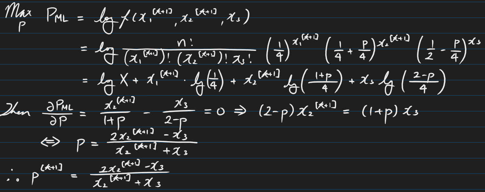
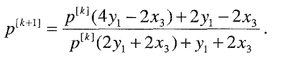
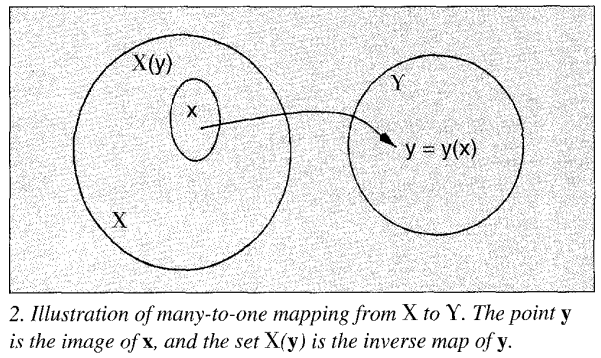

* [Back to Main](../../README.md)

# The Expectation Maximization Algorithm
### T. K. Moon
* [Read Paper](../paper_pdfs/231023%20expectation_maximization.pdf)

---

## The Expectation-Maximization Algorithm (EM Algorithm)
#### Def.) EM Algorithm
An algorithm that consists of two steps that are repeated until the parameter estimates converge.
  1. Expectation Step
     * Make expectations for unknown underlying variables.
     * Use the current estimate of the parameters
     * Is conditioned upon observations
  2. Maximization Step
     * Provide new estimate of the parameters

 

#### Prop.) Problems in Parameter Estimation and the EM Algorithm
* There are some problems in parameter estimation such as...
  1. Estimating the mean of a noise
  2. Direct access to the data necessary to estimate the parameters is impossible
  3. Some of the data are missing  
* EM algorithm is ideally suited for these kinds of problems
  * why?)
    * It produces [maximum-likelihood(ML) estimates](maximum_likelihood.md) of parameters when there is a **many-to-one mapping** from an underlying distribution to the distribution governing the observation.
 

 

#### Ex.) Ector's Problem
* Situation
  * An image pattern-recognition problem
    * Classes
      * Light Object
      * Dark Round Object
      * Dark Square Object
* Modeling
  * Settings
    * $X_1$ : the random variable representing the number of round dark objects
    * $X_2$ : the random variable representing the number of square dark objects
    * $X_3$ : the random variable representing the number of light objects
    * $x = [x_1, x_2, x_3]^T$ : the column vector of values that random variables take for a sample image
  * The Probability Density Function : $f$
    * $P(X_1=x_1, X_2=x_2, X_3=x_3 | p) \\ = \left( \frac{n!}{x_1!x_2!x_3!} \right) \left( \frac{1}{4} \right)^{x_1} \left( \frac{1}{4} + \frac{p}{4} \right)^{x_2} \left( \frac{1}{2} - \frac{p}{4} \right)^{x_3} \\ = f(x_1, x_2, x_3|p)$
      * where $p$ is an unknown parameter
      * and $n=x_1+x_2+x_3$
* Problem
  * Suppose we are given a feature extractor that can distinguish between dark and light but cannot distinguish the shape.
    * Let $[y_1, y_2]^T = y$ be the number of dark and light objects.
    * Then $y_1 = x_1 + x_2$ and $y_2 = x_3$.
  * We now have observations that are denoted in $\lbrace y_1, y_2 \rbrace$
  * The problem is that we cannot distinguish between the $x_1$ and $x_2$.
  * In other words, we do not know the distribution of $f(x_1, x_2, x_3|p)$
* Solution : EM Algorithm
  * Settings
    * Put $Y_1$ and $Y_2$ the respective random variables.
    * Here is the **many-to-one mapping** between $\lbrace x_1, x_2 \rbrace$ and $y_1$.
      * e.g.) If $y_1=3$, we don't know whether $x_1=1,x_2=2$ or $x_1=2,x_2=1$.
    * Put observations into a new pdf : $g$
      * $`P(Y_1=y_1 | p) \\ = {}_nC_{y_1} \left( \frac{1}{4} + \frac{p}{4} \right)^{y_1} \left( \frac{1}{2} - \frac{p}{4} \right)^{n - y_1} \\ = g(y_1|p)`$
    * Using the EM Algorithm, we can compute the ML estimate of $p$ which is...
      * $p_{ML}=argmax_p \space g(Y_1=y_1|p)$
        * where $argmax$ means the value that maximizes the function
      * Simplify the above function using log.
        * $p_{ML}=argmax_p \space \log{g(Y_1=y_1|p)}$
    * Let $p^{[k]}$ be the estimate of $p$ after the $k$-th iteration.
  * Actual Steps
    1. Expectation Step
       1. Consider the expected value of $x_1$ given the measurement $y_1$ and the current($k$-th) estimate of the parameter
           * ${x_1}^{[k]} = E[x_1|y_1, p^{[k]}]$
       2. Then, 
           * ${x_1}^{[k+1]} = y_1 \frac{\frac{1}{4}}{\frac{1}{2}+\frac{p^{[k]}}{4}}$
             * Why?)   
               $`\begin{array}{lcl} {x_1}^{[k+1]} &=& E[x_1|y_1, p^{[k]}] \\&=& y_1 \frac{p_1^{[k]}}{p_1^{[k]}+p_2^{[k]}} \space (\because proof \space below) \\&=& y_1 \frac{\frac{1}{4}}{\frac{1}{4}+ \left( \frac{1}{4}+\frac{p^{[k]}}{4} \right)} \\&=& y_1 \frac{\frac{1}{4}}{\frac{1}{2}+\frac{p^{[k]}}{4}} \end{array}`$
                 * Refer to the [proof](./expectation_pf.md).
           * ${x_2}^{[k+1]} = y_1 \frac{\frac{1}{4}+\frac{p^{[k]}}{4}}{\frac{1}{2}+\frac{p^{[k]}}{4}}$
    2. Maximization Step
       * Since we can distinguish $x_3$, $x_3$ is known.
       * Also, we derived ${x_1}^{[k+1]}$ and ${x_2}^{[k+1]}$. (A.K.A. the **imputed** data)
       * Thus, applying the ML estimation, we will estimate $p$ that maximizes $f({x_1}^{[k+1]}, {x_2}^{[k+1]}, x_3 | p)$.
       * Then, our maximization problem goes as follows.
          
    3. Repeat $m$ times until $x^{[k+m]}$ in 2 and $p^{[k+m]}$ in 3 converges.
       * i.e.
         * Compute $x_1^{[k+2]}$ and $x_2^{[k+2]}$ using $p^{[k+1]}$
         * Compute $p^{[k+2]}$ using $x_1^{[k+2]}$ and $x_2^{[k+2]}$
         * And so on...
  * cf.) Faster computation
    * Expectation and Maximization in above case can be done using the following one-step formula.    

 

  

### Def.) General Statement of the EM Algorithm
#### Settings) EM Algorithm
* $Y$ : the sample space of the observations
  * $y \in \mathbb{R}^m$ : an observation from $Y$
* $\chi$ : the underlying space
  * $x \in \mathbb{R}^n$ : an outcome from $\chi$ with $m \lt n$
    * The data $x$ is referred to as the *complete data*.
    * The complete data $x$ is not observed directly, but only by means of $y$ where $y = y(x)$.
      * $y(x)$ is a **many-to-one mapping**.
  * An observation $y$ determines a subset of $\chi$, which is denoted as $\chi(y)$.   

* Probability Density Function (pdf) of $x$
  * $f_X(x|\theta)=f(x|\theta)$ 
    * where $\theta \in \Theta \subset \mathbb{R}^r$ : the set of parameters of the density
    * $f$ is assumed to be a continuous function of $\theta$ and appropriately differentiable.
* The ML estimate of $\theta$ is assumed to lie within the region $\Theta$.
* The pdf of the incomplete data 
  * $g(y|\theta)=\int_{\chi(y)}f(x|\theta) dx$
* The Likelihood Functions
  * $l_y(\theta) = g(y|\theta)$
  * $L_y(\theta) = \log{g(y|\theta)}$ : the log-likelihood function

 

#### Objective) EM Algorithm
* Find $\theta$ to maximize $\log{f(x|\theta)}$.
* However, we do not have the data $x$ to compute the log-likelihood.
* Instead, maximize the expectation of $\log{f(x|\theta)}$ given the data $y$ and our current estimate of $\theta$.

 

#### Methodology) EM Algorithm
- Concept) Two Steps
  - E-Step 
    - Compute $Q(\theta|\theta^{[k]}) = E[\log{f(x|\theta) \space | \space y, \theta^{[k]}}]$
      - where $\theta$ conditions the likelihood of the complete data
      - $\theta^{[k]}$ : the estimate of $\theta$ at the $k$-th iteration.
        - Regarded as fixed and known at every E-Step.
  - M-Step
    - $\theta^{[k+1]}$ : the value of $\theta$ that maximizes $Q(\theta|\theta^{[k]})$
      - i.e.) $\theta^{[k+1]} = argmax_\theta \space Q(\theta|\theta^{[k]})$
    - The maximization is with respect to $\theta$, the conditioner of the complete data likelihood.
- Application)
  - Choose an initial $\theta^{[k]}$.
  - Perform E-Step and M-Step successively until convergence.
    - i.e.) Stop when $||\theta^{[k]}-\theta^{[k-1]} \lt \epsilon||, \exists \epsilon$

 

#### Tech.) Restriction to Distributions in the Exponential Family
* pdf (or pmf)
  * $f(x|\theta) = \frac{b(x) \space \exp{[c(\theta)^T t(x)]}}{a(\theta)}$
    * where $t(x)$ : the *sufficient statistic* of the family.
      * A statistic is *sufficient* if it provides all of the information necessary to estimate the parameters of the distribution from the data.
* Members of the Exponential Family
  * Gaussian
  * Poisson
  * Binomial
  * Uniform
  * Rayleigh
* E-Step Representation
  * $Q(\theta|\theta^{[k]}) = E[\log{b(x)} \space | \space y, \theta^{[k]}] + c(\theta)^T E[t(x) \space | \space y, \theta^{[k]}] - \log{a(\theta)}$
    * Let $t^{[k+1]} = E[t(x) \space | \space y, \theta^{[k]}]$ : an estimate of the sufficient statistic
  * Since $E[\log{b(x)} \space | \space y, \theta^{[k]}]$ does not depend on $\theta$, we can simplify the E-Step as follows.
    * Compute $t^{[k+1]} = E[t(x) \space | \space y, \theta^{[k]}]$
* M-Step Representation
  * Maximize the following.
    * $E[\log{b(x)} \space | \space y, \theta^{[k]}] + c(\theta)^T t^{[k+1]} - \log{a(\theta)}$
  * Again, since $E[\log{b(x)} \space | \space y, \theta^{[k]}]$ does not depend on $\theta$, we can simplify the M-Step as follows.
    * $\theta^{[k+1]} = argmax_\theta \space c(\theta)^T t^{[k+1]} - \log{a(\theta)}$

 

#### Props.) EM Algorithm
* Simple
  * Repeating E-Step and M-Step until the convergence.
  * Still, computing expectation and performing maximization may be taxing.
* Every iteration increases the likelihood function until the (local) maximum is reached.
* Not necessary to compute gradients or Hessians
* No need to set step-size parameters
  * e.g.) Learning rate in the gradient descent algorithm

  

### Concept) Convergence of the EM Algorithm
* EM Algorithm always achieves a **local maximum**.
  * At every iteration of the EM Algorithm, the algorithm computes the parameters in the way that the likelihood function does not decrease.
    * This will be repeated until a local maximum is achieved.
      * i.e.) The likelihood cannot increase anymore.
* EM Algorithm does not guarantee the **global maximum**.
  * The convergence will be a local maximum that depends on the initial starting point $\theta^{[0]}$
* Convergence Rate
  * EM Algorithm's convergence rate is slower than that of the quadratic convergence typically available with a Newton's-type method.
  * But Newton's rapid convergence is limited to a certain condition.
    * For exponential families, convergence near the maximum depends upon the eigenvalues of the Hessian of the update function M.
  * Advantages of EM over Newton
    * No need to compute Hessian
    * No chance of overshooting
    * Guaranteed to be stable and to converge to an ML estimate.

  

### Concept) Applications of the EM Algorithm
#### 1. Ector's Problem Revisited
* Recall the [Ector's Problem](#ex-ectors-problem).
* The multinomial distribution is a member of the exponential family as below.
  * $t(x)=x$ : $`f(x_1,x_2,x_3|p)=\left( \frac{n!}{x_1!x_2!x_3!} \right) \exp{\left[ \left[ \begin{array}{cc} \log{\frac{\frac{x_1}{4}}{\frac{1}{2}-\frac{p}{4}}} & \log{\frac{\frac{1}{4}+\frac{p}{4}}{\frac{1}{2}-\frac{p}{4}}} \end{array} \right] \left[ \begin{array}{c} x_1 \\ x_2 \end{array} \right] \right]} \left( \frac{1}{2} - \frac{p}{4} \right)^n`$

 

---
* [Back to Main](../../README.md)