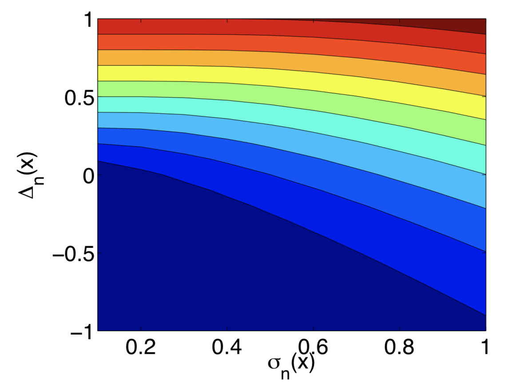

* [Back to Main](../../README.md)
---

# A Tutorial on Bayesian Optimization
### Peter I. Frazier
* [Read Paper](../paper_pdfs/240827%20A%20Tutorial%20on%20Bayesian%20Optimization.pdf)

  

# 1. Introduction
### Concept) Bayesian Optimization (BayesOpt)
- Def.)
  - A class of machine-learning-based optimization methods focused on solving the problem
    - $`\displaystyle\max_{x\in A} f(x)`$
      - where the feasible set $`A`$ and objective function $`f`$ typically have the following properties:
        - The input $`x\in \mathbb{R}^d`$
          - $`d`$ is not too large
          - Typically, $`d\le 20`$ in most successful applications of BayesOpt.
        - The feasible set $`A`$ is a simple set, in which it is easy to assess membership.
          - Typically $`A`$ is a hyper-rectangle $`\{x\in\mathbb{R}^d : a_i \le x_i \le b_i\}`$ or the $`d\textrm{-dimensional simplex } \{x\in\mathbb{R}^d : \sum_i x_i = 1\}`$
        - The objective function $`f`$ is continuous.
          - This will typically be required to model $`f`$ using Gaussian process regression.
        - $`f`$ is “expensive to evaluate”
          - i.e.) Each evaluation takes a substantial amount of time or monetary/opportunity cost
        - $`f`$ is a “black box.”
          - i.e.) $`f`$ lacks known special structure like concavity or linearity that would make it easy to optimize using techniques that leverage such structure to improve efficiency.
        - Derivative Free
          - When evaluating $`f`$, we observe only $`f(x)`$.
            - No first- or second-order derivatives are available.
              - Thus, we **cannot** use
                - gradient descent
                - Newton's methods
                - quasi-Newton methods
        - Assume that $`f(x)`$ is observed **WITHOUT** noise.
        - Our goal is to find a **global** rather than local optimum.

 

# 2. Overview of BayesOpt
### Algorithm 1) Basic pseudo-code for Bayesian optimization
- Algorithm)
  - Place a [Gaussian process](#3-gaussian-process-gp-regression) prior on $`f`$
  - Observe $`f`$ at $`n_0`$ points according to an initial space-filling experimental design.
  - Set $`n = n_0`$
  - `while` $`n\le N`$ `do`
    - Update the posterior probability distribution on $`f`$ using all available data.
    - Let $`x_n`$ be a maximizer of the [acquisition function](#4-acquisition-function) over $`x`$,
      - where the acquisition function is computed using the current posterior distribution.
    - Observe $`y_n = f(x_n)`$.
    - Increment $`n`$.
  - `end while`
  - Return a solution:
    - Either
      - the point evaluated with the largest $`f(x)`$
      - the the point with the largest posterior mean.
- Desc.)
  - The algorithm consists of two main components:
    1. A Bayesian [statistical model](#concept-statistical-model) for modeling the **objective function**
       - How?)
         - Evaluate the objective function according to an initial space-filling experimental design. 
         - Points are often chosen uniformly at random.
         - Points are used iteratively to allocate the remainder of a budget of $`N`$ function evaluations.
    2. An **acquisition function** for deciding where to sample next

 

#### Concept) Statistical Model
- Desc.)
  - Invariably a Gaussian process
  - It provides a Bayesian posterior probability distribution that describes potential values for $`f(x)`$ at a candidate point $`x`$.
  - Each time we observe $`f`$ at a new point, the posterior distribution is updated.

#### Concept) Acquisition Function
- Desc.)
  - It measures the value that would be generated by evaluation of the objective function at a new point $`x`$
    - based on the current posterior distribution over $`f`$.

#### e.g.) One Iteration using GP regression and Expected Improvements
||
|:-|
||
|- blue circles : noise-free observations of the objective functions   - GP regression produces a posterior probability on each $`f(x) \sim N(\mu_n(x), \sigma^2_n(x))`$   - solid red line : $`\mu_n(x)`$   - dashed red lines : a 95% Bayesian credible interval for $`f(x)`$, i.e. $`\mu_n(x)\pm 1.96\times\sigma_n(x)`$|
||
|- The expected improvement acquisition function that corresponds to this posterior.   - Value 0 at points that have previously been evaluated.|

 

# 3. Gaussian Process (GP) Regression
### Concept) Gaussian Process Regression
- Desc.)
  - A Bayesian statistical approach for **modeling functions**
  - Here, the brief introduction is provided.
    - For more complete treatment, refer to Rasmussen, C. and Williams, C. (2006). *Gaussian Processes for Machine Learning.*
- Goal)
  - Using the prior distribution observed by the previous data, derive the posterior probability distribution of the new data.
- Model)
  - $`f:\mathbb{R}^d\rightarrow\mathbb{R}`$
    - $`[f(x_1), f(x_2), \cdots, f(x_k)]`$ : $`f`$'s values at a finite collection of points $`x_1, x_2,\cdots, x_k\in\mathbb{R}^d`$ in a vector.
      - Assumptions)
        - They were drawn at random by nature from some **prior probability distribution**.
        - GP Regression takes this prior distribution to be multivariate normal with...
          - **Mean Vector**
            - How to construct?)
              - Evaluate a mean function $`\mu_0`$ at each $`x_i`$.
                - e.g.) [Mean Function](#concept-types-of-mean-function)
          - **Covariance Matrix**
            - How to construct?)
              - Evaluate a **covariance function** or **kernel** $`\Sigma_0`$ at each pair of point $`x_i, x_j`$.
                - $`x_i, x_j`$ are closer $`\rightarrow`$ They have a larger positive correlation.
                - The kernel must be chosen to make the covariance matrix be positive semi-definite, regardless of the collection of points chosen.
                - e.g.) [Kernel Function](#concept-kernel-functions)
  - The resulting prior distribution on $`[f(x_1), f(x_2), \cdots, f(x_k)]`$
    - $`\displaystyle f(x_{1:k})\sim \textrm{Normal}(\mu_0(x_{1:k}), \Sigma_0(x_{1:k}, x_{1:k}))`$ 
      - where
        - $`x_{1:k}=x_1,x_2,\cdots, x_k`$
        - $`f(x_{1:k})=[f(x_1), f(x_2), \cdots, f(x_k)]`$
        - $`\mu_0(x_{1:k})=[\mu_0(x_1), \mu_0(x_2), \cdots, \mu_0(x_k)]`$
        - $`\Sigma_0(x_{1:k})=[\Sigma_0(x_1, x_1), \Sigma_0(x_1, x_2), \cdots, \Sigma_0(x_1, x_k) ; \cdots ; \Sigma_0(x_k, x_1), \Sigma_0(x_k, x_2), \cdots, \Sigma_0(x_k, x_k)]`$
  - Posterior Probability Distribution
    - Desc.)
      - the conditional distribution of $`f(x)`$ given some previous observations
    - Derivation)
      - Suppose we observe $`f(x_{1:n})`$ without noise for some $`n`$.
      - Our goal is to infer the value of $`f(x)`$ at some new point $`x`$.
      - Put $`k=n+1`$ and $`x_k=x`$.
      - Then the conditional distribution of $`f(x)`$ given these observations can be derived using Bayes' rule as follows:
        - $`f(x)|f(x_{1:n})\sim\text{Normal}(\mu_n(x), \sigma^2(x))`$
          - where
            - $`\mu_n(x) = \Sigma_0(x,x_{1:n})\Sigma_0(x_{1:n},x_{1:n})^{-1}\left( f(x_{1:n}) - \mu_0(x_{1:n}) \right) +\mu_0(x)`$ : the posterior mean
            - $`\sigma^2_n(x) = \Sigma_0(x,x) - \Sigma_0(x,x_{1:n})\Sigma_0(x_{1:n},x_{1:n})^{-1}\Sigma_0(x_{1:n}, x)`$ : the posterior variance
    - Analysis)
      - The Posterior Mean : $`\mu_n(x)`$
        - A weighted average between the prior $`\mu_0(x)`$ and an estimate based on the data $`f(x_{1:n})`$, with a weight that depends on the kernel.
      - The Posterior Variance : $`\sigma^2_n(x)`$
        - The prior covariance $`\Sigma_0(x,x)`$ less a term that corresponds to the variance removed by observing $`f(x_{1:n})`$.
- cf.)
  - How to speed up the algorithm.)
    - Rather than computing **posterior means** $`(\mu_n(x))`$ and **variances** $`(\sigma_n^2(x))`$ directly using the equation above and matrix inversion, it is typically faster and more numerically stable to use a **Cholesky decomposition** and then solve a linear system of equations.
  - How to improve the numerical stability of this approach.)
    - Add small positive number like $`10^{-6}`$ to each element of the diagonal of $`\Sigma_0(x_{1:n},x_{1:n})`$.
      - Why?)
        - Consider the case that $`x_{1:n}`$ contains two or more points that are close together.
        - Then the eigenvalues of $`\Sigma_0(x_{1:n},x_{1:n})`$ may be closer to 0.
        - By adding a small positive number, we can make it closer to positive-definite.

 

## 3.1 Choosing a Mean Function and Kernel
#### Concept) Types of Mean Function
- **Constant Value Mean Function**
  - Model)
    - $`\mu_0(x) = \mu \in\mathbb{R}`$
  - Prop.)
    - The most common choice for the mean function.
- **Non-Constant Mean Function**
  - Model)
    - $`\displaystyle \mu_0(x) = \mu + \sum_{i=1}^p \beta_i \Psi_i(x)`$
      - where $`\Psi_i`$ is a parametric function and often a low-order polynomial in $`x`$.
  - Prop.)
    - When to use.)
      - $`f`$ is believed to have a trend or some application-specific parametric structure.

#### Concept) Kernel Functions
- Props.)
  - Points that are closer in the input space are more strongly correlated.
    - i.e.)
      - $`\Vert x-x'\Vert  \lt \Vert x-x''\Vert  \Rightarrow \Sigma_0(x,x') \gt \Sigma_0(x,x'')`$
  - Kernels are required to be positive semi-definite functions.
- Types)
  - **Power Exponential Kernel (Gaussian Kernel)**
    - Model)
      - $`\Sigma_0(x,x') = \alpha_0 \exp(-\Vert x-x'\Vert ^2)`$
        - where
          - $`\displaystyle \Vert x-x'\Vert ^2 = \sum_{i=1}^d \alpha_i (x_i-x_i')^2`$
          - $`\alpha_{1:d}`$ are the parameters of the kernel.
    - Prop.)
      - Varying parameters creates different beliefs about how quickly $`f(x)`$ changes with $`x`$.
    - e.g.)
      ||
      |:-|
      ||
      |- Random functions with a 1-dimensional input drawn from a Gaussian process prior with a power exponential kernel with different values of $`\alpha_1`$   - $`\alpha_1`$ decreasing from left to right.|
  - **Matern Kernel**
    - Model)
      - $`\displaystyle \Sigma_0(x,x') = \alpha_0\frac{2^{1-\nu}}{\Gamma(\nu)}\left(\sqrt{2\nu}\Vert x-x'\Vert \right)^\nu K_\nu \left(\sqrt{2\nu}\Vert x-x'\Vert \right)`$
        - where
          - $`K_\nu`$ : the modified Bessel function
          - $`\nu`$ : a parameter

 

## 3.2 Choosing Hyperparameters
### Concept) Hyperparameter
- Desc.)
  - Prior Hyperparameters
    - The parameters contained in the [mean function](#concept-types-of-mean-function) and the [kernel function](#concept-kernel-functions)
- Notation)
  - $`\eta`$ : the vector with hyperparameters
    - e.g.) [Matern kernel](#concept-kernel-functions) and a [constant mean function](#concept-types-of-mean-function).
      - $`\eta = (\alpha_{0:d}, \nu, \mu)`$

### Concept) Approaches for Choosing Hyperparameters
1. [Maximum Likelihood Estimate (MLE)](#concept-maximum-likelihood-estimate-mle)
2. [Maximum A Posteriori (MAP)](#concept-maximum-a-posteriori-map)
3. [Fully Bayesian Approach](#concept-fully-bayesian-approach)

#### Concept) Maximum Likelihood Estimate (MLE)
- Desc.)
  - Given observations $`f(x_{1:n})`$, we calculate the likelihood of these observations under the prior $`P(f(x_{1:n})|\eta)`$.
  - Here, we modified the notation to indicate its dependence on $`\eta`$.
  - This likelihood is a multivariate normal density.
- Model)
  - $`\displaystyle \hat{\eta} = \arg\max_\eta P(f(x_{1:n})|\eta)`$
- Prop.)
  - **MLE** is a special case of the [MAP](#concept-maximum-a-posteriori-map).
    - Refer to [MAP](#concept-maximum-a-posteriori-map) for more description.

#### Concept) Maximum A Posteriori (MAP)
- Desc.)
  - Assume that the hyperparameters $`\eta`$ were themselves chosen from a prior $`P(\eta)`$.
  - Then estimate $`\eta`$ byt the maximum a posteriori (MAP) estimate
    - i.e.) the value of $`\eta`$ that maximizes the posterior.
- Model)   
  - $`\displaystyle \hat{\eta} = \arg\max_\eta P(\eta|f(x_{1:n})) = \arg\max_\eta P(f(x_{1:n})|\eta)P(\eta)`$
- Prop.)
  - Comparison with [MLE](#concept-maximum-likelihood-estimate-mle)
    - [MLE](#concept-maximum-likelihood-estimate-mle) is a special case of the **MAP**
      - if we take the prior on the hyperparameters $`P(\eta)`$ to be the probability distribution that has constant density over the domain of $`\eta`$.
    - The **MAP** is useful than [MLE](#concept-maximum-likelihood-estimate-mle) 
      - Why?) 
        - [MLE](#concept-maximum-likelihood-estimate-mle) sometimes estimates unreasonable hyperparameter values
          - e.g.) hyperparameter values corresponding to functions that vary too quickly or too slowly.
      - How?) 
        - Choose a prior that puts more weight on hyperparameter values that are reasonable for a particular problem.
          - e.g.) Prior with...
            - Uniform Distribution
              - It prevents estimates from falling outside of some pre-specified range
            - Normal Distribution
              - It suggests estimates to fall near some nominal value without setting a hard cutoff.
            - Log-Normal Distribution / Truncated Normal Distribution
              - It provides a similar suggestions for positive parameters.

#### Concept) Fully Bayesian Approach
- Desc.)
  - Target is to compute the posterior distribution on $`f(x)`$ marginalizing over all possible values of the hyperparameters.
- Model)
  - Ideal
    - $`\displaystyle P(f(x) = y|f(x_{1:n})) = \int P(f(x) = y|f(x_{1:n}), \eta) P(\eta|f(x_{1:n})) d\eta`$
      - However, this integral is intractable...
  - Actual (Approximation)
    - $`\displaystyle P(f(x) = y|f(x_{1:n})) \approx \frac{1}{J}\sum_{j=1}^J P(f(x) = y|f(x_{1:n}), \eta = \hat{\eta_j})`$
      - where $`(\hat{n_j}: j=1,\cdots, J)`$ are sampled from $`P(\eta|f(x_{1:n}))`$ via an MCMC method.
        - e.g.) Slice Sampling
- Prop.)
  - [MAP](#concept-maximum-a-posteriori-map) can  be seen as an approximation to fully Bayesian inference.
    - If we approximate the posterior $`P(\eta|f(x_{1:n}))`$ by a point mass at the $`\eta`$ that maximizes the posterior density, 
      - then inference with [MAP](#concept-maximum-a-posteriori-map) recovers the Ideal model above.

  

# 4. Acquisition Function
#### Assumptions) Types of Settings Covered
- [The Standard Problem : noise-free evaluation](#concept-bayesian-optimization-bayesopt)
- Noisy Evaluation
- Parallel Evaluation
- Derivative Observations
- Other "exotic" Extensions

#### Models) Types of Acquisition Functions Covered
- [Expected Improvement](#41-expected-improvement)
- [Knowledge Gradient](#42-knowledge-gradient)
- [Entropy Search](#concept-entropy-search-es-acquisition-function)
- [Predictive Entropy Search](#concept-predictive-entropy-search-pes-acquisition-function)
- [Multi-Step Optimal Acquisition Functions](#44-multi-step-optimal-acquisition-functions)

 

## 4.1 Expected Improvement
- Ideation) A Thought Experiment
  - Suppose we are using [Algorithm 1](#algorithm-1-basic-pseudo-code-for-bayesian-optimization) to solve [the noise free standard problem](#concept-bayesian-optimization-bayesopt).
  - Assumptions)
    - Notations)
      - $`x_n`$ indicate the point sampled at iteration $`n`$
      - $`y_n`$ indicate the observed value at iteration $`n`$
    - We may only return a solution that we have evaluated as our final solution to [the standard problem](#concept-bayesian-optimization-bayesopt).
    - For the moment that we have no evaluations left to make, we must return a solution based on those we have already performed.
  - Then the optimal choice is the previously evaluated point with the largest observed value.
    - Why?) We observe $`f`$ without noise!
  - Let $`\displaystyle f_n^* = \max_{m\le n} f(x_m)`$ be the value of the optimal point $`x_m`$.
    - where $`n`$ is the number of times we have evaluated $`f`$ thus far.
  - Now, suppose we have one additional evaluation to perform and we can perform it anywhere.
    - i.e.) If we evaluate at $`x`$, we will observe $`f(x)`$.
  - In this case the value of the best observed point is $`\begin{cases} f(x) & \text{if } f(x) \ge f_n^* \\ f_n^* & \text{if } f(x) \le f_n^* \end{cases}`$
  - Then the improvement will be $`[f(x) - f_n^*]^+ = \begin{cases} f(x) - f_n^* & \text{if } f(x) \ge f_n^* \\ 0 & \text{otherwise.} \end{cases}`$
    - where $`a^+ = \max(a, 0)`$
  - Although we want to choose $`x`$ that maximizes $`[f(x) - f_n^*]^+`$,
    - $`f(x)`$ is unknown until we evaluate it.
  - Thus, we take the expected value of the improvement and choose $`x`$ that maximize it.
    - i.e.) $`EI_n(x) = E_n\left[ [f(x) - f_n^*]^+ \right]`$
      - where $`E_n[\cdot] = E[\cdot|x_{1:n}, y_{1:n}]`$ indicates the expectation taken under the **posterior distribution** given evaluations of $`f`$ at $`x_1, ... , x_n`$.
        - Recall that this [posterior probability distribution](#concept-gaussian-process-regression) was given by:
          - $`f(x)|f(x_{1:n})\sim\text{Normal}(\mu_n(x), \sigma^2(x))`$
- Closed Form Solution for the **Expected Improvement**
  - Jones et al. (1998) or Clark (1961)
    - Using the integration by parts, we can derive
      - $`\displaystyle EI_n(x) = [\Delta_n(x)]^+ + \sigma_n(x)\;\varphi\left(\frac{\Delta_n(x)}{\sigma_n(x)}\right) - \vert\Delta_n(x)\vert\;\Phi\left(\frac{\Delta_n(x)}{\sigma_n(x)}\right)`$
        - where 
          - $`\Delta_n(x) := \mu_n(x) - f_n^*`$ is the expected difference in quality between the proposed point $`x`$ and the previous best.
            - Thus, high $`\Delta_n(x)`$ denotes the high performance (quality) of the model.
              - cf.) $`\sigma_n(x)`$ denotes the std. deviation, which is the uncertainty of the model.
- Optimization) Efficient Global Optimization
  - The **expected improvement** algorithm then evaluates at the point with the largest expected improvement:
    - $`x_{n+1} = \arg\max EI_n(x)`$
  - There are variety of approaches for solving the above.
    - e.g.) Using first- and second-order derivatives
      - Recall that this was not applicable to $`f`$.
      - However, $`EI_n(x)`$ is inexpensive to evaluate.
    - e.g.) L-BFGS-B 
- Analysis)
  - $`EI_n(x)`$'s trade-off between the quality $`(\Delta_n(x))`$ and the uncertainty $`(\sigma_n(x))`$
    ||
    |:-|
    ||
    |- Blue (Red) indicates the smaller (larger) values of $`EI_n(x)`$|
  - **Expected Improvement**  is reasonable when 
    - evaluations are noise-free
    - the decision-maker wants to minimize the risk of low performance.
      - Why?)
        - It returns a previously evaluated point as our final solution.

 

## 4.2. Knowledge Gradient
### Assumptions)
#### 1. Not Previously Evaluated Value)
- The decision-maker is allowed to return any solution she likes, even if it has **not** been previously evaluated.
  - i.e.) Taking the risk!
  - cf.) Recall that [Expected Improvement](#41-expected-improvement) returned the previously evaluated point as the final solution!

#### 2. Risk Neutrality (Berger, 2013)
- i.e.) We value a random outcome $`X`$ according to its expected value.
- e.g.)
  - Suppose we sampled $`n`$ examples.
  - Then, the solution that we would choose to stop is $`f(\widehat{x^*})`$
    - where 
      - $`\widehat{x^*}`$ satisfies $`\displaystyle\mu_n(\widehat{x^*}) = \max_{x'} \mu_n(x') =: \mu_n^*`$
        - Here, $`\mu_n^*`$ is the conditional expected value.

 

### Concept) Knowledge Gradient
#### Ideation) Knowledge Gradient
  - In [risk neutrality](#2-risk-neutrality-berger-2013), we derived $`\mu_n^*`$, which is the largest $`\mu_n(x)`$ from $`n`$ samples.
  - Suppose we have one more example $`x_{n+1}`$.
  - Then, we would obtain a new posterior distribution with posterior mean $`\mu_{n+1}(x)`$.
  - If this sample is the final one and we have to report the final solution, the expected value under the new posterior distribution would be
    - $`\displaystyle \mu_{n+1}^* := \max_{x'} \mu_{n+1}(x')`$
  - Then, the increase in conditional expected solution value due to sampling $`x`$ would be
    - $`\mu_{n+1}^* - \mu_{n}^*`$
  - This quantity is unknown before we actually sample $`x_{n+1}`$.
  - However, we can compute **the expected value given the observations** at $`x_1, x_2, \cdots, x_n`$.
    - We call this the **knowledge gradient**.

#### Def.) Knowledge Gradient
- $`\text{KG}_n(x) := E_n\left[ \mu_{n+1}^* - \mu_n^* | x_{n+1} = x \right]`$

#### Props.) Knowledge Gradient
  - Using the knowledge gradient as our acquisition function, the algorithm leads us to sample at the point with the largest $`KG_n(x)`$

 

#### Algorithm 2) Simulation-based computation of the knowledge-gradient factor
- Input Parameters)
  - $`J`$ : the number of replications
- Algorithm)
  - Let $`\displaystyle \mu_n^* = \max_{x'} \mu_n(x')`$ : Use nonlinear opt'n method! (e.g. L-BFGS)
  - `for` $`j=1`$ to $`J`$: `do`
    - Generate $`y_{n+1}\sim\text{Normal}(\mu_n(x), \sigma_n^2(x))`$.
    - Set $`\mu_{n+1}(x'; x, y_{n+1})`$ to the posterior mean at $`x'`$.
      - i.e.) Use $`\mu_n(x) = \Sigma_0(x,x_{1:n})\Sigma_0(x_{1:n},x_{1:n})^{-1}\left( f(x_{1:n}) - \mu_0(x_{1:n}) \right) +\mu_0(x)`$ 
        - where
          - $`f(x)|f(x_{1:n})\sim\text{Normal}(\mu_n(x), \sigma^2(x))`$
          - $`\sigma^2_n(x) = \Sigma_0(x,x) - \Sigma_0(x,x_{1:n})\Sigma_0(x_{1:n},x_{1:n})^{-1}\Sigma_0(x_{1:n}, x)`$
      - with $`(x, y_{n+1})`$ as the last observation.
    - Calculate $`\displaystyle \mu_{n+1}^* = \max_{x'} \mu_{n+1} (x'; x, y_{n+1})`$ : Use nonlinear opt'n method! (e.g. L-BFGS)
    - $`\Delta^{(j)} = \mu_{n+1}^* - \mu_{n}^*`$
  - `end for`
  - Estimate $`\text{KG}_n(x)`$ by $`\displaystyle \frac{1}{J}\sum_{j=1}^J \Delta^{(j)}`$
- Desc.)
  - In each loop,
    1. Simulate one possible value for the observation $`y_{n+1}`$.
       - where $`y_{n+1}`$ my result from taking evaluation $`n+1`$ at a designated $`x`$.
    2. Assuming $`y_{n+1}`$ is the actual observation, compute the maximum of the new posterior mean $`\mu_{n+1}^*`$
    3. Get $`\Delta^{(j)} = \mu_{n+1}^* - \mu_{n}^*`$ which will later be used to calculate $`\text{KG}_n(x)`$.
  - Get $`\text{KG}_n(x)`$ by averaging the $`J`$ number of simulated $`\Delta`$s.
- Prop.)
  - A derivative-free simulation-based optimization method to optimize the KG acquisition function.
    - However, optimizing noisy simulation-based functions without access to derivatives is challenging.
    - Frazier et al. (2009) proposed discretizing the feasible set $`A`$ and calculating (10) exactly using properties of the normal distribution. 
      - This works well for low-dimensional problems but becomes computationally burdensome in higher dimensions.

 

#### Algorithm 3) Multistart Stochastic Gradient Ascent based KG Finder
- Ideation)
  - Recall that [Algorithm 1](#algorithm-1-basic-pseudo-code-for-bayesian-optimization) had the challenge with dimensionality.
- Input Parameters)
  - $`R`$ : the number of starts
  - $`T`$ : the number of iterations for each pass of gradient ascent
  - $`a`$ : the parameter determining the step-size sequence
  - $`J`$ : the number of replications
    - cf.) Suggested inputs : $`R=10, T=10^2, a=4, J=10^3`$
- Algorithm)
  - `for` $`r=1`$ to $`R`$ `do`
    - Choose $`x_0^{(r)}`$ uniformly at random from $`A`$.
    - `for` $t=1`$ to $`T`$ `do`
      - Let 
        - $`G`$ : the stochastic gradient estimate of $`\nabla \text{KG}_n(x_{t-1}^{\left(r\right)})`$ from [Algorithm 4](#algorithm-4-simulation-of-unbiased-stochastic-gradients).
        - $`\alpha_t = \frac{a}{a+t}`$
      - $`x_t^{(r)} = x_{t-1}^{(r)} + \alpha_t G`$
    - `end for`
    - Estimate $`\text{KG}_n(x_T^{(r)})`$ using [Algorithm 2](#algorithm-2-simulation-based-computation-of-the-knowledge-gradient-factor) and $`J`$ replications.
  - `end for`
  - `return` the $`x_T^{(r)}`$ with the largest estimated value of $`\text{KG}_n(x_T^{(r)})`$
- Desc.)
  - Each starting point is indexed by $`r`$.
    - The sequence of iterates $`x_t^{(r)}`$ is indexed by $`t`$.
      - This sequence converges to a local optimum of the KG acquisition function.
      - $`G`$ is a random variable whose expected value is equal to the **gradient** of the KG acquisition function w.r.t. where we sample.
        - Consider that $`\nabla`$ refers to taking the gradient w.r.t. $`x`$.
        - $`G`$ is evaluated at the current iterate $`x_{t-1}^{(r)}`$
        - $`G`$ is calculated via [Algorithm 4](#algorithm-4-simulation-of-unbiased-stochastic-gradients). 
      - $`\alpha_t`$ decreases overtime.

 

#### Algorithm 4) Simulation of Unbiased Stochastic Gradients
- Algorithm)
  - `for` $`j=1`$ to $`J`$ `do`
    - Generate $`Z\sim\text{Normal}(0,1)`$.
    - $`y_{n+1} = \mu_n(x) + \sigma_n(x)Z \; (\because y_{n+1}\sim\text{Normal}(\mu_n(x), \sigma_n^2(x)))`$
    - Let $`\mu_{n+1}(x'; x, y_{n+1}) = \mu_{n+1}(x'; x, \mu_n(x) + \sigma_n(x)Z)`$ be the posterior mean at $`x'`$ computed... 
      - via $`f(x)|f(x_{1:n})\sim\text{Normal}(\mu_n(x), \sigma^2(x))`$
        - where
          - $`\mu_n(x) = \Sigma_0(x,x_{1:n})\Sigma_0(x_{1:n},x_{1:n})^{-1}\left( f(x_{1:n}) - \mu_0(x_{1:n}) \right) +\mu_0(x)`$ : the posterior mean
          - $`\sigma^2_n(x) = \Sigma_0(x,x) - \Sigma_0(x,x_{1:n})\Sigma_0(x_{1:n},x_{1:n})^{-1}\Sigma_0(x_{1:n}, x)`$ : the posterior variance
      - with $`(x, y_{n+1})`$ as the last observation.
    - Solve $`\displaystyle \max_{x'} \mu_{n+1}(x'; x, y_{n+1})`$.
      - Use methods such as L-BFGS.
      - Let $`\widehat{x^*}`$ be the maximizing $`x'`$.
    - Let $`G^{(j)}`$ be the gradient of $`\mu_{n+1}(\widehat{x^*}; x, \mu_n(x) + \sigma_n(x)Z)`$ w.r.t. $`x`$ holding $`\widehat{x^*}`$ fixed.
  - `end for`
  - Estimate $`\nabla\text{KG}_n(x)`$ by $`\displaystyle G = \frac{1}{J}\sum_{j=1}^J G^{(j)}`$
- Desc.)
  - The goal of this algorithm is to compute $`\nabla\text{KG}_n(x)`$, the stochastic gradient.
  - Infinitesimal Perturbation Analysis)
    - We can exchange gradient and expectation under sufficient regularity conditions.   
      $`\begin{aligned}
        \nabla \text{KG}_n(x) 
        &= \nabla E_n\left[ \mu_{n+1}^* - \mu_n^* | x_{n+1} = x \right] \\
        &= E_n\left[ \nabla (\mu_{n+1}^* - \mu_n^*) | x_{n+1} = x \right] \\
        &= E_n\left[ \nabla \mu_{n+1}^* | x_{n+1} = x \right] & \because \frac{\partial \mu_n^*}{\partial x} = 0 \\
      \end{aligned}`$
    - Thus, it is sufficient to sample $`\nabla\mu_{n+1}^*`$ to construct a stochastic gradient $`(\nabla\text{KG})`$.
  - Now consider $`\mu_{n+1}^*`$.
    - Recall that $`\displaystyle \mu_{n+1}^* = \max_{x'} \mu_{n+1}(x'; x, y_{n+1}) = \max_{x'} \mu_{n+1}(x'; x, \mu_n(x) + \sigma_n(x)Z)`$.
      - i.e.) $`\mu_{n+1}^*`$ is a maximum over collection of functions of $`x`$.
    - The envelope theorem (Milgrom and Segal, 2002) tells us (under sufficient regularity conditions) that the gradient with respect to $`x`$ of a maximum of a collection of functions of $`x`$ is given simply by 
      - (1) first finding the maximum in this collection, 
      - (2) and then differentiating this single function with respect to $`x`$.
    - The algorithm implements this by
      - (1) letting $`\widehat{x^*}`$ be the $`x'`$ maximizing $`\mu_{n+1}(x'; x, \mu_n(x)+\sigma_n(x)Z)`$
      - (2) Calculating $`\nabla\mu_{n+1}(\widehat{x^*}; x, \mu_n(x)+\sigma_n(x)Z)`$ w.r.t. $`x`$ holding $`\widehat{x^*}`$ fixed.
        - i.e.) $`\displaystyle\nabla\max_{x'}\mu_{n+1}(x';x,\mu_n(x)+\sigma_n(x)Z) = \nabla\mu_{n+1}(\widehat{x^*}; x, \mu_n(x)+\sigma_n(x)Z)`$

 

#### Prop.) Knowledge Gradient
- KG acquisition considers the posterior over $`f`$'s full domain and how the sample will change that posterior.
  - cf.) [Expected Improvement](#41-expected-improvement) considered only the posterior at the point sampled!
- KG places a positive value on measurements that cause the maximum of the posterior mean to improve, even if the value at the sampled point is not better than the previous best point.
  - This provides a **small** performance benefit in the [standard BayesOpt problem with noise-free evaluations](#2-overview-of-bayesopt).
  - This provides **substantial** performance improvements in problems with noise, multi-fidelity observations,derivative observations, the need to integrate over environmental conditions, and other more exotic problem features.

  

## 4.3 Entropy Search and Predictive Entropy Search
### Concept) Entropy Search (ES) Acquisition Function
- Desc.)
  - It values the information we have about the location of the global maximum according to its differential **entropy**.
  - ES seeks the point to evaluate that causes the largest decrease in differential entropy.
    - where the differential entropy of a continuous probability distribution $`p(x)`$ is
      - $`\displaystyle \int p(x)\log(p(x))dx`$
- Derivation)
  - Let $`x^*`$ be the global optimum of $`f`$.
    - Then the posterior distribution on $`f`$ at time $`n`$ induces a probability distribution for $`x^*`$.
    - If the domain $`A`$ is finite, then we could represent $`f`$ over its domain by a vector : $`f(x) : x\in A`$.
      - $`x^*`$ would correspond to the largest element in this vector.
      - The distribution of this vector under the time-$`n`$ posterior distribution would be multivariate normal.
      - And this multivariate normal distribution would imply the distribution of $`x^*`$.
    - When $`A`$ is continuous, $`x^*`$ is a random variable whose distribution is implied by the Gaussian process posterior on $`f`$.
  - $`H(P_n(x^*))`$ : the entropy of the time-$`n`$ posterior distribution on $`x^*`$.
    - Then $`H(P_n(x^*|x, f(x)))`$ represents the entropy of what the time-$`(n+1)`$ posterior distribution on $`x^*`$ will be if we observe at $`x`$ and see $`f(x)`$.
    - Thus, the entropy reduction due to sampling $`x`$ can be written as:
      - $`\text{ES}_n(x) = H(P_n(x^*)) - E_{f(x)}[H(P_n(x^*| f(x)))]`$
        - Continuous Case:
          - $`\displaystyle\int\varphi(y;\mu_n(x), \sigma^2(x)) H(P_n(x^*|f(x) = y))dy`$
            - where $`\varphi(y; \mu_n(x), \sigma_n^2(x))`$ is the normal density with mean $`\mu_n(x)`$ and variance $`\sigma_n^2(x)`$.
- Limit)
  - While ES can be computed and optimized approximately (Hennig and Schuler, 2012), doing so is challenging because...
    1. the entropy of the maximizer of a Gaussian process is not available in closed form
    2. we must calculate this entropy for a large number of $`y`$ to approximate the expectation $`E_{f(x)}[H(P_n(x^*| f(x)))]`$
    3. we must then optimize this hard-to-evaluate function
  - Sol.) [PES](#concept-predictive-entropy-search-pes-acquisition-function)

 

### Concept) Predictive Entropy Search (PES) Acquisition Function
- Desc.)
  - It seeks the same point as the [ES acquisition function](#concept-entropy-search-es-acquisition-function), but uses a reformulation of the entropy reduction objective based on [mutual information](../../text_books/elmnts_info_theory/ch02/03/note.md#concept-mutual-information).
  - It is influenced by how the measurement changes the posterior over the whole domain, and not just on whether it improves over an incumbent solution at the point sampled.
    - Similar to [ES](#concept-entropy-search-es-acquisition-function) and [KG](#42-knowledge-gradient)
    - This is useful when deciding where to sample in exotic problems, and it is here that [ES](#concept-entropy-search-es-acquisition-function) and PES can provide substantial value relative to [EI](#41-expected-improvement).
- Derivation)
  - The reduction in the entropy of $`x^*`$ due to measuring $`f(x)`$ is equal to the mutual information between $`f(x)`$ and $`x^*`$.
    - i.e.) $`\text{PES}_n(X) = \text{ES}_n(x) = H(P_n(f(x))) - E_{x^*}[H(P_n(f(x)|x^*))]`$
  - Then, unlike [ES](#concept-entropy-search-es-acquisition-function), $`H(P_n(f(x)))`$ can be computed in closed form.
  - Still, $`E_{x^*}[H(P_n(f(x)|x^*))]`$ should be approximated.

  

## 4.4 Multi-Step Optimal Acquisition Functions
- Ideation)
  - Similarities in the previous models)
    - Recall that the EI, KG, ES, and PES were sequential decision-making problem.
      - Why?)
        - We sequentially choose $`x_n`$ and observe $`y_n=f(x_n)`$ with the choice of $`x_n`$ depending on all past observations.
    - At the end of the observations, we then receive a reward that might be equal to the value of the best point observed
      - EI : $`\displaystyle\max_{m\le N} f(x_m)`$
      - KG : $`f(\widehat{x^*})`$
      - ES/PES : the entropy of the posterior distribution on $`x^*`$.
    - By construction, the EI, KG, ES, and PES acquisition functions are optimal when $`N = n + 1`$.
    - However, they are no longer optimal when $`N\gt n+1`$.
  - In principle, it is possible to compute a multi-step optimal acquisition function that would maximize expected reward for general $`N`$ via stochastic dynamic programming (Dynkin and Yushkevich, 1979), 
  - But the so-called curse of dimensionality (Powell, 2007) makes it extremely challenging to compute this multi-step optimal acquisition function in practice.

---
* [Back to Main](../../README.md)