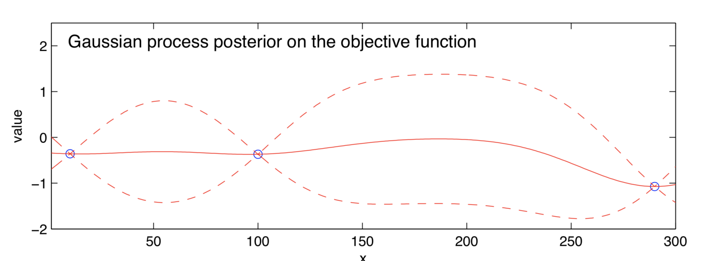
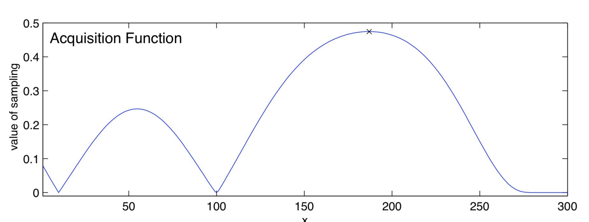
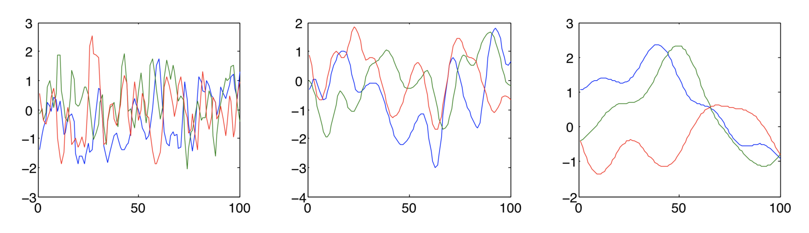

* [Back to Main](../../README.md)
---

# A Tutorial on Bayesian Optimization
### Peter I. Frazier
* [Read Paper](../paper_pdfs/240827%20A%20Tutorial%20on%20Bayesian%20Optimization.pdf)

  

# 1. Introduction
### Concept) Bayesian Optimization (BayesOpt)
- Def.)
  - A class of machine-learning-based optimization methods focused on solving the problem
    - $`\displaystyle\max_{x\in A} f(x)`$
      - where the feasible set $`A`$ and objective function $`f`$ typically have the following properties:
        - The input $`x\in \mathbb{R}^d`$
          - $`d`$ is not too large
          - Typically, $`d\le 20`$ in most successful applications of BayesOpt.
        - The feasible set $`A`$ is a simple set, in which it is easy to assess membership.
          - Typically $`A`$ is a hyper-rectangle $`\{x\in\mathbb{R}^d : a_i \le x_i \le b_i\}`$ or the $`d\textrm{-dimensional simplex } \{x\in\mathbb{R}^d : \sum_i x_i = 1\}`$
        - The objective function $`f`$ is continuous.
          - This will typically be required to model $`f`$ using Gaussian process regression.
        - $`f`$ is “expensive to evaluate”
          - i.e.) Each evaluation takes a substantial amount of time or monetary/opportunity cost
        - $`f`$ is a “black box.”
          - i.e.) $`f`$ lacks known special structure like concavity or linearity that would make it easy to optimize using techniques that leverage such structure to improve efficiency.
        - Derivative Free
          - When evaluating $`f`$, we observe only $`f(x)`$.
            - No first- or second-order derivatives are available.
              - Thus, we **cannot** use
                - gradient descent
                - Newton's methods
                - quasi-Newton methods
        - Assume that $`f(x)`$ is observed **WITHOUT** noise.
        - Our goal is to find a **global** rather than local optimum.

 

# 2. Overview of BayesOpt
### Algorithm 1) Basic pseudo-code for Bayesian optimization
- Algorithm)
  - Place a Gaussian process prior on $`f`$
  - Observe $`f`$ at $`n_0`$ points according to an initial space-filling experimental design.
  - Set $`n = n_0`$
  - `while` $`n\le N`$ `do`
    - Update the posterior probability distribution on $`f`$ using all available data.
    - Let $`x_n`$ be a maximizer of the acquisition function over $`x`$,
      - where the acquisition function is computed using the current posterior distribution.
    - Observe $`y_n = f(x_n)`$.
    - Increment $`n`$.
  - `end while`
  - Return a solution:
    - Either
      - the point evaluated with the largest $`f(x)`$
      - the the point with the largest posterior mean.
- Desc.)
  - The algorithm consists of two main components:
    1. A Bayesian [statistical model](#concept-statistical-model) for modeling the **objective function**
       - How?)
         - Evaluate the objective function according to an initial space-filling experimental design. 
         - Points are often chosen uniformly at random.
         - Points are used iteratively to allocate the remainder of a budget of $`N`$ function evaluations.
    2. An **acquisition function** for deciding where to sample next

 

#### Concept) Statistical Model
- Desc.)
  - Invariably a Gaussian process
  - It provides a Bayesian posterior probability distribution that describes potential values for $`f(x)`$ at a candidate point $`x`$.
  - Each time we observe $`f`$ at a new point, the posterior distribution is updated.

#### Concept) Acquisition Function
- Desc.)
  - It measures the value that would be generated by evaluation of the objective function at a new point $`x`$
    - based on the current posterior distribution over $`f`$.

#### e.g.) One Iteration using GP regression and Expected Improvements
||
|:-|
||
|- blue circles : noise-free observations of the objective functions   - GP regression produces a posterior probability on each $`f(x) \sim N(\mu_n(x), \sigma^2_n(x))`$   - solid red line : $`\mu_n(x)`$   - dashed red lines : a 95% Bayesian credible interval for $`f(x)`$, i.e. $`\mu_n(x)\pm 1.96\times\sigma_n(x)`$|
||
|- The expected improvement acquisition function that corresponds to this posterior.   - Value 0 at points that have previously been evaluated.|

 

# 3. Gaussian Process (GP) Regression
### Concept) Gaussian Process Regression
- Desc.)
  - A Bayesian statistical approach for **modeling functions**
  - Here, the brief introduction is provided.
    - For more complete treatment, refer to Rasmussen, C. and Williams, C. (2006). *Gaussian Processes for Machine Learning.*
- Goal)
  - Using the prior distribution observed by the previous data, derive the posterior probability distribution of the new data.
- Model)
  - $`f:\mathbb{R}^d\rightarrow\mathbb{R}`$
    - $`[f(x_1), f(x_2), \cdots, f(x_k)]`$ : $`f`$'s values at a finite collection of points $`x_1, x_2,\cdots, x_k\in\mathbb{R}^d`$ in a vector.
      - Assumptions)
        - They were drawn at random by nature from some **prior probability distribution**.
        - GP Regression takes this prior distribution to be multivariate normal with...
          - **Mean Vector**
            - How to construct?)
              - Evaluate a mean function $`\mu_0`$ at each $`x_i`$.
                - e.g.) Mean Function
                  - d
          - **Covariance Matrix**
            - How to construct?)
              - Evaluate a **covariance function** or **kernel** $`\Sigma_0`$ at each pair of point $`x_i, x_j`$.
                - $`x_i, x_j`$ are closer $`\rightarrow`$ They have a larger positive correlation.
                - The kernel must be chosen to make the covariance matrix be positive semi-definite, regardless of the collection of points chosen.
                - e.g.) Kernel
                  - d
  - The resulting prior distribution on $`[f(x_1), f(x_2), \cdots, f(x_k)]`$
    - $`\displaystyle f(x_{1:k})\sim \textrm{Normal}(\mu_0(x_{1:k}), \Sigma_0(x_{1:k}, x_{1:k}))`$ 
      - where
        - $`x_{1:k}=x_1,x_2,\cdots, x_k`$
        - $`f(x_{1:k})=[f(x_1), f(x_2), \cdots, f(x_k)]`$
        - $`\mu_0(x_{1:k})=[\mu_0(x_1), \mu_0(x_2), \cdots, \mu_0(x_k)]`$
        - $`\Sigma_0(x_{1:k})=[\Sigma_0(x_1, x_1), \Sigma_0(x_1, x_2), \cdots, \Sigma_0(x_1, x_k) ; \cdots ; \Sigma_0(x_k, x_1), \Sigma_0(x_k, x_2), \cdots, \Sigma_0(x_k, x_k)]`$
  - Posterior Probability Distribution
    - Desc.)
      - the conditional distribution of $`f(x)`$ given some previous observations
    - Derivation)
      - Suppose we observe $`f(x_{1:n})`$ without noise for some $`n`$.
      - Our goal is to infer the value of $`f(x)`$ at some new point $`x`$.
      - Put $`k=n+1`$ and $`x_k=x`$.
      - Then the conditional distribution of $`f(x)`$ given these observations can be derived using Bayes' rule as follows:
        - $`f(x)|f(x_{1:n})\sim\text{Normal}(\mu_n(x), \sigma^2(x))`$
          - where
            - $`\mu_n(x) = \Sigma_0(x,x_{1:n})\Sigma_0(x_{1:n},x_{1:n})^{-1}\left( f(x_{1:n}) - \mu_0(x_{1:n}) \right) +\mu_0(x)`$ : the posterior mean
            - $`\sigma^2_n(x) = \Sigma_0(x,x) - \Sigma_0(x,x_{1:n})\Sigma_0(x_{1:n},x_{1:n})^{-1}\Sigma_0(x_{1:n}, x)`$ : the posterior variance
    - Analysis)
      - The Posterior Mean : $`\mu_n(x)`$
        - A weighted average between the prior $`\mu_0(x)`$ and an estimate based on the data $`f(x_{1:n})`$, with a weight that depends on the kernel.
      - The Posterior Variance : $`\sigma^2_n(x)`$
        - The prior covariance $`\Sigma_0(x,x)`$ less a term that corresponds to the variance removed by observing $`f(x_{1:n})`$.
- cf.)
  - How to speed up the algorithm.)
    - Rather than computing **posterior means** $`(\mu_n(x))`$ and **variances** $`(\sigma_n^2(x))`$ directly using the equation above and matrix inversion, it is typically faster and more numerically stable to use a **Cholesky decomposition** and then solve a linear system of equations.
  - How to improve the numerical stability of this approach.)
    - Add small positive number like $`10^{-6}`$ to each element of the diagonal of $`\Sigma_0(x_{1:n},x_{1:n})`$.
      - Why?)
        - Consider the case that $`x_{1:n}`$ contains two or more points that are close together.
        - Then the eigenvalues of $`\Sigma_0(x_{1:n},x_{1:n})`$ may be closer to 0.
        - By adding a small positive number, we can make it closer to positive-definite.

 

## 3.1 Choosing a Mean Function and Kernel
#### Concept) Types of Mean Function
- **Constant Value Mean Function**
  - Model)
    - $`\mu_0(x) = \mu \in\mathbb{R}`$
  - Prop.)
    - The most common choice for the mean function.
- **Non-Constant Mean Function**
  - Model)
    - $`\displaystyle \mu_0(x) = \mu + \sum_{i=1}^p \beta_i \Psi_i(x)`$
      - where $`\Psi_i`$ is a parametric function and often a low-order polynomial in $`x`$.
  - Prop.)
    - When to use.)
      - $`f`$ is believed to have a trend or some application-specific parametric structure.

#### Concept) Kernel Functions
- Props.)
  - Points that are closer in the input space are more strongly correlated.
    - i.e.)
      - $`||x-x'|| \lt ||x-x''|| \Rightarrow \Sigma_0(x,x') \gt \Sigma_0(x,x'')`$
  - Kernels are required to be positive semi-definite functions.
- Types)
  - **Power Exponential Kernel (Gaussian Kernel)**
    - Model)
      - $`\Sigma_0(x,x') = \alpha_0 \exp(-||x-x'||^2)`$
        - where
          - $`\displaystyle ||x-x'||^2 = \sum_{i=1}^d \alpha_i (x_i-x_i')^2`$
          - $`\alpha_{1:d}`$ are the parameters of the kernel.
    - Prop.)
      - Varying parameters creates different beliefs about how quickly $`f(x)`$ changes with $`x`$.
    - e.g.)
      ||
      |:-|
      ||
      |- Random functions with a 1-dimensional input drawn from a Gaussian process prior with a power exponential kernel with different values of $`\alpha_1`$   - $`\alpha_1`$ decreasing from left to right.|
  - **Matern Kernel**
    - Model)
      - $`\displaystyle \Sigma_0(x,x') = \alpha_0\frac{2^{1-\nu}}{\Gamma(\nu)}\left(\sqrt{2\nu}||x-x'||\right)^\nu K_\nu \left(\sqrt{2\nu}||x-x'||\right)`$
        - where
          - $`K_\nu`$ : the modified Bessel function
          - $`\nu`$ : a parameter

 

## 3.2 Choosing Hyperparameters
### Concept) Hyperparameter
- Desc.)
  - Prior Hyperparameters
    - The parameters contained in the [mean function](#concept-types-of-mean-function) and the [kernel function](#concept-kernel-functions)
- Notation)
  - $`\eta`$ : the vector with hyperparameters
    - e.g.) [Matern kernel](#concept-kernel-functions) and a [constant mean function](#concept-types-of-mean-function).
      - $`\eta = (\alpha_{0:d}, \nu, \mu)`$

### Concept) Approaches for Choosing Hyperparameters
1. [Maximum Likelihood Estimate (MLE)](#concept-maximum-likelihood-estimate-mle)
2. [Maximum A Posteriori (MAP)](#concept-maximum-a-posteriori-map)
3. [Fully Bayesian Approach](#concept-fully-bayesian-approach)

#### Concept) Maximum Likelihood Estimate (MLE)
- Desc.)
  - Given observations $`f(x_{1:n})`$, we calculate the likelihood of these observations under the prior $`P(f(x_{1:n})|\eta)`$.
  - Here, we modified the notation to indicate its dependence on $`\eta`$.
  - This likelihood is a multivariate normal density.
- Model)
  - $`\displaystyle \hat{\eta} = \arg\max_\eta P(f(x_{1:n})|\eta)`$
- Prop.)
  - **MLE** is a special case of the [MAP](#concept-maximum-a-posteriori-map).
    - Refer to [MAP](#concept-maximum-a-posteriori-map) for more description.

#### Concept) Maximum A Posteriori (MAP)
- Desc.)
  - Assume that the hyperparameters $`\eta`$ were themselves chosen from a prior $`P(\eta)`$.
  - Then estimate $`\eta`$ byt the maximum a posteriori (MAP) estimate
    - i.e.) the value of $`\eta`$ that maximizes the posterior.
- Model)   
  - $`\displaystyle \hat{\eta} = \arg\max_\eta P(\eta|f(x_{1:n})) = \arg\max_\eta P(f(x_{1:n})|\eta)P(\eta)`$
- Prop.)
  - Comparison with [MLE](#concept-maximum-likelihood-estimate-mle)
    - [MLE](#concept-maximum-likelihood-estimate-mle) is a special case of the **MAP**
      - if we take the prior on the hyperparameters $`P(\eta)`$ to be the probability distribution that has constant density over the domain of $`\eta`$.
    - The **MAP** is useful than [MLE](#concept-maximum-likelihood-estimate-mle) 
      - Why?) 
        - [MLE](#concept-maximum-likelihood-estimate-mle) sometimes estimates unreasonable hyperparameter values
          - e.g.) hyperparameter values corresponding to functions that vary too quickly or too slowly.
      - How?) 
        - Choose a prior that puts more weight on hyperparameter values that are reasonable for a particular problem.
          - e.g.) Prior with...
            - Uniform Distribution
              - It prevents estimates from falling outside of some pre-specified range
            - Normal Distribution
              - It suggests estimates to fall near some nominal value without setting a hard cutoff.
            - Log-Normal Distribution / Truncated Normal Distribution
              - It provides a similar suggestions for positive parameters.

#### Concept) Fully Bayesian Approach
- Desc.)
  - Target is to compute the posterior distribution on $`f(x)`$ marginalizing over all possible values of the hyperparameters.
- Model)
  - Ideal
    - $`\displaystyle P(f(x) = y|f(x_{1:n})) = \int P(f(x) = y|f(x_{1:n}), \eta) P(\eta|f(x_{1:n})) d\eta`$
      - However, this integral is intractable...
  - Actual (Approximation)
    - $`\displaystyle P(f(x) = y|f(x_{1:n})) \approx \frac{1}{J}\sum_{j=1}^J P(f(x) = y|f(x_{1:n}), \eta = \hat{\eta_j})`$
      - where $`(\hat{n_j}: j=1,\cdots, J)`$ are sampled from $`P(\eta|f(x_{1:n}))`$ via an MCMC method.
        - e.g.) Slice Sampling
- Prop.)
  - [MAP](#concept-maximum-a-posteriori-map) can  be seen as an approximation to fully Bayesian inference.
    - If we approximate the posterior $`P(\eta|f(x_{1:n}))`$ by a point mass at the $`\eta`$ that maximizes the posterior density, 
      - then inference with [MAP](#concept-maximum-a-posteriori-map) recovers the Ideal model above.

---
* [Back to Main](../../README.md)